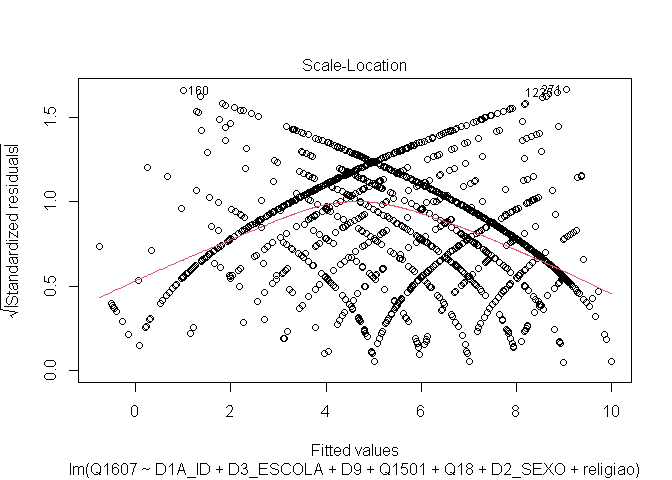
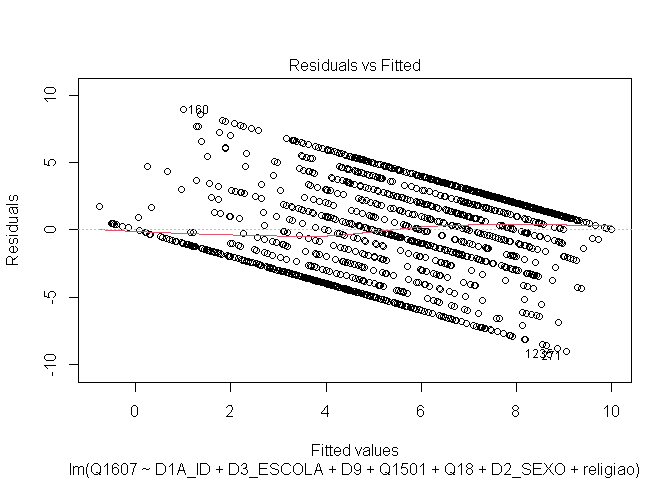
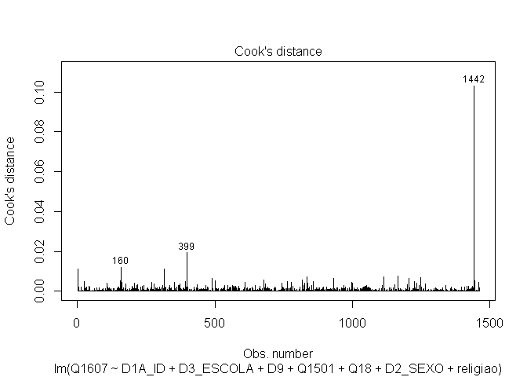
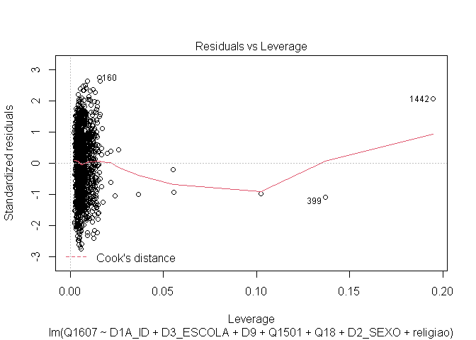

Exercicio 11
================

``` r
library( tidyverse )
library( haven )
library( car )
library( lmtest )
library( sandwich )

link <- "https://github.com/MartinsRodrigo/Analise-de-dados/blob/master/04622.sav?raw=true"

download.file(link, "04622.sav", mode = "wb")

banco <- read_spss("04622.sav") 

banco <- banco %>%
         mutate( D10 = as_factor( D10 ) ) %>%
         filter( Q1607 < 11, 
                 Q18 < 11,
                 D9 < 9999998,
                 Q1501 < 11 )


Outras <- levels( banco$D10 )[ -c( 3, 5, 13 ) ]

banco <- banco %>%
         mutate( religiao = case_when( D10 %in% Outras ~ "Outras",
                                       D10 == "Católica" ~ "Católica",
                                       D10 == "Evangélica" ~ "Evangélica",
                                       D10 == "Não tem religião" ~ "Não tem religião" ) )
```

### Faça uma regressão linear avaliando em que medida as variáveis independentes utilizadas nos exercícios 7 e 8,

### idade(D1A\_ID), educação (D3\_ESCOLA), renda (D9), nota atribuída ao PT (Q1501), auto-atribuição ideológica (Q18),

### sexo (D2\_SEXO) e religião (variável criada no passo anterior) explicam a avaliação de Bolsonaro (Q1607)

``` r
regressao_lin <- lm( Q1607 ~ D1A_ID + D3_ESCOLA + D9 + Q1501 + Q18 + D2_SEXO + religiao, data = banco )

summary( regressao_lin )
```

    ## 
    ## Call:
    ## lm(formula = Q1607 ~ D1A_ID + D3_ESCOLA + D9 + Q1501 + Q18 + 
    ##     D2_SEXO + religiao, data = banco)
    ## 
    ## Residuals:
    ##     Min      1Q  Median      3Q     Max 
    ## -9.0608 -2.5654  0.4179  2.3268  8.9954 
    ## 
    ## Coefficients:
    ##                            Estimate Std. Error t value Pr(>|t|)    
    ## (Intercept)               6.216e+00  5.365e-01  11.586  < 2e-16 ***
    ## D1A_ID                    1.040e-02  6.234e-03   1.669 0.095376 .  
    ## D3_ESCOLA                -1.116e-01  4.486e-02  -2.487 0.012982 *  
    ## D9                       -3.620e-05  2.764e-05  -1.309 0.190576    
    ## Q1501                    -3.946e-01  2.367e-02 -16.670  < 2e-16 ***
    ## Q18                       3.161e-01  2.603e-02  12.142  < 2e-16 ***
    ## D2_SEXO                  -6.874e-01  1.746e-01  -3.937 8.63e-05 ***
    ## religiaoEvangélica        6.685e-01  1.984e-01   3.370 0.000772 ***
    ## religiaoNão tem religião -7.565e-02  3.485e-01  -0.217 0.828177    
    ## religiaoOutras           -8.326e-01  3.081e-01  -2.702 0.006963 ** 
    ## ---
    ## Signif. codes:  0 '***' 0.001 '**' 0.01 '*' 0.05 '.' 0.1 ' ' 1
    ## 
    ## Residual standard error: 3.296 on 1452 degrees of freedom
    ## Multiple R-squared:  0.3018, Adjusted R-squared:  0.2975 
    ## F-statistic: 69.75 on 9 and 1452 DF,  p-value: < 2.2e-16

### Faça o teste de homoscedasticidade do modelo e corrija as estimações dos coeficientes caso seja necessário.

``` r
plot( regressao_lin, 3 )
```

<!-- -->

``` r
plot( regressao_lin, 1 )
```

<!-- -->

``` r
bptest( regressao_lin )
```

    ## 
    ##  studentized Breusch-Pagan test
    ## 
    ## data:  regressao_lin
    ## BP = 65.763, df = 9, p-value = 1.025e-10

``` r
ncvTest( regressao_lin )
```

    ## Non-constant Variance Score Test 
    ## Variance formula: ~ fitted.values 
    ## Chisquare = 22.48512, Df = 1, p = 2.1178e-06

``` r
coeftest( regressao_lin, vcov = vcovHC( regressao_lin, type = "HC3" ) )
```

    ## 
    ## t test of coefficients:
    ## 
    ##                             Estimate  Std. Error  t value  Pr(>|t|)    
    ## (Intercept)               6.2160e+00  5.4715e-01  11.3607 < 2.2e-16 ***
    ## D1A_ID                    1.0403e-02  6.2657e-03   1.6603 0.0970600 .  
    ## D3_ESCOLA                -1.1159e-01  4.7247e-02  -2.3619 0.0183123 *  
    ## D9                       -3.6198e-05  3.6481e-05  -0.9922 0.3212463    
    ## Q1501                    -3.9464e-01  2.6381e-02 -14.9593 < 2.2e-16 ***
    ## Q18                       3.1608e-01  2.8534e-02  11.0772 < 2.2e-16 ***
    ## D2_SEXO                  -6.8736e-01  1.7967e-01  -3.8256 0.0001360 ***
    ## religiaoEvangélica        6.6854e-01  1.9676e-01   3.3978 0.0006978 ***
    ## religiaoNão tem religião -7.5647e-02  3.7488e-01  -0.2018 0.8401094    
    ## religiaoOutras           -8.3256e-01  3.0592e-01  -2.7215 0.0065759 ** 
    ## ---
    ## Signif. codes:  0 '***' 0.001 '**' 0.01 '*' 0.05 '.' 0.1 ' ' 1

Comentário: De acordo com o ncvTest, o qual tem como hipótese nula a
presença de homocedasticidade, podemos ver que tal hipótese aqui pode
ser descartada, dado o p-valor baixíssimo de 2.117e-06. I.e., podemos
considerar que não há homocedasticidade na amostra, havendo
heterocedasticidade. Tal consideração é reforçada pelo bptest

### Avalie a multicolinearidade entre as variáveis

``` r
vif( regressao_lin )
```

    ##               GVIF Df GVIF^(1/(2*Df))
    ## D1A_ID    1.219401  1        1.104265
    ## D3_ESCOLA 1.337368  1        1.156446
    ## D9        1.094849  1        1.046350
    ## Q1501     1.119818  1        1.058215
    ## Q18       1.049195  1        1.024302
    ## D2_SEXO   1.023001  1        1.011435
    ## religiao  1.093846  3        1.015062

### Verifique a presença de outilier ou observações influentes no modelo

``` r
plot( regressao_lin, 4 )
```

<!-- -->

Comentário: o Cook’s Distance destaca três grandes outliers: as
observações 160, 399 e 1442

``` r
plot( regressao_lin, 5 )
```

<!-- -->

Comentário: As três observações, 160, 399 e 1442, também são destacadas
com outliers aqui, além de outras não identificadas.

``` r
outlierTest( regressao_lin )
```

    ## No Studentized residuals with Bonferroni p < 0.05
    ## Largest |rstudent|:
    ##     rstudent unadjusted p-value Bonferroni p
    ## 271 -2.76344          0.0057918           NA

### Faça a regressao linear sem a observação mais influente e avalie a alteração do resultado

``` r
novo_banco <- banco[ -c( 160, 399, 1442 ), ]

nova_regressao <- lm( Q1607 ~ D1A_ID + D3_ESCOLA + D9 + Q1501 + Q18 + D2_SEXO + religiao, data = novo_banco )

summary( nova_regressao )
```

    ## 
    ## Call:
    ## lm(formula = Q1607 ~ D1A_ID + D3_ESCOLA + D9 + Q1501 + Q18 + 
    ##     D2_SEXO + religiao, data = novo_banco)
    ## 
    ## Residuals:
    ##     Min      1Q  Median      3Q     Max 
    ## -9.0996 -2.5077  0.4035  2.2973  8.6938 
    ## 
    ## Coefficients:
    ##                            Estimate Std. Error t value Pr(>|t|)    
    ## (Intercept)               6.219e+00  5.350e-01  11.625  < 2e-16 ***
    ## D1A_ID                    1.107e-02  6.251e-03   1.771 0.076819 .  
    ## D3_ESCOLA                -1.014e-01  4.534e-02  -2.236 0.025517 *  
    ## D9                       -5.402e-05  3.347e-05  -1.614 0.106743    
    ## Q1501                    -3.988e-01  2.365e-02 -16.865  < 2e-16 ***
    ## Q18                       3.179e-01  2.600e-02  12.227  < 2e-16 ***
    ## D2_SEXO                  -7.128e-01  1.747e-01  -4.080 4.75e-05 ***
    ## religiaoEvangélica        6.813e-01  1.979e-01   3.443 0.000593 ***
    ## religiaoNão tem religião -1.583e-01  3.489e-01  -0.454 0.650163    
    ## religiaoOutras           -8.262e-01  3.072e-01  -2.690 0.007234 ** 
    ## ---
    ## Signif. codes:  0 '***' 0.001 '**' 0.01 '*' 0.05 '.' 0.1 ' ' 1
    ## 
    ## Residual standard error: 3.286 on 1449 degrees of freedom
    ## Multiple R-squared:  0.306,  Adjusted R-squared:  0.3017 
    ## F-statistic:    71 on 9 and 1449 DF,  p-value: < 2.2e-16

RESPOSTA: Não há mudanças significativas entre as regressões, i.e., a
remoção dos outliers detectados nos testes não influenciou muito no
resultado. Houve uma ligeira redução no valor do intercepto, porém sem
mudanças no p-valor do mesmo. Houve um ligeiro aumento no coeficiente de
D1A\_ID, acompanhada por uma redução no p-valor, mas não de forma a
tornar esta variável estatisticamente significate. Houve uma ligeira
redução no coeficiente de D3\_ESCOLA, acompanhada por quase o dobro do
aumento no p-valor, sem, entretanto interferir na significância
estatística da variável, a qual permanece significante. D9 foi
razoavelmente afetada, já que houve uma boa redução no seu coeficiente,
que caiu de -3.620e-05 para -5.402e-05, redução a qual também ocorre no
p-valor, que cai de 0.190576 para 0.106743, sem, entretanto, afetar a
significância estatística da variável. Q1501 e Q18 praticamente não
foram afetadas, nem no valor dos coeficientes, ou no p-valor. D2\_SEXO
teve uma ligeira redução no coeficiente, mas uma grande redução no
p-valor, que cai de 8.63e-05 para 4.75e-05, o que não afeta, entretanto,
a significância estatística da variável. Na variável religião, a única
categoria fortemente afetada foi Não Tem Religião, a qual teve um
aumento brusco no valor do coeficiente, que sobe de -7.565e-02 para
-1.583e-01, com uma redução razoável no p-valor, que cai de 0.828177
para 0.650163, sem, entretanto, tornar tal variável estatisticamente
significativa. Tanto o Erro Residual Padrão quando o R Quadrado não
foram muito afetados, na nova regressão, pela remoção de outliers.
