Exercicio 5
================
Kaique Pereira Santos

### Carregue o banco de dados `world` que está no pacote `poliscidata`.

``` r
library( poliscidata )

banco <- world


### Carregue o banco de dados `world` que está no pacote `poliscidata`.

library( tidyverse )
```

    ## -- Attaching packages ------------------------------------------------------------------------------------------ tidyverse 1.3.0 --

    ## v ggplot2 3.3.2     v purrr   0.3.4
    ## v tibble  3.0.1     v dplyr   1.0.0
    ## v tidyr   1.1.0     v stringr 1.4.0
    ## v readr   1.3.1     v forcats 0.5.0

    ## -- Conflicts --------------------------------------------------------------------------------------------- tidyverse_conflicts() --
    ## x dplyr::filter() masks stats::filter()
    ## x dplyr::lag()    masks stats::lag()

``` r
library( poliscidata )

banco <- world


### Existem diversas medidas de democracia para os países: `dem_score14`, `democ11`, `fhrate04_rev`,
### `fhrate08_rev`, `polity`. Descreva-as graficamente e diga quais são as diferenças entre tais medidas.

?world
```

    ## starting httpd help server ...

    ##  done

``` r
min( banco$dem_score14, na.rm = T )
```

    ## [1] 1.08

``` r
max( banco$dem_score14, na.rm = T )
```

    ## [1] 9.93

``` r
str( banco$dem_score14 )
```

    ##  num [1:167] 2.77 5.67 3.83 3.35 6.84 4.13 9.01 8.54 2.83 2.87 ...

``` r
ggplot( banco, aes( dem_score14 ) ) +
        geom_histogram( aes( y = ..density.. ), colour = "white", fill = "grey" ) +
        geom_density( colour = "red" )
```

    ## `stat_bin()` using `bins = 30`. Pick better value with `binwidth`.

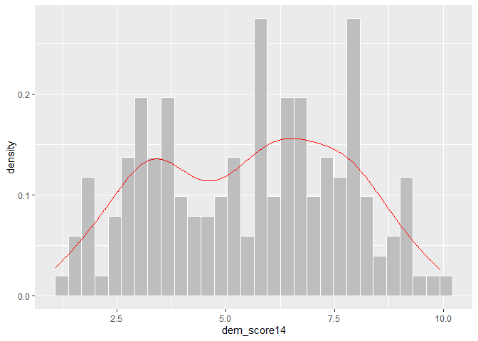<!-- -->

``` r
min( banco$democ11, na.rm = T )
```

    ## [1] 0

``` r
max( banco$democ11, na.rm = T )
```

    ## [1] 10

``` r
str( banco$democ11 )
```

    ##  num [1:167] NA 9 3 2 8 5 10 10 0 0 ...

``` r
ggplot( banco, aes( democ11 ) ) +
        geom_bar( )
```

    ## Warning: Removed 23 rows containing non-finite values (stat_count).

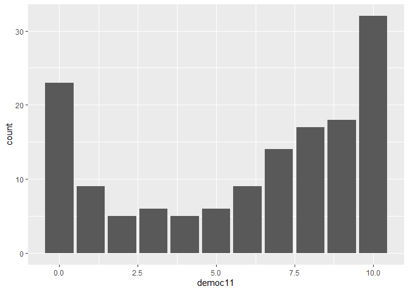<!-- -->

``` r
min( banco$fhrate04_rev, na.rm = T )
```

    ## [1] 1

``` r
max( banco$fhrate04_rev, na.rm = T )
```

    ## [1] 7

``` r
str( banco$fhrate04_rev )
```

    ##  num [1:167] 2.5 5 2.5 2.5 6 3.5 7 7 2.5 3 ...
    ##  - attr(*, "value.labels")= Named num [1:2] 7 1
    ##   ..- attr(*, "names")= chr [1:2] "Most free" "Least free"

``` r
ggplot( banco, aes( fhrate04_rev ) ) +
        geom_bar( )
```

    ## Warning: Removed 14 rows containing non-finite values (stat_count).

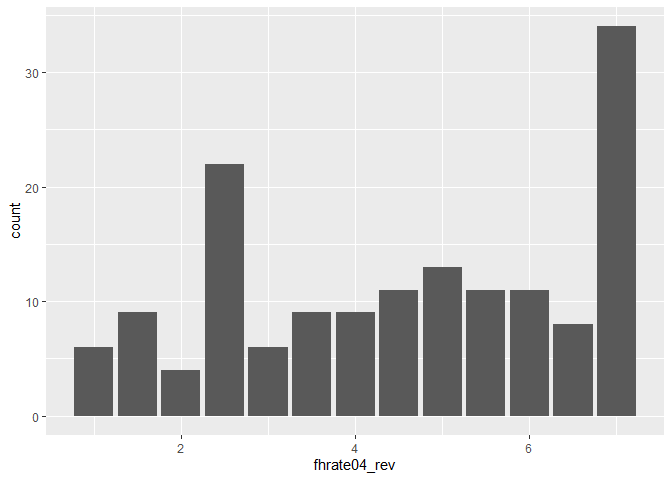<!-- -->

``` r
min( banco$fhrate08_rev, na.rm = T )
```

    ## [1] 0

``` r
max( banco$fhrate08_rev, na.rm = T )
```

    ## [1] 12

``` r
str( banco$fhrate08_rev )
```

    ##  num [1:167] 3 8 3 3 10 4 12 12 3 4 ...

``` r
ggplot( banco, aes( fhrate08_rev ) ) +
        geom_boxplot( )
```

    ## Warning: Removed 15 rows containing non-finite values (stat_boxplot).

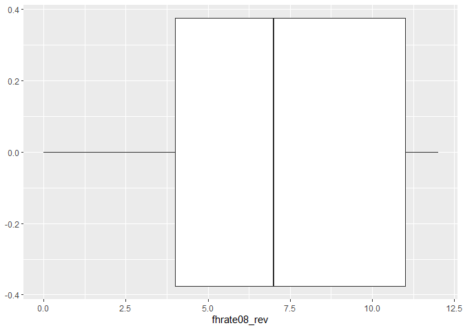<!-- -->

``` r
min( banco$polity, na.rm = T )
```

    ## [1] -10

``` r
max( banco$polity, na.rm = T )
```

    ## [1] 10

``` r
str( banco$polity )
```

    ##  num [1:167] NA 9 2 -2 8 5 10 10 -7 -8 ...

``` r
ggplot( banco, aes( polity ) ) +
        geom_bar( )
```

    ## Warning: Removed 23 rows containing non-finite values (stat_count).

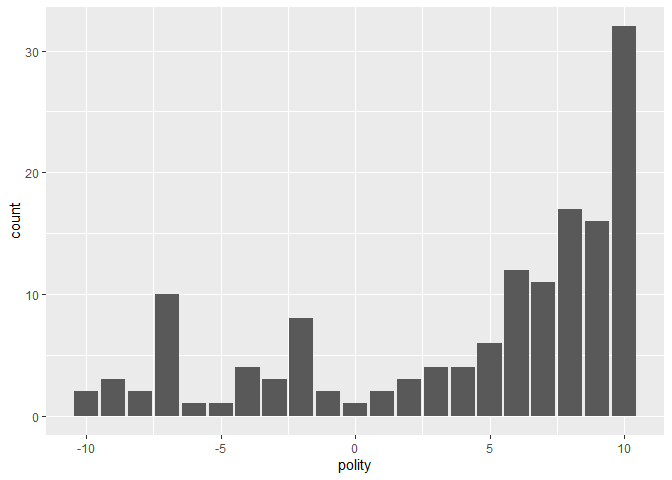<!-- -->

``` r
# RESPOSTA: dem_score14 é uma variável numérica contínua, ou seja, é representada por número reais. democ11
#           é uma variável numérica discreta, i.e., representa valores inteiros, indo de 0 a 10. Essas duas
#           variáveis medem o nível de democracia em um país, variando de menos para mais a medida que os
#           valores crescem. fhrate04_rev é uma variável contínua, em um intervalo de 1 a 7, enquanto 
#           fhrate08_rev é discreta, indo de 0 a 12. As duas são índices elaborados pela Freedom House para
#           representar graus de democracia. Por último, polity também é usada para medir nível de democracia
#           em um país. Ela é uma variável discreta, mas, diferentemente das outras variáveis discretas, ela
#           pode assumir valores negativos. Seu intervalo vai de -10 até 10.
  
### Avalie a relação entre todas as medidas de democracia e desigualdade, utilizando a variável
### `gini08`. Descreva graficamente esta variável, a relação entre as duas variáveis, meça a correla-
### ção entre elas e faça regressões lineares (interpretando em profundidade os resultados dos coefi-
### cientes e medidas de desempenho dos modelos). Enfatize as semelhanças e diferenças entre os resul-
### tados. Quais são suas conclusões?

# Descrever graficamente gini08
ggplot( banco, aes( gini08 ) ) +
        geom_histogram( aes( y = ..density.. ), colour = "white", fill = "grey" ) +
        geom_density( colour = "black" )
```

    ## `stat_bin()` using `bins = 30`. Pick better value with `binwidth`.

    ## Warning: Removed 45 rows containing non-finite values (stat_bin).

    ## Warning: Removed 45 rows containing non-finite values (stat_density).

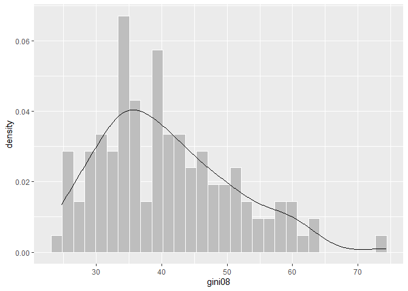<!-- -->

``` r
# descrever graficamente relação entre gini e dem_score14
ggplot( banco, aes( gini08, dem_score14 ) ) +
        geom_point( ) +      
        geom_smooth( method = "lm" )
```

    ## `geom_smooth()` using formula 'y ~ x'

    ## Warning: Removed 45 rows containing non-finite values (stat_smooth).

    ## Warning: Removed 45 rows containing missing values (geom_point).

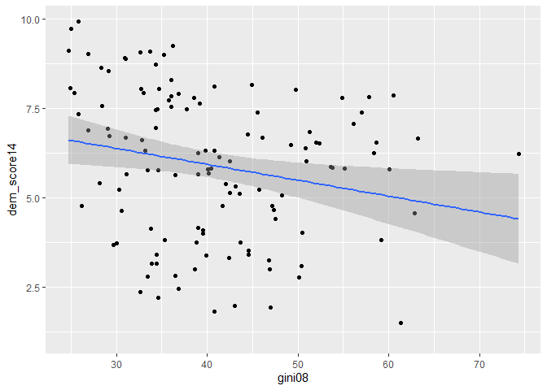<!-- -->

``` r
# correlação gini dem_score14
cor.test( banco$gini08, banco$dem_score14 )
```

    ## 
    ##  Pearson's product-moment correlation
    ## 
    ## data:  banco$gini08 and banco$dem_score14
    ## t = -2.4621, df = 120, p-value = 0.01523
    ## alternative hypothesis: true correlation is not equal to 0
    ## 95 percent confidence interval:
    ##  -0.38215203 -0.04321115
    ## sample estimates:
    ##        cor 
    ## -0.2192877

``` r
# regressão gini dem_score14
reg_gini_dem14 <- lm( dem_score14 ~ gini08, data = banco )
summary( reg_gini_dem14 )
```

    ## 
    ## Call:
    ## lm(formula = dem_score14 ~ gini08, data = banco)
    ## 
    ## Residuals:
    ##     Min      1Q  Median      3Q     Max 
    ## -4.0728 -1.7583  0.3513  1.6742  3.3600 
    ## 
    ## Coefficients:
    ##             Estimate Std. Error t value Pr(>|t|)    
    ## (Intercept)  7.71756    0.75639  10.203   <2e-16 ***
    ## gini08      -0.04448    0.01807  -2.462   0.0152 *  
    ## ---
    ## Signif. codes:  0 '***' 0.001 '**' 0.01 '*' 0.05 '.' 0.1 ' ' 1
    ## 
    ## Residual standard error: 2.003 on 120 degrees of freedom
    ##   (45 observations deleted due to missingness)
    ## Multiple R-squared:  0.04809,    Adjusted R-squared:  0.04015 
    ## F-statistic: 6.062 on 1 and 120 DF,  p-value: 0.01523

``` r
# INTERPRETAÇÃO: A correlação entre as duas variáveis é negativa, ou seja, existe uma relação inversa entre as
#                duas variáveis. Quanto maior o valor de gini08, menor o valor de dem_score14. Como o p-valor
#                é baixo e como o intervalo de confiança de 95% indica que o coeficiente de correlação está
#                entre dois valores negativos, -0.3821 e -0.0432, podemos concluir que o valor da correlação
#                não é zero, e, portanto, rejeita a hipótese nula de que não há relação entra as variáveis.
#                Quanto à regressão linear, ambos os p-valores, do intercepto e de gini08, são bem baixos, porém,
#                o do intercepto é menor. O p-valor menor para o intercepto indica um maior nível de confiança de
#                que o valor do intercepto é ou está bem próximo de 7.17 quando gini08 for igual a 0. O efeito 
#                estimado de gini08 sobre dem_score14 é de -0.04448. Isso significa que qualquer variação x no
#                valor de gini08 provoca uma variação de -0.04448 * x no valor de dem_score14. Por último, o R
#                quadrado está bem baixo, 0.04809, demonstrando o baixo valor explicativo do modelo.

# descrever graficamente relação entre gini e democ11
ggplot( banco, aes( gini08, democ11 ) ) +
        geom_point( ) +      
        geom_smooth( method = "lm" )
```

    ## `geom_smooth()` using formula 'y ~ x'

    ## Warning: Removed 52 rows containing non-finite values (stat_smooth).

    ## Warning: Removed 52 rows containing missing values (geom_point).

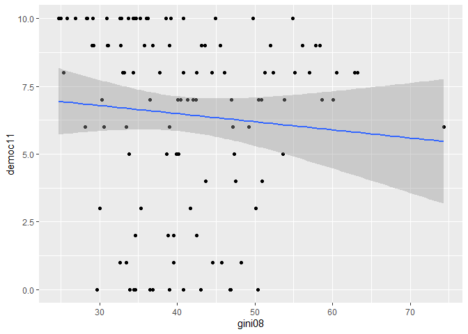<!-- -->

``` r
# correlação gini democ11
cor.test( banco$gini08, banco$democ11 )
```

    ## 
    ##  Pearson's product-moment correlation
    ## 
    ## data:  banco$gini08 and banco$democ11
    ## t = -0.90439, df = 113, p-value = 0.3677
    ## alternative hypothesis: true correlation is not equal to 0
    ## 95 percent confidence interval:
    ##  -0.26378781  0.09988899
    ## sample estimates:
    ##         cor 
    ## -0.08477203

``` r
# regressão gini democ11
reg_gini_dem11 <- lm( democ11 ~ gini08, data = banco )
summary( reg_gini_dem11 )
```

    ## 
    ## Call:
    ## lm(formula = democ11 ~ gini08, data = banco)
    ## 
    ## Residuals:
    ##    Min     1Q Median     3Q    Max 
    ## -6.796 -2.213  1.302  3.049  3.958 
    ## 
    ## Coefficients:
    ##             Estimate Std. Error t value Pr(>|t|)    
    ## (Intercept)  7.68568    1.38306   5.557 1.85e-07 ***
    ## gini08      -0.02994    0.03311  -0.904    0.368    
    ## ---
    ## Signif. codes:  0 '***' 0.001 '**' 0.01 '*' 0.05 '.' 0.1 ' ' 1
    ## 
    ## Residual standard error: 3.47 on 113 degrees of freedom
    ##   (52 observations deleted due to missingness)
    ## Multiple R-squared:  0.007186,   Adjusted R-squared:  -0.0016 
    ## F-statistic: 0.8179 on 1 and 113 DF,  p-value: 0.3677

``` r
# INTERPRETAÇÃO: Aqui, vários fatores indicam que a relação entre as duas variáveis é muito possivelmente ine-
#                inexistente. O p-valor de 0.3677 é muito alto, e o intervalo de confiança varia de negativo
#                para positivo, -0.263 e 0.099, deixando claro que um dos possíveis valores do intervalo é 0.
#                Ambos os fatores reforçam a hipótese nula, a qual indica que não existe relação entre as va-
#                riáveis. Essa conclusão é reforçada pela regressão linear, pois o p-valor de gini08 é de 0.368
#                e o impacto baixíssimo de -0.02994 que cada variação em gini08 tem sobre democ11. O único valor
#                significativo aqui é o do intercepto, que é de 7.68 com um p-valor bem baixo. O erro residual
#                padrão, que representa a distância média entre os valores das observações e o valor do intercepto,
#                tem valor alto de 3.47, e o poder explicativo nesse modelo é de R² = 0.007186, que é muito baixo.

# descrever graficamente relação entre gini e fhrate04_rev
ggplot( banco, aes( gini08, fhrate04_rev ) ) +
        geom_point( ) +      
        geom_smooth( method = "lm" )
```

    ## `geom_smooth()` using formula 'y ~ x'

    ## Warning: Removed 45 rows containing non-finite values (stat_smooth).

    ## Warning: Removed 45 rows containing missing values (geom_point).

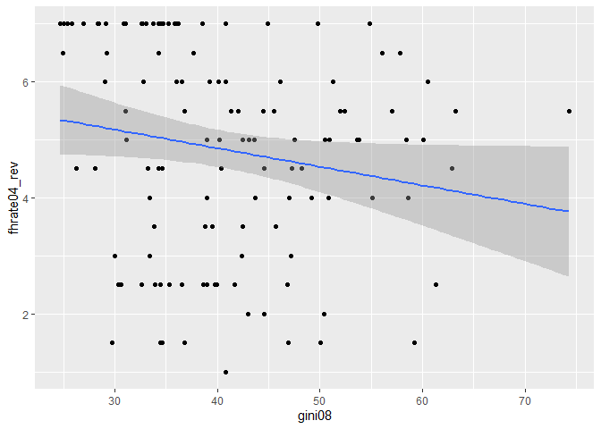<!-- -->

``` r
# correlação gini fhrate04_rev
cor.test( banco$gini08, banco$fhrate04_rev )
```

    ## 
    ##  Pearson's product-moment correlation
    ## 
    ## data:  banco$gini08 and banco$fhrate04_rev
    ## t = -1.9869, df = 120, p-value = 0.04921
    ## alternative hypothesis: true correlation is not equal to 0
    ## 95 percent confidence interval:
    ##  -0.3452745300 -0.0007294745
    ## sample estimates:
    ##        cor 
    ## -0.1784673

``` r
# regressão gini fhrate04_rev
reg_gini_fh04 <- lm( fhrate04_rev ~ gini08, data = banco )
summary( reg_gini_fh04 )
```

    ## 
    ## Call:
    ## lm(formula = fhrate04_rev ~ gini08, data = banco)
    ## 
    ## Residuals:
    ##     Min      1Q  Median      3Q     Max 
    ## -3.8312 -1.3896  0.4312  1.6729  2.6199 
    ## 
    ## Coefficients:
    ##             Estimate Std. Error t value Pr(>|t|)    
    ## (Intercept)  6.13654    0.67419   9.102 2.35e-15 ***
    ## gini08      -0.03199    0.01610  -1.987   0.0492 *  
    ## ---
    ## Signif. codes:  0 '***' 0.001 '**' 0.01 '*' 0.05 '.' 0.1 ' ' 1
    ## 
    ## Residual standard error: 1.786 on 120 degrees of freedom
    ##   (45 observations deleted due to missingness)
    ## Multiple R-squared:  0.03185,    Adjusted R-squared:  0.02378 
    ## F-statistic: 3.948 on 1 and 120 DF,  p-value: 0.04921

``` r
# INTERPRETAÇÃO: O p-valor razoável de 0.04921 e o intervalo, com 95% de confiança, entre -0.3452 e -0.0007, deixam
#                claro que há sim uma correlação negativa entre as variáveis. O fato de o p-valor ser baixo e o in-
#                tervalo não incluir o valor 0 indicam que a correlação observada é significativa de modo que podemos
#                com alguma confiança rejeitar a hipótese nula de que não há relação entre as variáveis.. Na regressão, 
#                vemos que o intercepto tem valor 6.136 com um p-valor baixíssimo, demonstrando boa confiabilidade
#                no resultado. O impacto de gini08 em fhrate04_rev é negativo e baixo, de -0.0319, com um p-valor de
#                0.0492, o qual garante também boa confiabilidade no resultado. O erro residual padrão é de 1.786 e
#                o R quadrado é baixo, de 0.03185, demonstrando que o modelo tem pouco poder explicativo.

# descrever graficamente relação entre gini e fhrate08_rev
ggplot( banco, aes( gini08, fhrate08_rev ) ) +
        geom_point( ) +      
        geom_smooth( method = "lm" )
```

    ## `geom_smooth()` using formula 'y ~ x'

    ## Warning: Removed 46 rows containing non-finite values (stat_smooth).

    ## Warning: Removed 46 rows containing missing values (geom_point).

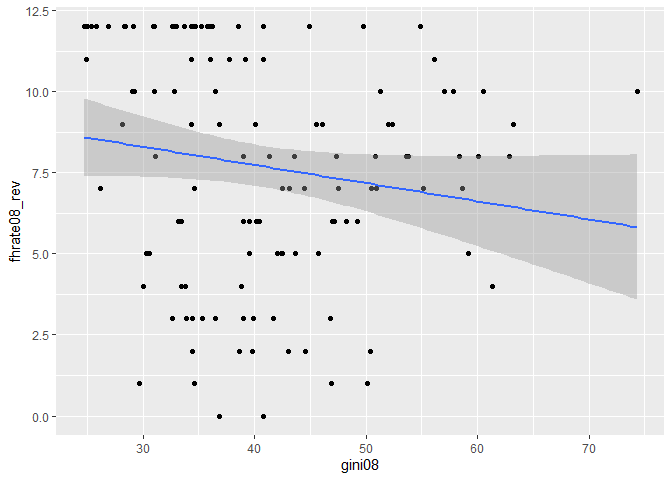<!-- -->

``` r
# correlação gini fhrate08_rev
cor.test( banco$gini08, banco$fhrate08_rev )
```

    ## 
    ##  Pearson's product-moment correlation
    ## 
    ## data:  banco$gini08 and banco$fhrate08_rev
    ## t = -1.7432, df = 119, p-value = 0.08387
    ## alternative hypothesis: true correlation is not equal to 0
    ## 95 percent confidence interval:
    ##  -0.32708386  0.02129614
    ## sample estimates:
    ##        cor 
    ## -0.1578002

``` r
# regressão gini fhrate08_rev
reg_gini_fh08 <- lm( fhrate08_rev ~ gini08, data = banco )
summary( reg_gini_fh08 )
```

    ## 
    ## Call:
    ## lm(formula = fhrate08_rev ~ gini08, data = banco)
    ## 
    ## Residuals:
    ##     Min      1Q  Median      3Q     Max 
    ## -7.9157 -2.5971  0.6712  3.4091  5.0961 
    ## 
    ## Coefficients:
    ##             Estimate Std. Error t value Pr(>|t|)    
    ## (Intercept)  9.97288    1.34188   7.432 1.79e-11 ***
    ## gini08      -0.05590    0.03207  -1.743   0.0839 .  
    ## ---
    ## Signif. codes:  0 '***' 0.001 '**' 0.01 '*' 0.05 '.' 0.1 ' ' 1
    ## 
    ## Residual standard error: 3.554 on 119 degrees of freedom
    ##   (46 observations deleted due to missingness)
    ## Multiple R-squared:  0.0249, Adjusted R-squared:  0.01671 
    ## F-statistic: 3.039 on 1 and 119 DF,  p-value: 0.08387

``` r
# INTERPRETAÇÃO: Na correlação, dado o p-valor um pouco mais alto, de 0.08387, e o fato do intervalo com 95% de significância 
#                possivelmente incluir o valor 0, já que vai de -0.327 a 0.0212, não podemos concluir que há uma relação
#                significativa entre as variáveis, e, portanto, também não podemos rejeitar imediatamente a hipótese nula.
#                No que diz respeito à regressão linear, temos o intercepto com valor 9.97288 a um p-valor baixíssimo, o
#                qual apresenta três asteriscos. gini08, de acordo com a regressão, tem impacto baixo e negativo de -0.0559,
#                a um p-valor ligeiramente mais alto de 0.0839. O erro residual padrão é ligeiramente mais alto, de 3.554, e
#                o R quadrado é bem baixo, 0.0249, deixando claro o baixo poder explicativo do modelo.

# descrever graficamente relação entre gini e polity
ggplot( banco, aes( gini08, polity ) ) +
        geom_point( ) +      
        geom_smooth( method = "lm" )
```

    ## `geom_smooth()` using formula 'y ~ x'

    ## Warning: Removed 52 rows containing non-finite values (stat_smooth).

    ## Warning: Removed 52 rows containing missing values (geom_point).

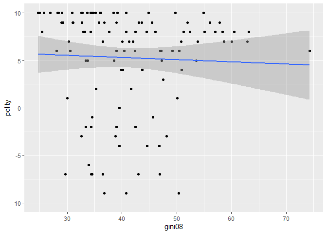<!-- -->

``` r
# correlação gini polity
cor.test( banco$gini08, banco$polity )
```

    ## 
    ##  Pearson's product-moment correlation
    ## 
    ## data:  banco$gini08 and banco$polity
    ## t = -0.43417, df = 113, p-value = 0.665
    ## alternative hypothesis: true correlation is not equal to 0
    ## 95 percent confidence interval:
    ##  -0.2222590  0.1433725
    ## sample estimates:
    ##         cor 
    ## -0.04080936

``` r
# regressão gini polity
reg_gini_pol <- lm( polity ~ gini08, data = banco )
summary( reg_gini_pol )
```

    ## 
    ## Call:
    ## lm(formula = polity ~ gini08, data = banco)
    ## 
    ## Residuals:
    ##     Min      1Q  Median      3Q     Max 
    ## -14.374  -1.300   2.364   4.087   5.040 
    ## 
    ## Coefficients:
    ##             Estimate Std. Error t value Pr(>|t|)   
    ## (Intercept)  6.21813    2.20594   2.819  0.00569 **
    ## gini08      -0.02292    0.05280  -0.434  0.66499   
    ## ---
    ## Signif. codes:  0 '***' 0.001 '**' 0.01 '*' 0.05 '.' 0.1 ' ' 1
    ## 
    ## Residual standard error: 5.535 on 113 degrees of freedom
    ##   (52 observations deleted due to missingness)
    ## Multiple R-squared:  0.001665,   Adjusted R-squared:  -0.007169 
    ## F-statistic: 0.1885 on 1 and 113 DF,  p-value: 0.665

``` r
# INTERPRETAÇÃO: Na correlação, temos um p-valor bem alto, de 0.665, e um intervalo de confiança de 95% entre -0.222 e 0.14,
#                no qual está presente o valor 0. Isso indica que não há correlação signficativa entre as variáveis.
#                Esses dois fatores indicam que não podemos imediatamente rejeitar a hipótese nula para essa relação.
#                Na regressão, temos o intercepto com valor 6.21813 a um p-valor bem baixo, de 0.00569. Quanto à va-
#                riável gini08, essa tem impacto negativo baixíssimo na variável polity, de -0.02292, acompanhado de
#                um p-valor bem alto de 0.66499. O erro residual padrão é alto, de 5.535, e o R quadrado é extrema-
#                mente baixo, de 0.001665, o que deixa claro o baixo poder explicativo do modelo.

# CONCLUSÃO: Todos os resultados deixam claro que é baixa ou inexistente a relação entre gini08 e as medidas de democracia
#            nos países. Apenas dois dos resultados, dem_score14 e fhrate04_rev, apresentaram valores estatísticamente sig-
#            nificantes, e mesmo assim, foram baixos e negativos. Os outros três resultados simplesmente não apresentaram
#            significância, demonstrando que gini08 não impacta em democ11, fhrate08_rev, e polity. Em suma, não podemos
#            dizer que gini08 afeta democracia de maneira muito forte.

### Avalie a relação entre todas as medidas de democracia e crescimento econômico, utilizando a vari-
### ável `gdppcap08`. Descreva graficamente esta variável, a relação entre as duas variáveis, meça a
### correlação entre elas e faça regressões lineares (interpretando em profundidade os resultados dos
### coeficientes e medidas de desempenho dos modelos). Enfatize as semelhanças e diferenças entre os
### resultados. Quais são suas conclusões?

# Descrever graficamente gdppcap08
ggplot( banco, aes( gdppcap08 ) ) +
        geom_boxplot( )
```

    ## Warning: Removed 15 rows containing non-finite values (stat_boxplot).

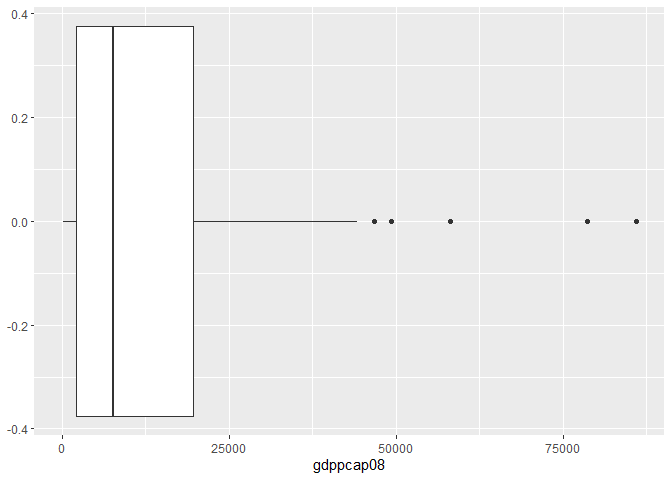<!-- -->

``` r
# descrever graficamente relação entre gdppcap08 e dem_score14
ggplot( banco, aes( gdppcap08, dem_score14 ) ) +
        geom_point( ) +      
        geom_smooth( method = "lm" )
```

    ## `geom_smooth()` using formula 'y ~ x'

    ## Warning: Removed 15 rows containing non-finite values (stat_smooth).

    ## Warning: Removed 15 rows containing missing values (geom_point).

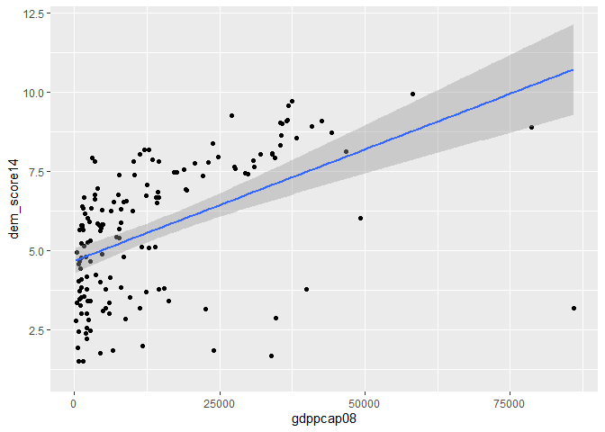<!-- -->

``` r
# correlação gdppcap08 dem_score14
cor.test( banco$gdppcap08, banco$dem_score14 )
```

    ## 
    ##  Pearson's product-moment correlation
    ## 
    ## data:  banco$gdppcap08 and banco$dem_score14
    ## t = 7.1713, df = 150, p-value = 3.159e-11
    ## alternative hypothesis: true correlation is not equal to 0
    ## 95 percent confidence interval:
    ##  0.3763618 0.6150148
    ## sample estimates:
    ##       cor 
    ## 0.5052872

``` r
# regressão gdppcap08 dem_score14
reg_gdp_dem14 <- lm( dem_score14 ~ gdppcap08, data = banco )
summary( reg_gdp_dem14 )
```

    ## 
    ## Call:
    ## lm(formula = dem_score14 ~ gdppcap08, data = banco)
    ## 
    ## Residuals:
    ##     Min      1Q  Median      3Q     Max 
    ## -7.5428 -1.3420  0.6982  1.2843  3.0329 
    ## 
    ## Coefficients:
    ##              Estimate Std. Error t value Pr(>|t|)    
    ## (Intercept) 4.678e+00  2.017e-01  23.197  < 2e-16 ***
    ## gdppcap08   7.040e-05  9.817e-06   7.171 3.16e-11 ***
    ## ---
    ## Signif. codes:  0 '***' 0.001 '**' 0.01 '*' 0.05 '.' 0.1 ' ' 1
    ## 
    ## Residual standard error: 1.864 on 150 degrees of freedom
    ##   (15 observations deleted due to missingness)
    ## Multiple R-squared:  0.2553, Adjusted R-squared:  0.2504 
    ## F-statistic: 51.43 on 1 and 150 DF,  p-value: 3.159e-11

``` r
# INTERPRETAÇÃO: A correlação entre gdppcap08 e dem_score14 é positiva e significativa, dado que o p-valor
#                é extremamente baixo e o intervalo de confiança de 95%, inteiramente positivo, vai de 0.3763 a
#                0.615, ou seja, não inclui 0. A regressão linar tem intercepto 4.678e+00, com p-valor
#                extremamente pequeno, de 2e-16, mostrando a robustez do resultado. Tem também gdppcap08
#                com valor positivo de 7.040e-05 e p-valor extremamente pequeno, de 3.16e-11. Esses valores
#                baixos em ambos os p-valor deixam claro a significância dos resultados. O erro residual padrão
#                tem valor de 1.864, e o R quadrado tem valor alto de 0.2553, mostrando que o poder explicativo
#                desse modelo é grande, i.e., gdppcap08 é responsável por uma boa parcela da variação em dem_score14.

# descrever graficamente relação entre gdppcap08 e democ11
ggplot( banco, aes( gdppcap08, democ11 ) ) +
        geom_point( ) +      
        geom_smooth( method = "lm" )
```

    ## `geom_smooth()` using formula 'y ~ x'

    ## Warning: Removed 25 rows containing non-finite values (stat_smooth).

    ## Warning: Removed 25 rows containing missing values (geom_point).

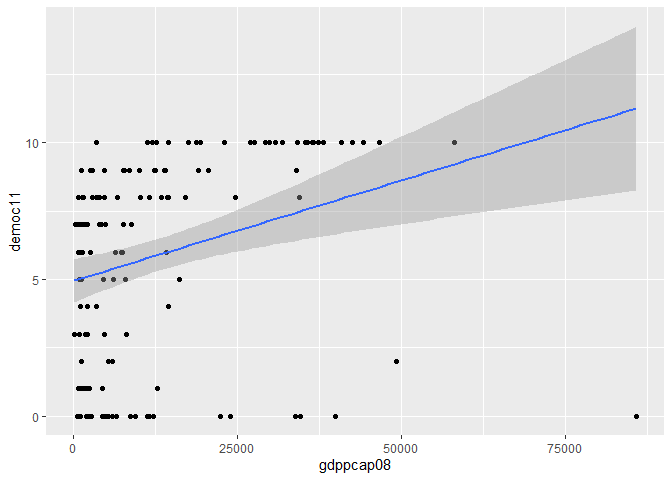<!-- -->

``` r
# correlação gdppcap08 democ11
cor.test( banco$gdppcap08, banco$democ11 )
```

    ## 
    ##  Pearson's product-moment correlation
    ## 
    ## data:  banco$gdppcap08 and banco$democ11
    ## t = 3.6037, df = 140, p-value = 0.000435
    ## alternative hypothesis: true correlation is not equal to 0
    ## 95 percent confidence interval:
    ##  0.1330147 0.4351981
    ## sample estimates:
    ##      cor 
    ## 0.291358

``` r
# regressão gdppcap08 democ11
reg_gdp_dem11 <- lm( democ11 ~ gdppcap08, data = banco )
summary( reg_gdp_dem11 )
```

    ## 
    ## Call:
    ## lm(formula = democ11 ~ gdppcap08, data = banco)
    ## 
    ## Residuals:
    ##     Min      1Q  Median      3Q     Max 
    ## -11.258  -3.030   1.723   2.783   4.803 
    ## 
    ## Coefficients:
    ##              Estimate Std. Error t value Pr(>|t|)    
    ## (Intercept) 4.939e+00  4.026e-01  12.270  < 2e-16 ***
    ## gdppcap08   7.359e-05  2.042e-05   3.604 0.000435 ***
    ## ---
    ## Signif. codes:  0 '***' 0.001 '**' 0.01 '*' 0.05 '.' 0.1 ' ' 1
    ## 
    ## Residual standard error: 3.57 on 140 degrees of freedom
    ##   (25 observations deleted due to missingness)
    ## Multiple R-squared:  0.08489,    Adjusted R-squared:  0.07835 
    ## F-statistic: 12.99 on 1 and 140 DF,  p-value: 0.000435

``` r
# INTERPRETAÇÃO: O teste de correlação apresenta resultados significativos, dado que o p-valor é bem baixo, de
#                0.000435, e que o intervalo de confiança de 95% é inteiramente positivo, ou seja, não inclui 0,
#                indo de 0.1330 a 0.4351. A correlação também é positiva. No que diz respeito à regressão linear,
#                temos p-valor baixo para ambos os intercepto e gdppcap08, sendo o primeiro menor que o segundo.
#                Isso deixa claro que ambos o intercepto e gdppcap08 são estatísticamente significantes. O intercepto
#                tem valor de 4.939e+00 e gdppcap08 tem valor de 7.359e-05. O erro residual padrão, i.e., a distância
#                média entre os valores das observações e a linha de regressão, é alto, de 3.57. O R quadrado é razoa-
#                velmente baixo, de 0.08489, mostrando o baixo valor explicativo que esse modelo tem.

# descrever graficamente relação entre gdppcap08 e fhrate04_rev
ggplot( banco, aes( gdppcap08, fhrate04_rev ) ) +
        geom_point( ) +      
        geom_smooth( method = "lm" )
```

    ## `geom_smooth()` using formula 'y ~ x'

    ## Warning: Removed 15 rows containing non-finite values (stat_smooth).

    ## Warning: Removed 15 rows containing missing values (geom_point).

<!-- -->

``` r
# correlação gdppcap08 fhrate04_rev
cor.test( banco$gdppcap08, banco$fhrate04_rev )
```

    ## 
    ##  Pearson's product-moment correlation
    ## 
    ## data:  banco$gdppcap08 and banco$fhrate04_rev
    ## t = 6.0129, df = 150, p-value = 1.331e-08
    ## alternative hypothesis: true correlation is not equal to 0
    ## 95 percent confidence interval:
    ##  0.3027442 0.5605748
    ## sample estimates:
    ##       cor 
    ## 0.4407043

``` r
# regressão gdppcap08 fhrate04_rev
reg_gdp_fh04 <- lm( fhrate04_rev ~ gdppcap08, data = banco )
summary( reg_gdp_fh04 )
```

    ## 
    ## Call:
    ## lm(formula = fhrate04_rev ~ gdppcap08, data = banco)
    ## 
    ## Residuals:
    ##     Min      1Q  Median      3Q     Max 
    ## -6.0897 -1.4154  0.5914  1.2481  2.9773 
    ## 
    ## Coefficients:
    ##              Estimate Std. Error t value Pr(>|t|)    
    ## (Intercept) 3.828e+00  1.894e-01  20.210  < 2e-16 ***
    ## gdppcap08   5.545e-05  9.222e-06   6.013 1.33e-08 ***
    ## ---
    ## Signif. codes:  0 '***' 0.001 '**' 0.01 '*' 0.05 '.' 0.1 ' ' 1
    ## 
    ## Residual standard error: 1.751 on 150 degrees of freedom
    ##   (15 observations deleted due to missingness)
    ## Multiple R-squared:  0.1942, Adjusted R-squared:  0.1888 
    ## F-statistic: 36.16 on 1 and 150 DF,  p-value: 1.331e-08

``` r
# INTERPRETAÇÃO: A correlação entre as duas variáves é positiva e significativa, com um intervalo de confiança de 95%
#                inteiramente positivo, indo de 0.302 a 0.560. O p-valor é baixíssimo, de 1.331e-08, mostrando a sig-
#                nificância do resultado e a possibilidade de se rejeitar a hipótese nula. No que diz respeito à re-
#                gressão, temos ambos intercepto e gdppcap08 com valores estatísticamente significantes. O intercepto
#                tem valor de 3.828e+00, a um p-valor de 2e-16, e gdppcap08 tem valor de 5.545e-05, a um p-valor de
#                1.33e-08, ambos com três asteriscos. O erro residual padrão é ligeiramente alto, de 1.751, mostrando
#                que os valores das observações tem distância média não muito alta da reta de regressão, e o R quadrado
#                tem valor de 0.1942, alto, mostrando que é razoável o poder explicativo desse modelo.

# descrever graficamente relação entre gdppcap08 e fhrate08_rev
ggplot( banco, aes( gdppcap08, fhrate08_rev ) ) +
        geom_point( ) +      
        geom_smooth( method = "lm" )
```

    ## `geom_smooth()` using formula 'y ~ x'

    ## Warning: Removed 16 rows containing non-finite values (stat_smooth).

    ## Warning: Removed 16 rows containing missing values (geom_point).

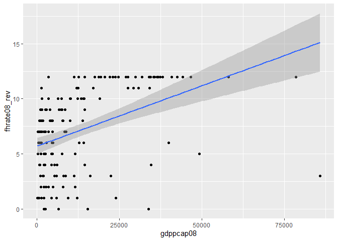<!-- -->

``` r
# correlação gdppcap08 fhrate08_rev
cor.test( banco$gdppcap08, banco$fhrate08_rev )
```

    ## 
    ##  Pearson's product-moment correlation
    ## 
    ## data:  banco$gdppcap08 and banco$fhrate08_rev
    ## t = 6.0508, df = 149, p-value = 1.115e-08
    ## alternative hypothesis: true correlation is not equal to 0
    ## 95 percent confidence interval:
    ##  0.3061176 0.5638582
    ## sample estimates:
    ##     cor 
    ## 0.44413

``` r
# regressão gdppcap08 fhrate08_rev
reg_gdp_fh08 <- lm( fhrate08_rev ~ gdppcap08, data = banco )
summary( reg_gdp_fh08 )
```

    ## 
    ## Call:
    ## lm(formula = fhrate08_rev ~ gdppcap08, data = banco)
    ## 
    ## Residuals:
    ##     Min      1Q  Median      3Q     Max 
    ## -12.124  -2.345   1.164   2.510   5.918 
    ## 
    ## Coefficients:
    ##              Estimate Std. Error t value Pr(>|t|)    
    ## (Intercept) 5.698e+00  3.739e-01  15.237  < 2e-16 ***
    ## gdppcap08   1.098e-04  1.814e-05   6.051 1.11e-08 ***
    ## ---
    ## Signif. codes:  0 '***' 0.001 '**' 0.01 '*' 0.05 '.' 0.1 ' ' 1
    ## 
    ## Residual standard error: 3.438 on 149 degrees of freedom
    ##   (16 observations deleted due to missingness)
    ## Multiple R-squared:  0.1973, Adjusted R-squared:  0.1919 
    ## F-statistic: 36.61 on 1 and 149 DF,  p-value: 1.115e-08

``` r
# INTERPRETAÇÃO: A correlação entre as duas variáveis é positiva e estatísticamente significativa. Temos um intervalo
#                de 95% de confiança inteiramente positivo, i.e., não inclui 0, indo de 0.30611 a 0.56385, com um
#                p-valor de 1.115e-08, evidenciando a possibilidade de se rejeitar a hipótese nula. No que diz respeito
#                à regressão linear, ela reforça essa relação estatística. O intercepto tem valor de 5.698e+00, a um
#                p-valor de 2e-16, enquanto gdppcap08 tem valor de 1.098e-04, a um p-valor de 1.11e-08. Ambos os p-
#                valor são baixíssimos, indicando a significância estatística das duas variáveis. O erro residual padrão
#                tem valor de 3.438, o que é ligeiramente alto, e o R quadrado tem valor alto de 0.1973, mostrando que
#                o modelo tem bom poder explicativo.

# descrever graficamente relação entre gdppcap08 e polity
ggplot( banco, aes( gdppcap08, polity ) ) +
        geom_point( ) +      
        geom_smooth( method = "lm" )
```

    ## `geom_smooth()` using formula 'y ~ x'

    ## Warning: Removed 25 rows containing non-finite values (stat_smooth).

    ## Warning: Removed 25 rows containing missing values (geom_point).

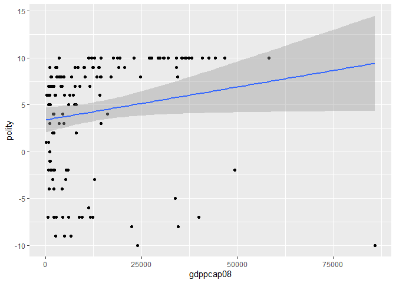<!-- -->

``` r
# correlação gdppcap08 polity
cor.test( banco$gdppcap08, banco$polity )
```

    ## 
    ##  Pearson's product-moment correlation
    ## 
    ## data:  banco$gdppcap08 and banco$polity
    ## t = 2.0332, df = 140, p-value = 0.04392
    ## alternative hypothesis: true correlation is not equal to 0
    ## 95 percent confidence interval:
    ##  0.004758504 0.325013386
    ## sample estimates:
    ##      cor 
    ## 0.169353

``` r
# regressão gdppcap08 polity
reg_gdp_pol <- lm( polity ~ gdppcap08, data = banco )
summary( reg_gdp_pol )
```

    ## 
    ## Call:
    ## lm(formula = polity ~ gdppcap08, data = banco)
    ## 
    ## Residuals:
    ##     Min      1Q  Median      3Q     Max 
    ## -19.426  -4.207   2.847   4.332   6.378 
    ## 
    ## Coefficients:
    ##              Estimate Std. Error t value Pr(>|t|)    
    ## (Intercept) 3.375e+00  6.833e-01   4.940  2.2e-06 ***
    ## gdppcap08   7.047e-05  3.466e-05   2.033   0.0439 *  
    ## ---
    ## Signif. codes:  0 '***' 0.001 '**' 0.01 '*' 0.05 '.' 0.1 ' ' 1
    ## 
    ## Residual standard error: 6.059 on 140 degrees of freedom
    ##   (25 observations deleted due to missingness)
    ## Multiple R-squared:  0.02868,    Adjusted R-squared:  0.02174 
    ## F-statistic: 4.134 on 1 and 140 DF,  p-value: 0.04392

``` r
# INTERPRETAÇÃO: A correlação entre as duas variáveis é positiva e estatísticamente significativa. Temos um intervalo
#                de 95% de confiança inteiramente positivo, indo de 0.004758 à 0.32501, com um p-valor de 0.04392, o
#                qual é baixo. No que diz respeito à regressão linear, ela reforça ligeiramente essa relação estatística.
#                Temos um intercepto com valor de 3.374e+00, com p-valor baixo de 2.2e-06, e temos gdppcap08 com valor
#                baixo de 7.047e-05, com um p-valor de 0.0439, tendo apenas um asterisco. O erro residual padrão é razoa-
#                velmente alto, de 6.059, e o R qadrado é baixo, de 0.02868, demonstrando o baixo poder explicativo de
#                gdppcap08 sobre polity. 

# CONCLUSÃO: Com excessão do impacto de gdppcap08 sobre polity, o qual foi positivo porém baixo, todas as outras relações
#            entre gdppcap08 e dem_score14, democ11, fhrate04_rev e fhrate08_rev, foram também positivas, porém bem mais
#            fortes. Podemos concluir que renda per capta, como medida de desenvolvimento econômico, tem um bom impacto
#            sobre sobre os níveis de democracia, de modo que valores mais altos de gdppcap08 estejam associados a valores
#            mais altos nos índices de democracia.

### Avalie a relação entre todas as medidas de democracia e produção de petróleo, utilizando a variá-
### vel `oil`. Descreva graficamente esta variável, a relação entre as duas variáveis, meça a corre-
### lação entre elas e faça regressões lineares (interpretando em profundidade os resultados dos co-
### eficientes e medidas de desempenho dos modelos). Enfatize as semelhanças e diferenças entre os
### resultados. Quais são suas conclusões?

# Descrever graficamente oil
ggplot( banco, aes( oil ) ) +
        geom_histogram( )
```

    ## `stat_bin()` using `bins = 30`. Pick better value with `binwidth`.

    ## Warning: Removed 2 rows containing non-finite values (stat_bin).

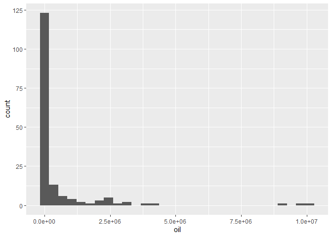<!-- -->

``` r
# descrever graficamente relação entre oil e dem_score14
ggplot( banco, aes( oil, dem_score14 ) ) +
        geom_point( ) +      
        geom_smooth( method = "lm" )
```

    ## `geom_smooth()` using formula 'y ~ x'

    ## Warning: Removed 2 rows containing non-finite values (stat_smooth).

    ## Warning: Removed 2 rows containing missing values (geom_point).

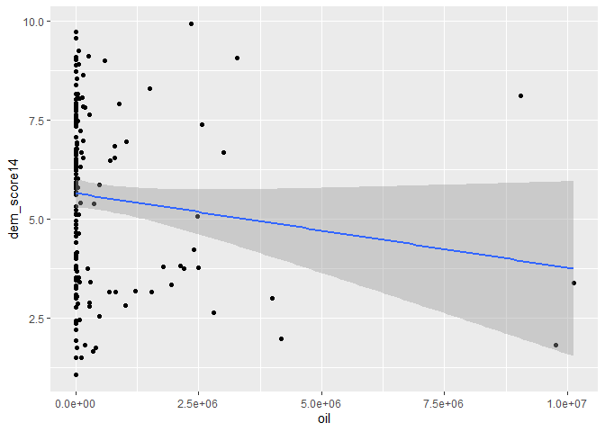<!-- -->

``` r
# correlação oil dem_score14
cor.test( banco$oil, banco$dem_score14 )
```

    ## 
    ##  Pearson's product-moment correlation
    ## 
    ## data:  banco$oil and banco$dem_score14
    ## t = -1.6344, df = 163, p-value = 0.1041
    ## alternative hypothesis: true correlation is not equal to 0
    ## 95 percent confidence interval:
    ##  -0.27443572  0.02631799
    ## sample estimates:
    ##        cor 
    ## -0.1269762

``` r
# regressão oil dem_score14
reg_oil_dem14 <- lm( dem_score14 ~ oil, data = banco )
summary( reg_oil_dem14 )
```

    ## 
    ## Call:
    ## lm(formula = dem_score14 ~ oil, data = banco)
    ## 
    ## Residuals:
    ##    Min     1Q Median     3Q    Max 
    ## -4.574 -1.934  0.144  1.797  4.718 
    ## 
    ## Coefficients:
    ##               Estimate Std. Error t value Pr(>|t|)    
    ## (Intercept)  5.654e+00  1.795e-01  31.503   <2e-16 ***
    ## oil         -1.881e-07  1.151e-07  -1.634    0.104    
    ## ---
    ## Signif. codes:  0 '***' 0.001 '**' 0.01 '*' 0.05 '.' 0.1 ' ' 1
    ## 
    ## Residual standard error: 2.177 on 163 degrees of freedom
    ##   (2 observations deleted due to missingness)
    ## Multiple R-squared:  0.01612,    Adjusted R-squared:  0.01009 
    ## F-statistic: 2.671 on 1 and 163 DF,  p-value: 0.1041

``` r
# INTERPRETAÇÃO: Não podemos dizer que a correlação entre as duas variáveis é estatísticamente significativa. Isso acontece
#                por dois fatores: o intervalo de 95% de confiança varia entre valores negativos e positivos, i.e., inclui
#                0, indo de -0.2744 à 0.02631, e o p-valor é bem alto, sendo igual a 0.1041, indicando a possibilidade de
#                aceitarmos a hipótese nula. No que diz respeito à regressão linear, ela reforça os achados da correlação.
#                O intercepto tem valor de 5.654e+00, com p-valor baixíssimo, de 2e-16, três asteriscos. Já oil tem valor
#                de -1.881e-07, ou seja, influencia pouquíssimo em dem_score14, e tem p-valor alto de 0.104. O erro residual
#                padrão é razoável, de 2.177, e o R quadrado é de 0.01612, ou seja, deixando claro o baixo valor explicativo
#                do modelo, em termos do quão bem oil explica variações em dem_score14.

# descrever graficamente relação entre oil e democ11
ggplot( banco, aes( oil, democ11 ) ) +
        geom_point( ) +      
        geom_smooth( method = "lm" )
```

    ## `geom_smooth()` using formula 'y ~ x'

    ## Warning: Removed 23 rows containing non-finite values (stat_smooth).

    ## Warning: Removed 23 rows containing missing values (geom_point).

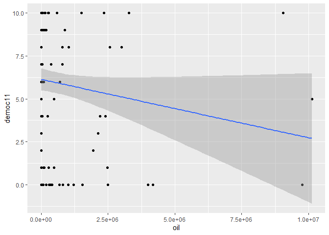<!-- -->

``` r
# correlação oil democ11
cor.test( banco$oil, banco$democ11 )
```

    ## 
    ##  Pearson's product-moment correlation
    ## 
    ## data:  banco$oil and banco$democ11
    ## t = -1.718, df = 142, p-value = 0.08798
    ## alternative hypothesis: true correlation is not equal to 0
    ## 95 percent confidence interval:
    ##  -0.29928445  0.02138076
    ## sample estimates:
    ##        cor 
    ## -0.1426942

``` r
# regressão oil democ11
reg_oil_dem11 <- lm( democ11 ~ oil, data = banco )
summary( reg_oil_dem11 )
```

    ## 
    ## Call:
    ## lm(formula = democ11 ~ oil, data = banco)
    ## 
    ## Residuals:
    ##     Min      1Q  Median      3Q     Max 
    ## -6.1387 -3.2230  0.8616  2.8893  6.9421 
    ## 
    ## Coefficients:
    ##               Estimate Std. Error t value Pr(>|t|)    
    ## (Intercept)  6.139e+00  3.259e-01  18.837   <2e-16 ***
    ## oil         -3.402e-07  1.980e-07  -1.718    0.088 .  
    ## ---
    ## Signif. codes:  0 '***' 0.001 '**' 0.01 '*' 0.05 '.' 0.1 ' ' 1
    ## 
    ## Residual standard error: 3.685 on 142 degrees of freedom
    ##   (23 observations deleted due to missingness)
    ## Multiple R-squared:  0.02036,    Adjusted R-squared:  0.01346 
    ## F-statistic: 2.951 on 1 and 142 DF,  p-value: 0.08798

``` r
# INTERPRETAÇÃO: Não podemos dizer que a correlação entre as duas variáveis é estatísticamente significativa. Isso acontece
#                por dois fatores: o intervalo de confiança de 95% varia entre valores negativos e positivos, i.e., inclui
#                0, indo de -0.2992 à 0.02138, e o p-valor é ligeiramente alto, sendo 0.0879, indicando a possibilidade de
#                aceitarmos a hipótese nula. No que diz respeito à regressão linear, ela reforça os resultados da correlação.
#                O intercepto tem valor de 6.139e+00, com p-valor baixíssimo de 2e-16, três asteriscos. Já oil tem valor muito
#                baixo, de -3.402e-07, influenciando poquíssimo em democ11, e tem p-valor ligeiramente alto, de 0.088. O erro
#                residual é razoavelmente alto, de 3.685, e o R quadrado é baixíssimo, de 0.02036, deixando claro o baixo valor
#                explicativo do modelo. 

# descrever graficamente relação entre oil e fhrate04_rev
ggplot( banco, aes( oil, fhrate04_rev ) ) +
        geom_point( ) +      
        geom_smooth( method = "lm" )
```

    ## `geom_smooth()` using formula 'y ~ x'

    ## Warning: Removed 15 rows containing non-finite values (stat_smooth).

    ## Warning: Removed 15 rows containing missing values (geom_point).

<!-- -->

``` r
# correlação oil fhrate04_rev
cor.test( banco$oil, banco$fhrate04_rev )
```

    ## 
    ##  Pearson's product-moment correlation
    ## 
    ## data:  banco$oil and banco$fhrate04_rev
    ## t = -1.9244, df = 150, p-value = 0.0562
    ## alternative hypothesis: true correlation is not equal to 0
    ## 95 percent confidence interval:
    ##  -0.306837012  0.004083069
    ## sample estimates:
    ##        cor 
    ## -0.1552185

``` r
# regressão oil fhrate04_rev
reg_oil_fh04 <- lm( fhrate04_rev ~ oil, data = banco )
summary( reg_oil_fh04 )
```

    ## 
    ## Call:
    ## lm(formula = fhrate04_rev ~ oil, data = banco)
    ## 
    ## Residuals:
    ##     Min      1Q  Median      3Q     Max 
    ## -3.6658 -1.7613  0.3246  1.8334  4.1268 
    ## 
    ## Coefficients:
    ##               Estimate Std. Error t value Pr(>|t|)    
    ## (Intercept)  4.675e+00  1.663e-01  28.109   <2e-16 ***
    ## oil         -1.990e-07  1.034e-07  -1.924   0.0562 .  
    ## ---
    ## Signif. codes:  0 '***' 0.001 '**' 0.01 '*' 0.05 '.' 0.1 ' ' 1
    ## 
    ## Residual standard error: 1.934 on 150 degrees of freedom
    ##   (15 observations deleted due to missingness)
    ## Multiple R-squared:  0.02409,    Adjusted R-squared:  0.01759 
    ## F-statistic: 3.703 on 1 and 150 DF,  p-value: 0.0562

``` r
# INTERPRETAÇÃO: Na correlação, apesar do p-valor de 0.0562, i.e., um p-valor razoável, não podemos dizer que a correlação é
#                estatísticamente significante, dado que o intervalo de confiança de 95% inclui o valor 0. Portanto, não po-
#                demos rejeitar a hipótese nula. No que diz respeito à regressão linear, ela reforça os resultados da corre-
#                lação. O intercepto tem valor de 4.675e+00, com p-valor baixíssimo de 2e-16, três asteriscos. Já oil tem
#                valor baixíssimo e negativo de -1.990e-07, mostrando o fraco impacto na variação de fhrate04_rev, com p-valor
#                razoável de 0.0562. O erro residual padrão é razoável, de 1.934, e o R quadrado é baixo, de 0.02409, deixando
#                claro o baixo valor de oil como explicador da variação em fhrate04_rev.

# descrever graficamente relação entre oil e fhrate08_rev
ggplot( banco, aes( oil, fhrate08_rev ) ) +
        geom_point( ) +      
        geom_smooth( method = "lm" )
```

    ## `geom_smooth()` using formula 'y ~ x'

    ## Warning: Removed 16 rows containing non-finite values (stat_smooth).

    ## Warning: Removed 16 rows containing missing values (geom_point).

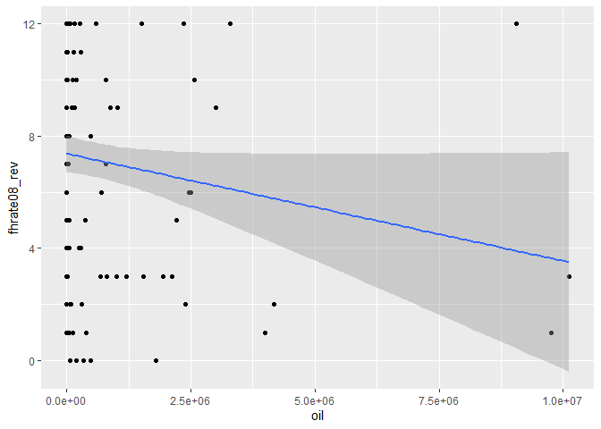<!-- -->

``` r
# correlação oil fhrate08_rev
cor.test( banco$oil, banco$fhrate08_rev )
```

    ## 
    ##  Pearson's product-moment correlation
    ## 
    ## data:  banco$oil and banco$fhrate08_rev
    ## t = -1.8779, df = 149, p-value = 0.06235
    ## alternative hypothesis: true correlation is not equal to 0
    ## 95 percent confidence interval:
    ##  -0.304387817  0.007867529
    ## sample estimates:
    ##       cor 
    ## -0.152052

``` r
# regressão oil fhrate08_rev
reg_oil_fh08 <- lm( fhrate08_rev ~ oil, data = banco )
summary( reg_oil_fh08 )
```

    ## 
    ## Call:
    ## lm(formula = fhrate08_rev ~ oil, data = banco)
    ## 
    ## Residuals:
    ##     Min      1Q  Median      3Q     Max 
    ## -7.3506 -3.3777 -0.3643  3.6243  8.0856 
    ## 
    ## Coefficients:
    ##               Estimate Std. Error t value Pr(>|t|)    
    ## (Intercept)  7.378e+00  3.286e-01  22.449   <2e-16 ***
    ## oil         -3.824e-07  2.037e-07  -1.878   0.0624 .  
    ## ---
    ## Signif. codes:  0 '***' 0.001 '**' 0.01 '*' 0.05 '.' 0.1 ' ' 1
    ## 
    ## Residual standard error: 3.808 on 149 degrees of freedom
    ##   (16 observations deleted due to missingness)
    ## Multiple R-squared:  0.02312,    Adjusted R-squared:  0.01656 
    ## F-statistic: 3.526 on 1 and 149 DF,  p-value: 0.06235

``` r
# INTERPRETAÇÃO: Na correlação, apesar do p-valor de 0.06235, o qual é ligeiramente alto, não podemos dizer que a correlação
#                é estatísticamente significante, dado que o intervalo de confiança de 95% inclui o valor 0. Portanto, não
#                podemos rejeitar a hipótese nula. No que diz respeito à regressão linear, ela reforça os resultados da cor-
#                relação. O intercepto tem valor de 7.378e+00, com p-valor baixíssimo de 2e-16. Já oil tem valor negativo e
#                baixíssimo de -3.824e-07, mostrando o fraco impacto na variação de fhrate08_rev, com p-valor de 0.0624. O 
#                erro residual padrão é alto, de 3.526, e o R quadrado é baixo, de 0.02312, deixando claro o baixo valor 
#                explicativo do modelo.

# descrever graficamente relação entre oil e polity
ggplot( banco, aes( oil, polity ) ) +
        geom_point( ) +      
        geom_smooth( method = "lm" )
```

    ## `geom_smooth()` using formula 'y ~ x'

    ## Warning: Removed 23 rows containing non-finite values (stat_smooth).

    ## Warning: Removed 23 rows containing missing values (geom_point).

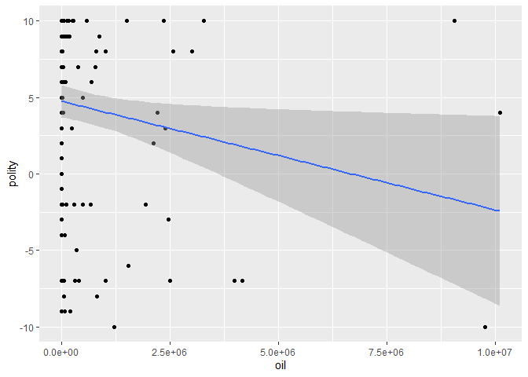<!-- -->

``` r
# correlação oil polity
cor.test( banco$oil, banco$polity )
```

    ## 
    ##  Pearson's product-moment correlation
    ## 
    ## data:  banco$oil and banco$polity
    ## t = -2.195, df = 142, p-value = 0.02979
    ## alternative hypothesis: true correlation is not equal to 0
    ## 95 percent confidence interval:
    ##  -0.33480603 -0.01811182
    ## sample estimates:
    ##        cor 
    ## -0.1811511

``` r
# regressão oil polity
reg_oil_pol <- lm( polity ~ oil, data = banco )
summary( reg_oil_pol )
```

    ## 
    ## Call:
    ## lm(formula = polity ~ oil, data = banco)
    ## 
    ## Residuals:
    ##     Min      1Q  Median      3Q     Max 
    ## -13.890  -4.906   2.248   4.505  11.681 
    ## 
    ## Coefficients:
    ##               Estimate Std. Error t value Pr(>|t|)    
    ## (Intercept)  4.752e+00  5.327e-01   8.922 2.09e-15 ***
    ## oil         -7.105e-07  3.237e-07  -2.195   0.0298 *  
    ## ---
    ## Signif. codes:  0 '***' 0.001 '**' 0.01 '*' 0.05 '.' 0.1 ' ' 1
    ## 
    ## Residual standard error: 6.024 on 142 degrees of freedom
    ##   (23 observations deleted due to missingness)
    ## Multiple R-squared:  0.03282,    Adjusted R-squared:  0.026 
    ## F-statistic: 4.818 on 1 and 142 DF,  p-value: 0.02979

``` r
# INTERPRETAÇÃO: A correlação entre as duas variáveis é negativa e estatísticamente significante. Temos um intervalo de con-
#                fiança de 95% inteiramente negativo, indo de -0.3348 à -0.01811. Portanto, podemos rejeitar a hipótese nula.
#                A regressão linear tem intercepto com valor de 4.752e+00, a um p-valor baixíssimo de 2.09e-15. Já oil tem
#                valor negativo baixíssimo de -7.105e-07, com p-valor bom de 0.0298. O erro residual padrão tem valor alto de
#                6.024, e o R quadrado é baixo, de 0.03282, deixando claro o baixo valor explicativo do modelo.

# CONCLUSÃO: Com exceção da relação entre polity e oil, todas as outras relações entre oil e dem_score14, democ11, fhrate04_rev
#            e fhrate08_rev são fracas e sem significância estatística. Isso significa que a produção de petróleo tem pouca
#            relação com alterações nos níveis de democracia nos países. Ou seja, produção de petróleo não explica variação
#            de grau em níveis de democracia.

### Avalie a relação entre crescimento econômico e produção de petróleo. Descreva a relação entre as
### duas variáveis, meça a correlação entre elas e faça regressões lineares (interpretando em profun-
### didade os resultados dos coeficientes e medidas de desempenho dos modelos). Enfatize as semelhan-
### ças e diferenças entre os resultados. Quais são suas conclusões?

ggplot( banco, aes( oil ) ) +
        geom_boxplot( )
```

    ## Warning: Removed 2 rows containing non-finite values (stat_boxplot).

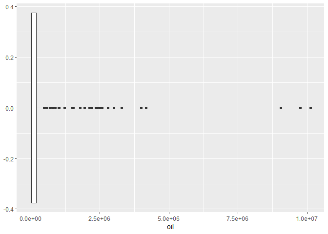<!-- -->

``` r
ggplot( banco, aes( gdppcap08 ) ) +
        geom_histogram( aes( y = ..density.. ), colour = "white", fill = "grey" ) +
        geom_density( colour = "red" )
```

    ## `stat_bin()` using `bins = 30`. Pick better value with `binwidth`.

    ## Warning: Removed 15 rows containing non-finite values (stat_bin).

    ## Warning: Removed 15 rows containing non-finite values (stat_density).

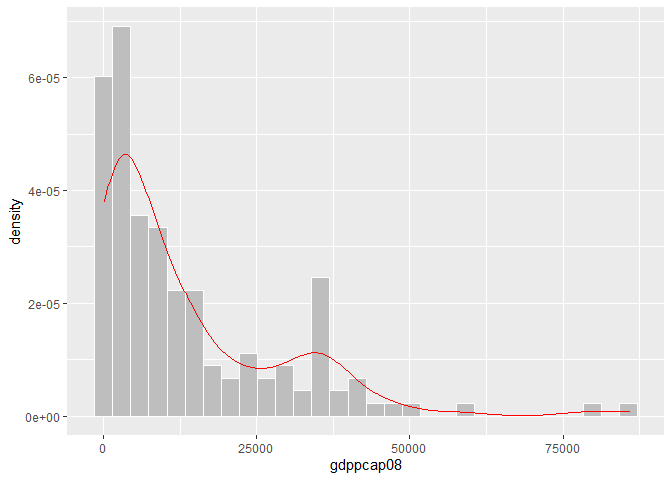<!-- -->

``` r
# Descrever graficamente oil e gdppcap08
ggplot( banco, aes( oil, gdppcap08 ) ) +
        geom_point( ) +      
        geom_smooth( method = "lm" )
```

    ## `geom_smooth()` using formula 'y ~ x'

    ## Warning: Removed 16 rows containing non-finite values (stat_smooth).

    ## Warning: Removed 16 rows containing missing values (geom_point).

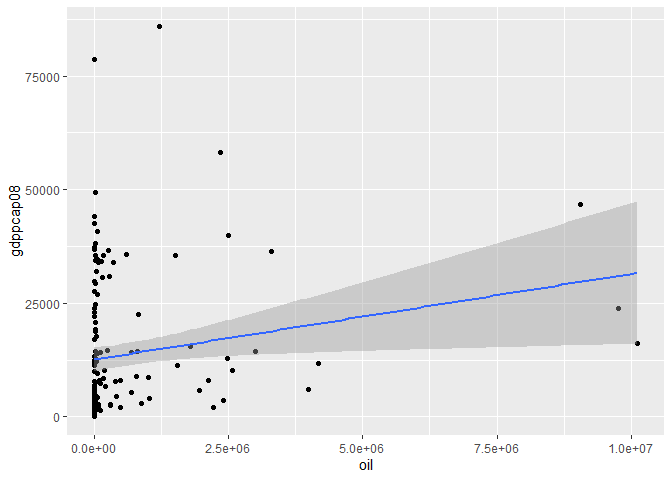<!-- -->

``` r
# correlação oil gdppcap08
cor.test( banco$oil, banco$gdppcap08 )
```

    ## 
    ##  Pearson's product-moment correlation
    ## 
    ## data:  banco$oil and banco$gdppcap08
    ## t = 2.3051, df = 149, p-value = 0.02254
    ## alternative hypothesis: true correlation is not equal to 0
    ## 95 percent confidence interval:
    ##  0.02661893 0.33534756
    ## sample estimates:
    ##       cor 
    ## 0.1855584

``` r
# regressão oil gdppcap08
reg_oil_gdp <- lm( gdppcap08 ~ oil, data = banco )
summary( reg_oil_gdp )
```

    ## 
    ## Call:
    ## lm(formula = gdppcap08 ~ oil, data = banco)
    ## 
    ## Residuals:
    ##    Min     1Q Median     3Q    Max 
    ## -15541 -10735  -6347   6549  70967 
    ## 
    ## Coefficients:
    ##              Estimate Std. Error t value Pr(>|t|)    
    ## (Intercept) 1.262e+04  1.319e+03   9.566   <2e-16 ***
    ## oil         1.884e-03  8.173e-04   2.305   0.0225 *  
    ## ---
    ## Signif. codes:  0 '***' 0.001 '**' 0.01 '*' 0.05 '.' 0.1 ' ' 1
    ## 
    ## Residual standard error: 15280 on 149 degrees of freedom
    ##   (16 observations deleted due to missingness)
    ## Multiple R-squared:  0.03443,    Adjusted R-squared:  0.02795 
    ## F-statistic: 5.313 on 1 and 149 DF,  p-value: 0.02254

``` r
# INTERPRETAÇÃO: A correlação entre as duas variáveis é estatisticamente significante. Temos um intervalo de confiança de
#                95% inteiramente positivo, i.e., não inclui 0, e com valores que vão de 0.02661 à 0.0335. O p-valor é baixo,
#                com valor de 0.02254. Esses dois fatores deixam claro que podemos rejeitar a hipótese nula. No que diz res-
#                peito à regressão, ela corrobora com o resultado da correlação. O intercepto tem valor de 1.262e+04, com p-
#                valor baixíssimo de 2e-16, e oil tem valor baixo 1.884e-03, com p-valor bem baixo de 0.0225, tendo um aste-
#                isco. O erro residual padrão é de 15280, dada a escala alta dos valores das observações, e o R quadrado é
#                baixo, de 0.03443, deixando claro o baixo valor explicativo do modelo.

# CONCLUSÃO: Existe sim uma relação entre produção de petróleo e desenvolvimento econômico, medido em termos da renda per
#            capta. Como a renda per capta é calculada em termos do PIB e do tamanho da população, e como produção de pe-
#            tróleo afeta o PIB de um país, é totalmente compreensível que a produção de petróleo também afete a renda per
#            capta do país.

### A partir das suas conclusões sobre a relação entre democracia, economia e produção de petróleo,
### quais considerações são possíveis fazer sobre a relação CAUSAL entre estas variáveis? Lembre dos
### 4 "hurdles" do livro *Fundamentals of Political Science Research*

# RESPOSTA: De acordo com o livro de Kellstedt e Whitten, os 4 hurdles são considerações que devemos ter sobre a relação
#           entre as variáveis às quais pretendemos atribuir valor causal. Os 4 hurdles são:

#           1. Mecanismo conectando X à Y?
#           2. Podemos eliminar causalidade reversa?
#           3. Existe covariação entre X e Y?
#           4. Controlamos por todas as confounders Z que podem afetar a relação entre X e Y?

#           Para o ponto 4, dificilmente, usando testes que envolvem apens duas variáveis, podemos ter controlados por
#           todos os tipos de confounders que poderiam afetar as relações exploradas. 

#           Para o ponto 3, vimos que há covariação entre somente entre duas medidas de democracia e o indíce de gini08,
#           ou seja, em 3 dos 5 casos apenas 2 apresentaram covariação, portanto, podemos eliminar a possibilidade de 
#           relação causal nesses 3 casos. Na relação entre renda per capta e democracia, todas as relações apresentam
#           covariação, de modo que não podemos aqui eliminar a possibilidade de relação causal. Na relação entre demo-
#           cracia e produção de petróleo, apenas uma relação apresentou covariação, de modo que podemos eliminar a pos-
#           sibilidade de relação causal nos outros 4 casos. E, por último, há covariação entre produção de petróleo e
#           desenvolvimento econômico, de modo que não podemos eliminar a possibilidade de relação causal entre as duas.

#           Para o ponto 2, não podemos eliminar a possibilidade de relação causal reversa entre democracia e desigualdade,
#           democracia e desenvolvimento econômico, e desenvolvimento econômico e produção de petróleo. Porém, podemos eli-
#           minar a possibilidade de causalidade reversa entre democracia e produção de petróleo, já que não é evidente como
#           regimes mais ou menos democráticos afetam a produção de petróleo, dado que existe países, principalmente no
#           oriente médio, pouco democráticos mas que estão entre os principais produtores de petróleo do mundo.

#           Para o ponto 1, a diminuição da desigualdade pode afetar a democracia ao equilibrar os poderes entre os cidadão.
#           Não existem mecanismos evidente de como renda per capta ou produção de petróleo podem afetar o nível de democracia.
#           Quanto à relação entre pib per capta e produção de petróleo, a produção de petróleo afeta o PIB, o qual é usado
#           como base para o cálculo do PIB per capta. Logo, produção de petróleo diretamente afeta desenvolvimento econômico.
```
