Exercicio 6
================
Kaíque Pereira Santos

``` r
### Neste exercício usaremos o banco de dados do ESEB 2018. Para maiores detalhes sobre o survey, ver neste [link](https://www.cesop.unicamp.br/por/eseb).
### O questionário da pesquisa de 2018 está [aqui](https://www.cesop.unicamp.br/vw/1IMr0S64wNQ_MDA_91ea3_/quest_04622.pdf) e pode ser consultado para ter
### maiores detalhes sobre as variáveis.


library( haven )
library( tidyverse )
```

    ## -- Attaching packages -------------------------------------------------------------------------------------------------------------------------- tidyverse 1.3.0 --

    ## v ggplot2 3.3.2     v purrr   0.3.4
    ## v tibble  3.0.3     v dplyr   1.0.0
    ## v tidyr   1.1.0     v stringr 1.4.0
    ## v readr   1.3.1     v forcats 0.5.0

    ## -- Conflicts ----------------------------------------------------------------------------------------------------------------------------- tidyverse_conflicts() --
    ## x dplyr::filter() masks stats::filter()
    ## x dplyr::lag()    masks stats::lag()

``` r
library( observer )
library( tibble )


### O banco de dados está disponível no site do CESOP para usuários cadastrados. Para facilitar o acesso, deixei o banco de dados dispónivel no seguinte
### endereço:

# https://github.com/MartinsRodrigo/Analise-de-dados/raw/master/04622.sav

### Baixe o banco de dados pelo R


url <- "https://github.com/MartinsRodrigo/Analise-de-dados/raw/master/04622.sav"

download.file( url, "banco_ex6.sav", mode = "wb" )


### O banco foi feito em SPSS e está em formato SAV. Carregue-o

banco <- read_sav( "banco_ex6.sav" )

write_sav( banco, "banco.sav" )


### Utilize as funções para observar o banco de dados


banco
```

    ## # A tibble: 2,506 x 286
    ##    A1_Nquest DIAENTR  MESENTR ANOENTR D1A_ID D1A_FAIXAID D2_SEXO D3_ESCOLA
    ##        <dbl>   <dbl> <dbl+lb>   <dbl>  <dbl>   <dbl+lbl> <dbl+l> <dbl+lbl>
    ##  1         1      15 11 [Nov~    2018     41 4 [35 A 44] 2 [Fem~ 5 [Coleg~
    ##  2         2      15 11 [Nov~    2018     23 2 [18 A 24] 1 [Mas~ 5 [Coleg~
    ##  3         3      15 11 [Nov~    2018     21 2 [18 A 24] 2 [Fem~ 6 [Coleg~
    ##  4         4      16 11 [Nov~    2018     39 4 [35 A 44] 1 [Mas~ 3 [Ginás~
    ##  5         5      16 11 [Nov~    2018     64 6 [55 A 64] 1 [Mas~ 0 [Analf~
    ##  6         6      16 11 [Nov~    2018     45 5 [45 A 54] 2 [Fem~ 0 [Analf~
    ##  7         7      16 11 [Nov~    2018     18 2 [18 A 24] 2 [Fem~ 4 [Ginás~
    ##  8         8      17 11 [Nov~    2018     29 3 [25 A 34] 1 [Mas~ 8 [Ensin~
    ##  9         9      17 11 [Nov~    2018     25 3 [25 A 34] 2 [Fem~ 8 [Ensin~
    ## 10        10      17 11 [Nov~    2018     31 3 [25 A 34] 1 [Mas~ 6 [Coleg~
    ## # ... with 2,496 more rows, and 278 more variables: RAMOATIV <dbl+lbl>,
    ## #   RAMOCHEFEF <dbl+lbl>, OCUPA <dbl+lbl>, UF <dbl+lbl>, CID <dbl+lbl>,
    ## #   REG <dbl+lbl>, Q1 <dbl+lbl>, Q2 <dbl+lbl>, Q3 <dbl+lbl>, Q401 <dbl+lbl>,
    ## #   Q402 <dbl+lbl>, Q403 <dbl+lbl>, Q404 <dbl+lbl>, Q405 <dbl+lbl>,
    ## #   Q406 <dbl+lbl>, Q407 <dbl+lbl>, Q501 <dbl+lbl>, Q502 <dbl+lbl>,
    ## #   Q503 <dbl+lbl>, Q504 <dbl+lbl>, Q505 <dbl+lbl>, Q601 <dbl+lbl>,
    ## #   Q602 <dbl+lbl>, Q603 <dbl+lbl>, Q604 <dbl+lbl>, Q7 <dbl+lbl>, Q8 <dbl+lbl>,
    ## #   Q9 <dbl+lbl>, Q10A <dbl+lbl>, Q10B <dbl+lbl>, Q11 <dbl+lbl>,
    ## #   Q12P1_A <dbl+lbl>, Q12P1_B <dbl+lbl>, Q12P2_A <dbl+lbl>, Q12P2_B <dbl+lbl>,
    ## #   Q12G_1A <dbl+lbl>, Q12G_2 <dbl+lbl>, Q12S1 <dbl+lbl>, Q12S2 <dbl+lbl>,
    ## #   Q12CD <dbl+lbl>, Q12CD_recode <dbl+lbl>, Q12AL <dbl+lbl>,
    ## #   Q12AL_recode <dbl+lbl>, Q13A <dbl+lbl>, Q13B <dbl+lbl>, Q13B_2 <dbl+lbl>,
    ## #   Q13B2A <dbl+lbl>, Q13G1 <dbl+lbl>, Q13G2 <dbl+lbl>, Q13S <dbl+lbl>,
    ## #   Q13CD <dbl+lbl>, Q13CD_recode <dbl+lbl>, Q13AL <dbl+lbl>,
    ## #   Q13AL_recode <dbl+lbl>, Q14A <dbl+lbl>, Q14B <dbl+lbl>, Q1501 <dbl+lbl>,
    ## #   Q1502 <dbl+lbl>, Q1503 <dbl+lbl>, Q1504 <dbl+lbl>, Q1505 <dbl+lbl>,
    ## #   Q1506 <dbl+lbl>, Q1507 <dbl+lbl>, Q1508 <dbl+lbl>, Q1509 <dbl+lbl>,
    ## #   Q1510 <dbl+lbl>, Q1511 <dbl+lbl>, Q1512 <dbl+lbl>, Q1513 <dbl+lbl>,
    ## #   Q1514 <dbl+lbl>, Q1515 <dbl+lbl>, Q1516 <dbl+lbl>, Q1517 <dbl+lbl>,
    ## #   Q1518 <dbl+lbl>, Q1519 <dbl+lbl>, Q1520 <dbl+lbl>, Q1521 <dbl+lbl>,
    ## #   Q1522 <dbl+lbl>, Q1523 <dbl+lbl>, Q1524 <dbl+lbl>, Q1525 <dbl+lbl>,
    ## #   Q1526 <dbl+lbl>, Q1601 <dbl+lbl>, Q1602 <dbl+lbl>, Q1603 <dbl+lbl>,
    ## #   Q1604 <dbl+lbl>, Q1605 <dbl+lbl>, Q1606 <dbl+lbl>, Q1607 <dbl+lbl>,
    ## #   Q1608 <dbl+lbl>, Q1609 <dbl+lbl>, Q1610 <dbl+lbl>, Q1611 <dbl+lbl>,
    ## #   Q1612 <dbl+lbl>, Q1613 <dbl+lbl>, Q1614 <dbl+lbl>, Q1615 <dbl+lbl>,
    ## #   Q1616 <dbl+lbl>, Q1617 <dbl+lbl>, Q1618 <dbl+lbl>, ...

``` r
glimpse( banco )
```

    ## Rows: 2,506
    ## Columns: 286
    ## $ A1_Nquest           <dbl> 1, 2, 3, 4, 5, 6, 7, 8, 9, 10, 11, 12, 13, 14, ...
    ## $ DIAENTR             <dbl> 15, 15, 15, 16, 16, 16, 16, 17, 17, 17, 17, 17,...
    ## $ MESENTR             <dbl+lbl> 11, 11, 11, 11, 11, 11, 11, 11, 11, 11, 11,...
    ## $ ANOENTR             <dbl> 2018, 2018, 2018, 2018, 2018, 2018, 2018, 2018,...
    ## $ D1A_ID              <dbl> 41, 23, 21, 39, 64, 45, 18, 29, 25, 31, 23, 45,...
    ## $ D1A_FAIXAID         <dbl+lbl> 4, 2, 2, 4, 6, 5, 2, 3, 3, 3, 2, 5, 6, 3, 6...
    ## $ D2_SEXO             <dbl+lbl> 2, 1, 2, 1, 1, 2, 2, 1, 2, 1, 1, 1, 2, 2, 1...
    ## $ D3_ESCOLA           <dbl+lbl> 5, 5, 6, 3, 0, 0, 4, 8, 8, 6, 2, 2, 1, 2, 6...
    ## $ RAMOATIV            <dbl+lbl>  6,  4, 10,  3,  1,  7, 10,  5,  4,  7, 10,...
    ## $ RAMOCHEFEF          <dbl+lbl> 99, 99, 99, 99, 99, 99, 99, 99, 99, 99, 99,...
    ## $ OCUPA               <dbl+lbl> 2, 1, 4, 3, 3, 1, 4, 2, 1, 1, 4, 4, 4, 4, 3...
    ## $ UF                  <dbl+lbl> 12, 12, 12, 12, 12, 12, 12, 12, 12, 12, 12,...
    ## $ CID                 <dbl+lbl> 1, 1, 1, 1, 1, 1, 1, 1, 1, 1, 1, 1, 1, 1, 2...
    ## $ REG                 <dbl+lbl> 1, 1, 1, 1, 1, 1, 1, 1, 1, 1, 1, 1, 1, 1, 1...
    ## $ Q1                  <dbl+lbl> 4, 4, 4, 4, 1, 4, 4, 3, 4, 2, 3, 3, 3, 4, 3...
    ## $ Q2                  <dbl+lbl> 3, 3, 4, 3, 4, 3, 4, 3, 4, 2, 3, 3, 4, 4, 3...
    ## $ Q3                  <dbl+lbl> 2, 3, 3, 2, 1, 2, 4, 2, 4, 1, 5, 2, 3, 5, 1...
    ## $ Q401                <dbl+lbl> 3, 2, 5, 1, 4, 2, 2, 1, 2, 3, 4, 1, 2, 1, 1...
    ## $ Q402                <dbl+lbl> 1, 1, 3, 1, 1, 1, 1, 1, 1, 1, 1, 1, 1, 2, 1...
    ## $ Q403                <dbl+lbl> 5, 1, 5, 3, 5, 3, 5, 5, 1, 5, 4, 5, 2, 5, 5...
    ## $ Q404                <dbl+lbl> 1, 1, 1, 1, 1, 1, 2, 1, 1, 1, 4, 1, 3, 1, 1...
    ## $ Q405                <dbl+lbl> 3, 3, 3, 1, 1, 3, 4, 5, 1, 5, 2, 2, 5, 5, 1...
    ## $ Q406                <dbl+lbl> 1, 1, 3, 1, 4, 1, 2, 1, 2, 1, 1, 1, 2, 1, 4...
    ## $ Q407                <dbl+lbl> 1, 1, 1, 1, 1, 1, 1, 1, 1, 1, 1, 1, 1, 1, 1...
    ## $ Q501                <dbl+lbl> 3, 3, 3, 3, 4, 2, 4, 1, 2, 2, 2, 5, 3, 1, 1...
    ## $ Q502                <dbl+lbl> 1, 4, 2, 2, 2, 4, 3, 1, 1, 1, 5, 5, 2, 3, 5...
    ## $ Q503                <dbl+lbl> 2, 2, 1, 3, 1, 8, 3, 5, 2, 2, 2, 5, 3, 2, 5...
    ## $ Q504                <dbl+lbl> 3, 5, 1, 3, 3, 2, 5, 1, 4, 4, 4, 1, 3, 1, 1...
    ## $ Q505                <dbl+lbl> 3, 3, 3, 3, 4, 5, 4, 1, 5, 4, 5, 4, 3, 1, 1...
    ## $ Q601                <dbl+lbl> 1, 1, 1, 1, 1, 1, 4, 4, 2, 1, 3, 1, 2, 4, 1...
    ## $ Q602                <dbl+lbl> 1, 3, 1, 3, 3, 1, 2, 1, 1, 3, 1, 2, 4, 3, 1...
    ## $ Q603                <dbl+lbl> 1, 3, 1, 1, 1, 1, 3, 1, 1, 2, 2, 3, 3, 4, 1...
    ## $ Q604                <dbl+lbl> 1, 2, 2, 1, 1, 1, 1, 1, 2, 1, 1, 1, 4, 2, 1...
    ## $ Q7                  <dbl+lbl> 1, 1, 1, 1, 1, 1, 1, 1, 1, 1, 1, 1, 2, 3, 4...
    ## $ Q8                  <dbl+lbl> 1, 2, 3, 2, 1, 1, 3, 1, 1, 1, 1, 1, 3, 1, 1...
    ## $ Q9                  <dbl+lbl> 5, 5, 5, 5, 5, 5, 5, 5, 4, 5, 4, 5, 4, 5, 5...
    ## $ Q10A                <dbl+lbl> 5, 5, 5, 1, 1, 5, 5, 1, 5, 5, 5, 5, 5, 5, 5...
    ## $ Q10B                <dbl+lbl> 99, 99, 99, 17, 13, 99, 99, 17, 99, 99, 99,...
    ## $ Q11                 <dbl+lbl> 5, 3, 5, 5, 5, 5, 5, 5, 5, 4, 4, 4, 3, 5, 5...
    ## $ Q12P1_A             <dbl+lbl> 1, 1, 1, 1, 1, 1, 1, 1, 1, 7, 6, 1, 1, 1, 1...
    ## $ Q12P1_B             <dbl+lbl>  9,  9,  9,  9,  9,  9,  9,  9,  9, 99, 99,...
    ## $ Q12P2_A             <dbl+lbl> 1, 1, 1, 1, 1, 1, 1, 1, 1, 4, 6, 1, 1, 1, 1...
    ## $ Q12P2_B             <dbl+lbl>  2,  2,  2,  2,  2,  2,  2,  2,  2, 99, 99,...
    ## $ Q12G_1A             <dbl+lbl> 9950, 1203, 9998, 1203, 1203, 1203, 1203, 1...
    ## $ Q12G_2              <dbl+lbl> 9999, 9999, 9999, 9999, 9999, 9999, 9999, 9...
    ## $ Q12S1               <dbl+lbl> 1206, 1203, 9998, 1206, 1206, 1201, 1204, 1...
    ## $ Q12S2               <dbl+lbl> 9998, 1202, 9998, 1202, 1202, 1206, 1201, 1...
    ## $ Q12CD               <dbl+lbl> 2037, 9950, 9998, 9998, 9998, 2038, 9960,  ...
    ## $ Q12CD_recode        <dbl+lbl>   1,   4,   3,   3,   3,   1,   4,   1,   1...
    ## $ Q12AL               <dbl+lbl> 9998, 2084, 9998, 1174, 9998, 1092, 9960,  ...
    ## $ Q12AL_recode        <dbl+lbl>   3,   1,   3,   1,   3,   1,   4,   1,   1...
    ## $ Q13A                <dbl+lbl>  1,  5,  1,  1,  1,  1,  3,  1,  1,  1,  1,...
    ## $ Q13B                <dbl+lbl>  2, 99,  2,  2,  7, 98, 99,  2, 98,  1,  2,...
    ## $ Q13B_2              <dbl+lbl>  4,  5,  1,  1,  1,  1,  3,  1,  1,  1,  1,...
    ## $ Q13B2A              <dbl+lbl> 99, 99,  2,  2,  1,  2, 99,  2, 60,  1,  2,...
    ## $ Q13G1               <dbl+lbl> 9950, 9999, 1204, 1204, 1203, 1204, 9999, 1...
    ## $ Q13G2               <dbl+lbl> 9999, 9999, 1204, 1204, 1203, 1204, 9999, 1...
    ## $ Q13S                <dbl+lbl> 9950, 9999, 1203, 1201, 1203, 1202, 9999, 1...
    ## $ Q13CD               <dbl+lbl> 9950, 9999, 9998, 1175, 9998, 9998, 9999, 9...
    ## $ Q13CD_recode        <dbl+lbl>   4, 999,   3,   2,   3,   3, 999,   3,   1...
    ## $ Q13AL               <dbl+lbl> 9950, 9999, 9998, 9998,  770, 9998, 9999,  ...
    ## $ Q13AL_recode        <dbl+lbl>   4, 999,   3,   3,   3,   3, 999,   3,   3...
    ## $ Q14A                <dbl+lbl> 5, 5, 4, 5, 5, 5, 5, 5, 3, 5, 5, 2, 3, 5, 3...
    ## $ Q14B                <dbl+lbl> 5, 5, 5, 5, 5, 5, 4, 5, 4, 5, 5, 5, 1, 5, 5...
    ## $ Q1501               <dbl+lbl>  1,  0,  0,  0,  0, 10,  0, 96,  2,  0,  0,...
    ## $ Q1502               <dbl+lbl> 96,  5, 96,  0,  5,  5, 96, 96, 96,  4,  0,...
    ## $ Q1503               <dbl+lbl> 96, 96,  2, 96,  8, 96, 98, 96,  5,  2,  0,...
    ## $ Q1504               <dbl+lbl> 96, 96, 96,  0, 96, 96, 96, 96, 96,  2,  0,...
    ## $ Q1505               <dbl+lbl>  1,  0,  3,  0, 10, 10,  0, 96,  8,  5,  6,...
    ## $ Q1506               <dbl+lbl> 98, 96, 96,  0, 96,  5,  0, 96,  5,  8,  0,...
    ## $ Q1507               <dbl+lbl> 96, 96, 96,  0, 96, 96,  0, 96, 96,  6,  0,...
    ## $ Q1508               <dbl+lbl>  1,  0, 96,  0,  7, 96,  0, 96,  8,  8,  4,...
    ## $ Q1509               <dbl+lbl> 96,  0, 96,  0, 96, 96, 96, 96, 96, 96,  0,...
    ## $ Q1510               <dbl+lbl> 96, 96, 96, 96, 96, 96, 96, 96, 96, 96,  0,...
    ## $ Q1511               <dbl+lbl>  1, 96, 96,  0, 10, 96,  0, 96,  3, 96,  5,...
    ## $ Q1512               <dbl+lbl> 96,  9,  2, 10, 96,  5, 96, 10,  7,  8,  5,...
    ## $ Q1513               <dbl+lbl>  1, 96, 96,  0, 96, 96,  0, 96, 96,  1,  0,...
    ## $ Q1514               <dbl+lbl> 96, 96,  3,  0,  8, 96, 10, 96,  4,  0,  0,...
    ## $ Q1515               <dbl+lbl> 96, 96, 96,  0, 96, 96, 96, 96, 96,  0,  0,...
    ## $ Q1516               <dbl+lbl> 96, 96, 96, 96, 96, 96, 96, 96, 96,  8,  0,...
    ## $ Q1517               <dbl+lbl> 96, 96,  2,  0, 96, 96,  7, 96,  5, 96,  6,...
    ## $ Q1518               <dbl+lbl>  1, 96, 96,  0, 96,  5, 96, 96,  5,  5,  0,...
    ## $ Q1519               <dbl+lbl> 96, 96, 96, 96, 96, 96,  0, 96,  5,  2,  0,...
    ## $ Q1520               <dbl+lbl> 96, 96, 96, 96,  5,  5,  0, 96,  7,  5,  4,...
    ## $ Q1521               <dbl+lbl> 96, 96, 96,  0,  8, 96,  4, 96,  4,  8,  0,...
    ## $ Q1522               <dbl+lbl> 96, 96, 96,  0, 96, 96,  1, 96,  6,  5,  0,...
    ## $ Q1523               <dbl+lbl> 96, 96, 96, 96,  4, 96, 98, 96,  4,  2,  0,...
    ## $ Q1524               <dbl+lbl> 96, 96, 96,  0, 96, 96,  0, 96, 96,  1,  0,...
    ## $ Q1525               <dbl+lbl> 96, 96, 96,  0, 10, 96, 96, 96, 96, 96,  0,...
    ## $ Q1526               <dbl+lbl> 96, 96, 96, 96, 96, 96, 96, 96, 96,  2,  5,...
    ## $ Q1601               <dbl+lbl>  1,  0,  0,  0, 96,  5,  8,  0,  1,  8,  0,...
    ## $ Q1602               <dbl+lbl>  0,  0, 96, 96, 96, 96, 96,  0, 96,  0,  0,...
    ## $ Q1603               <dbl+lbl>  1,  0, 96,  0, 96, 96,  0,  0, 96,  0,  0,...
    ## $ Q1604               <dbl+lbl>  0,  3,  3,  0, 10,  5,  0,  5,  5,  8,  0,...
    ## $ Q1605               <dbl+lbl> 0, 0, 2, 0, 8, 5, 0, 0, 5, 0, 0, 0, 0, 0, 5...
    ## $ Q1606               <dbl+lbl>  1,  0,  0,  0, 96, 96, 98,  6,  7,  0,  7,...
    ## $ Q1607               <dbl+lbl> 10, 10,  3, 10, 10, 10, 10, 10,  8, 10, 10,...
    ## $ Q1608               <dbl+lbl>  1,  0,  0,  0, 10, 96,  6,  0,  2,  5,  8,...
    ## $ Q1609               <dbl+lbl>  1,  0, 96, 96, 96, 96, 96,  0, 96,  0,  7,...
    ## $ Q1610               <dbl+lbl>  1,  0,  1,  0, 10,  5,  0,  0,  0,  0,  0,...
    ## $ Q1611               <dbl+lbl>  1,  0, 96,  0, 96, 96,  7,  0,  3,  0,  6,...
    ## $ Q1612               <dbl+lbl>  1,  0, 96,  0, 96, 96, 96,  0, 96,  2, 96,...
    ## $ Q1613               <dbl+lbl>  1,  3, 96,  6, 96, 96,  9, 10, 96,  0,  0,...
    ## $ Q1614               <dbl+lbl>  1,  0, 96,  0, 96, 96, 96,  0, 96, 96,  0,...
    ## $ Q1615               <dbl+lbl>  1, 96, 96, 96, 96, 96, 96,  3, 96, 96, 96,...
    ## $ Q1616               <dbl+lbl>  1,  0,  1,  0, 96, 96, 96,  0, 96, 96, 96,...
    ## $ Q1617               <dbl+lbl>  1,  0,  1,  0,  8, 96, 98,  0,  3,  8,  0,...
    ## $ Q1618               <dbl+lbl>  0,  0,  0,  0,  0,  5,  0,  0,  0,  0,  0,...
    ## $ Q1619               <dbl+lbl>  1,  0, 96,  0, 96, 96, 96,  0, 96, 96, 96,...
    ## $ Q1620               <dbl+lbl>  1,  0, 96,  0, 96, 96, 96,  0,  3,  0,  0,...
    ## $ Q1621               <dbl+lbl> 1, 0, 0, 0, 8, 0, 0, 0, 1, 0, 0, 0, 0, 0, 0...
    ## $ Q1701               <dbl+lbl>  0,  0,  0,  0,  0,  5,  0,  0,  2, 10,  1,...
    ## $ Q1702               <dbl+lbl>  0,  0, 96, 96,  5,  0, 96, 96,  8,  8, 96,...
    ## $ Q1703               <dbl+lbl>  1,  0,  0,  0,  5,  0,  4, 96, 10,  7,  3,...
    ## $ Q1704               <dbl+lbl>  0, 96, 96,  0, 96,  0, 96, 96,  5, 96,  6,...
    ## $ Q1705               <dbl+lbl>  0,  0, 10,  4,  5,  5,  2, 96,  8,  7,  7,...
    ## $ Q1706               <dbl+lbl>  2, 96, 96,  0, 96,  0, 96,  2,  4,  5,  6,...
    ## $ Q1707               <dbl+lbl>  2,  0, 96, 96, 96,  0, 96, 96,  3,  5, 96,...
    ## $ Q1708               <dbl+lbl>  2,  0, 96,  0,  4,  0,  3,  5,  1,  1,  5,...
    ## $ Q1709               <dbl+lbl>  3,  0, 96, 96, 96,  0, 96,  5,  2, 96,  6,...
    ## $ Q1710               <dbl+lbl>  0, 96, 96,  0,  5,  0, 96, 96,  6, 96, 96,...
    ## $ Q1711               <dbl+lbl>  2,  0, 96,  0, 10,  0, 96, 96,  6,  6,  7,...
    ## $ Q1712               <dbl+lbl>  4,  8,  0, 10,  5,  5, 96, 10,  3,  3,  5,...
    ## $ Q1713               <dbl+lbl>  2,  0, 96,  1, 96,  0, 96,  2,  5, 96, 96,...
    ## $ Q1714               <dbl+lbl>  2,  0,  0,  1,  5,  5,  8,  0, 10, 10,  3,...
    ## $ Q1715               <dbl+lbl> 96, 96, 96, 96, 96,  0, 96, 96,  3, 96, 96,...
    ## $ Q1716               <dbl+lbl>  2,  0, 96,  0,  4,  0, 96, 96,  4,  8, 96,...
    ## $ Q1717               <dbl+lbl>  2,  0,  0,  3,  4,  5,  4, 96,  6,  6,  6,...
    ## $ Q1718               <dbl+lbl>  2,  0, 96,  0,  4,  0, 96, 96,  3,  5, 96,...
    ## $ Q1719               <dbl+lbl>  2,  0, 96,  0, 96,  0, 96, 96,  7,  7, 96,...
    ## $ Q1720               <dbl+lbl>  2,  0, 10,  0,  5,  0,  9, 96,  8,  8,  4,...
    ## $ Q1721               <dbl+lbl>  2,  0, 96,  0,  0,  0,  5, 96,  2, 96,  4,...
    ## $ Q1722               <dbl+lbl>  2,  0, 96, 96,  0,  0, 96, 96,  1,  3, 96,...
    ## $ Q1723               <dbl+lbl>  2,  0, 96,  6,  8,  0,  7,  2,  7,  3, 96,...
    ## $ Q1724               <dbl+lbl>  0,  0,  0, 96, 96,  0, 96,  0,  5, 96, 96,...
    ## $ Q1725               <dbl+lbl>  2, 96, 96, 96, 96,  0, 96, 96,  7, 96, 96,...
    ## $ Q1726               <dbl+lbl>  1,  0, 96,  0, 96,  0, 96,  2,  4, 96,  4,...
    ## $ Q18                 <dbl+lbl> 10, 10, 10, 10, 10, 10,  7,  0, 10, 10, 10,...
    ## $ Q21                 <dbl+lbl> 5, 4, 5, 4, 5, 5, 5, 5, 4, 5, 2, 4, 4, 4, 5...
    ## $ Q22A                <dbl+lbl> 2, 2, 2, 2, 1, 2, 2, 2, 2, 2, 2, 2, 2, 2, 2...
    ## $ Q22B                <dbl+lbl>  2,  1,  2,  1, 99,  1,  2,  2,  2,  1,  2,...
    ## $ Q22C                <dbl+lbl> 99, 17, 99, 17, 17, 98, 99, 99, 99, 50, 99,...
    ## $ Q22D                <dbl+lbl> 99,  2, 99,  2,  2, 99, 99, 99, 99,  2, 99,...
    ## $ P1                  <dbl+lbl> 1, 1, 1, 1, 1, 2, 1, 1, 1, 1, 1, 1, 1, 1, 2...
    ## $ P1A                 <dbl+lbl>  13,  13,  13,  13,  13, 999,  13,  13,  13...
    ## $ D5_1                <dbl+lbl> 2, 2, 2, 2, 2, 2, 2, 1, 2, 1, 2, 2, 2, 2, 2...
    ## $ D5_2                <dbl+lbl> 2, 2, 2, 2, 2, 2, 2, 2, 2, 1, 2, 2, 2, 2, 2...
    ## $ P201                <dbl+lbl> 2, 2, 2, 2, 1, 2, 2, 2, 2, 2, 2, 2, 2, 2, 2...
    ## $ P202                <dbl+lbl> 2, 2, 2, 2, 1, 2, 2, 2, 2, 2, 2, 2, 2, 2, 2...
    ## $ P203                <dbl+lbl> 2, 2, 2, 2, 1, 2, 2, 2, 2, 2, 2, 2, 2, 2, 2...
    ## $ P204                <dbl+lbl> 2, 2, 2, 2, 2, 2, 2, 2, 2, 1, 2, 2, 2, 2, 2...
    ## $ P205                <dbl+lbl> 2, 2, 1, 2, 2, 2, 2, 2, 2, 2, 2, 2, 2, 2, 2...
    ## $ P206                <dbl+lbl> 1, 2, 1, 2, 1, 1, 1, 2, 2, 1, 1, 2, 2, 2, 2...
    ## $ P207                <dbl+lbl> 2, 2, 2, 2, 1, 2, 2, 2, 2, 2, 2, 1, 2, 2, 1...
    ## $ P208                <dbl+lbl> 2, 2, 2, 2, 2, 2, 2, 2, 2, 1, 2, 2, 2, 2, 2...
    ## $ P209                <dbl+lbl> 2, 2, 2, 2, 2, 2, 1, 2, 2, 2, 2, 2, 2, 2, 1...
    ## $ P210                <dbl+lbl> 2, 2, 2, 2, 2, 2, 2, 2, 2, 2, 2, 2, 2, 2, 2...
    ## $ P211                <dbl+lbl> 2, 2, 2, 2, 2, 2, 2, 2, 2, 2, 2, 2, 2, 2, 2...
    ## $ P212                <dbl+lbl> 2, 2, 2, 2, 2, 2, 2, 2, 2, 1, 2, 2, 2, 2, 2...
    ## $ P213                <dbl+lbl> 2, 2, 2, 2, 2, 2, 2, 2, 2, 2, 2, 2, 2, 2, 2...
    ## $ P214                <dbl+lbl> 2, 2, 2, 2, 1, 2, 2, 2, 2, 2, 2, 1, 2, 2, 2...
    ## $ P215                <dbl+lbl> 2, 2, 2, 2, 2, 2, 2, 2, 2, 2, 2, 2, 2, 2, 2...
    ## $ P216                <dbl+lbl> 2, 2, 2, 2, 2, 2, 2, 2, 2, 2, 2, 2, 2, 2, 2...
    ## $ P217                <dbl+lbl> 2, 2, 1, 2, 1, 2, 2, 2, 2, 2, 2, 1, 2, 2, 2...
    ## $ P301                <dbl+lbl> 5, 2, 1, 2, 2, 1, 3, 6, 2, 2, 2, 5, 2, 2, 6...
    ## $ P302                <dbl+lbl> 1, 2, 1, 2, 2, 2, 1, 1, 2, 2, 2, 4, 2, 1, 1...
    ## $ P303                <dbl+lbl> 1, 2, 2, 2, 2, 1, 1, 2, 1, 2, 1, 2, 2, 2, 6...
    ## $ P304                <dbl+lbl> 6, 2, 6, 6, 6, 6, 6, 6, 2, 6, 2, 5, 3, 6, 6...
    ## $ P305                <dbl+lbl> 6, 1, 6, 6, 2, 6, 6, 6, 1, 6, 2, 4, 2, 6, 6...
    ## $ P306                <dbl+lbl> 5, 2, 2, 6, 2, 2, 3, 6, 5, 2, 1, 4, 2, 5, 2...
    ## $ P307                <dbl+lbl> 5, 6, 2, 6, 5, 6, 2, 6, 6, 5, 5, 6, 5, 6, 6...
    ## $ P308                <dbl+lbl> 6, 5, 5, 6, 6, 6, 2, 6, 6, 6, 5, 6, 5, 6, 6...
    ## $ P309                <dbl+lbl> 1, 2, 2, 2, 2, 1, 1, 1, 2, 6, 2, 3, 2, 2, 6...
    ## $ P310                <dbl+lbl> 6, 2, 6, 6, 2, 6, 4, 6, 5, 6, 5, 2, 3, 2, 6...
    ## $ P311                <dbl+lbl> 5, 6, 6, 6, 2, 1, 2, 6, 6, 6, 6, 6, 3, 6, 6...
    ## $ P312                <dbl+lbl> 1, 2, 2, 6, 2, 1, 1, 1, 5, 2, 2, 2, 2, 1, 6...
    ## $ P401                <dbl+lbl> 3, 1, 1, 4, 1, 1, 3, 4, 3, 3, 2, 4, 3, 3, 3...
    ## $ P402                <dbl+lbl> 1, 3, 1, 4, 1, 3, 1, 1, 3, 3, 2, 3, 2, 1, 3...
    ## $ P403                <dbl+lbl> 1, 1, 4, 1, 1, 1, 3, 1, 2, 4, 1, 2, 2, 1, 3...
    ## $ P404                <dbl+lbl> 3, 1, 3, 4, 3, 4, 4, 4, 3, 4, 2, 4, 4, 3, 3...
    ## $ P405                <dbl+lbl> 4, 3, 3, 4, 1, 4, 2, 3, 3, 4, 2, 3, 2, 3, 3...
    ## $ P406                <dbl+lbl> 3, 3, 3, 4, 1, 1, 4, 4, 3, 4, 2, 3, 2, 3, 3...
    ## $ P407                <dbl+lbl> 4, 3, 4, 4, 3, 4, 4, 4, 4, 4, 3, 4, 4, 3, 3...
    ## $ P408                <dbl+lbl> 4, 3, 4, 4, 3, 4, 4, 4, 4, 4, 2, 4, 4, 3, 3...
    ## $ P409                <dbl+lbl> 1, 1, 3, 1, 1, 1, 1, 1, 2, 4, 2, 2, 3, 1, 3...
    ## $ P410                <dbl+lbl> 3, 3, 3, 4, 1, 4, 2, 4, 3, 4, 2, 2, 3, 3, 3...
    ## $ P411                <dbl+lbl> 3, 4, 4, 4, 1, 4, 3, 4, 4, 4, 4, 4, 3, 3, 3...
    ## $ P412                <dbl+lbl> 1, 3, 3, 4, 1, 4, 2, 1, 4, 3, 2, 3, 2, 3, 3...
    ## $ P5                  <dbl+lbl> 2, 2, 2, 2, 1, 1, 2, 2, 2, 2, 1, 2, 2, 2, 2...
    ## $ P601                <dbl+lbl> 0, 0, 0, 0, 0, 0, 9, 0, 1, 0, 4, 0, 0, 5, 0...
    ## $ P602                <dbl+lbl> 3, 0, 0, 0, 0, 0, 5, 0, 0, 0, 3, 4, 0, 5, 0...
    ## $ P603                <dbl+lbl> 0, 0, 0, 0, 0, 5, 1, 0, 4, 0, 4, 1, 0, 5, 0...
    ## $ P604                <dbl+lbl>  0,  0,  0,  0,  0, 10,  7,  0,  5,  0,  3,...
    ## $ P605                <dbl+lbl>  2,  0,  0,  0,  0, 10,  2,  0,  2,  0,  5,...
    ## $ P606                <dbl+lbl>  0,  0,  0,  0, 10,  0,  1,  0,  2,  0,  2,...
    ## $ P607                <dbl+lbl>  1,  3,  2,  0, 10, 10,  5,  0,  3,  8,  5,...
    ## $ P608                <dbl+lbl>  1,  3,  1,  0, 10, 10,  2,  0,  3,  8,  5,...
    ## $ P609                <dbl+lbl>  1,  5,  5,  0,  0,  5,  0,  0,  0,  5,  8,...
    ## $ P610                <dbl+lbl>  0, 10,  0,  0,  0,  0,  0,  0,  4,  0,  3,...
    ## $ P611                <dbl+lbl>  0,  0,  0,  0, 98,  0,  4,  0,  5,  0,  6,...
    ## $ P612                <dbl+lbl>  3,  0,  0,  0, 99,  0,  9,  0,  2,  5,  5,...
    ## $ P613                <dbl+lbl>  2,  0,  0,  0, 10, 10,  9,  0,  0,  0,  8,...
    ## $ P614                <dbl+lbl> 2, 0, 0, 0, 0, 5, 6, 0, 0, 0, 6, 2, 0, 5, 0...
    ## $ P615                <dbl+lbl>  0,  0,  0,  0,  0, 10,  2,  0,  0,  0,  5,...
    ## $ P616                <dbl+lbl> 3, 0, 5, 0, 0, 0, 3, 0, 2, 0, 8, 0, 0, 5, 0...
    ## $ P7_aberta_agregada  <dbl+lbl>  70, 998,  50,  72, 998, 998, 998,  72, 998...
    ## $ P8                  <dbl+lbl> 8, 2, 2, 1, 2, 1, 8, 1, 3, 1, 1, 2, 8, 8, 8...
    ## $ P9                  <dbl+lbl> 2, 1, 2, 1, 8, 2, 8, 2, 1, 1, 1, 2, 8, 8, 8...
    ## $ P1001               <dbl+lbl> 1, 1, 2, 1, 5, 1, 2, 1, 1, 1, 5, 1, 2, 1, 1...
    ## $ P1002               <dbl+lbl> 1, 2, 4, 1, 1, 1, 1, 1, 1, 2, 5, 1, 2, 1, 1...
    ## $ P1003               <dbl+lbl> 1, 4, 1, 2, 3, 1, 3, 1, 2, 2, 1, 4, 4, 2, 2...
    ## $ P1004               <dbl+lbl> 1, 1, 4, 5, 1, 1, 3, 1, 1, 1, 1, 1, 5, 2, 1...
    ## $ P1101               <dbl+lbl> 1, 1, 2, 1, 1, 1, 2, 1, 2, 4, 1, 1, 2, 5, 1...
    ## $ P1102               <dbl+lbl> 1, 1, 1, 1, 1, 1, 1, 1, 2, 1, 5, 1, 2, 1, 1...
    ## $ P1103               <dbl+lbl> 1, 1, 4, 1, 5, 1, 3, 1, 4, 2, 4, 1, 3, 8, 1...
    ## $ P1104               <dbl+lbl> 1, 1, 5, 1, 1, 1, 4, 5, 1, 1, 2, 1, 2, 5, 1...
    ## $ P1105               <dbl+lbl> 1, 1, 5, 1, 5, 1, 4, 5, 1, 1, 5, 1, 4, 5, 5...
    ## $ P12                 <dbl+lbl> 1, 1, 1, 1, 1, 1, 1, 1, 1, 1, 1, 1, 1, 1, 1...
    ## $ P13_aberta_agregada <dbl+lbl>  20,  11,  10,  10,  10,  10,  25,  20, 998...
    ## $ P14A                <dbl+lbl>  2, 99,  1, 99,  3, 99,  2, 99,  2, 99,  2,...
    ## $ P14B                <dbl+lbl> 99,  2, 99,  1, 99,  2, 99,  4, 99,  2, 99,...
    ## $ P15                 <dbl+lbl> 2, 1, 1, 2, 8, 2, 8, 2, 2, 2, 1, 2, 8, 1, 2...
    ## $ P1601               <dbl+lbl> 10, 10,  7,  9, 10, 10,  5,  7,  5,  5, 10,...
    ## $ P1602               <dbl+lbl>  2,  1,  3,  1, 10,  5,  2,  1,  2,  2,  8,...
    ## $ P1603               <dbl+lbl> 10,  1,  4,  1, 10,  5,  3,  1,  2,  6,  9,...
    ## $ P1604               <dbl+lbl> 10,  1,  2,  1, 10, 10,  3,  1,  5,  3,  8,...
    ## $ P1605               <dbl+lbl>  2, 10,  3,  1, 10,  5,  1,  1,  3,  3, 10,...
    ## $ P1606               <dbl+lbl>  2, 10,  5,  1, 10,  5,  3,  1,  5,  4,  9,...
    ## $ P1607               <dbl+lbl>  2, 10,  6,  1, 10, 10,  2,  1,  2,  4,  9,...
    ## $ P1608               <dbl+lbl>  2,  1,  2,  1, 10, 10,  1,  1,  1,  6,  7,...
    ## $ P1609               <dbl+lbl> 10, 10,  4,  1, 10,  5,  8,  1,  2,  6,  8,...
    ## $ P1610               <dbl+lbl> 10, 10,  5,  1, 10, 10,  1,  1,  3,  5,  9,...
    ## $ P1611               <dbl+lbl> 10,  1,  6,  1, 10,  5,  5,  1,  6,  6,  5,...
    ## $ P1701               <dbl+lbl> 5, 5, 5, 5, 3, 4, 3, 5, 5, 1, 1, 5, 5, 5, 5...
    ## $ P1702               <dbl+lbl> 1, 1, 1, 1, 3, 3, 1, 1, 1, 1, 1, 1, 1, 5, 1...
    ## $ P1703               <dbl+lbl> 1, 5, 1, 5, 3, 4, 5, 5, 5, 5, 2, 5, 5, 5, 4...
    ## $ P1704               <dbl+lbl> 5, 1, 5, 1, 3, 1, 5, 5, 1, 1, 4, 1, 2, 2, 1...
    ## $ P1705               <dbl+lbl> 1, 2, 1, 1, 3, 1, 8, 5, 2, 3, 2, 5, 4, 5, 5...
    ## $ P1706               <dbl+lbl> 1, 1, 2, 1, 1, 1, 8, 1, 1, 1, 1, 1, 1, 1, 5...
    ## $ P1707               <dbl+lbl> 5, 2, 4, 5, 3, 2, 8, 2, 2, 4, 4, 5, 4, 1, 1...
    ## $ P1708               <dbl+lbl> 1, 4, 1, 1, 3, 2, 8, 1, 2, 4, 4, 3, 2, 5, 5...
    ## $ P1709               <dbl+lbl> 5, 5, 4, 5, 3, 2, 5, 5, 4, 4, 5, 4, 3, 5, 5...
    ## $ P1710               <dbl+lbl> 5, 2, 4, 5, 1, 4, 8, 5, 2, 5, 2, 1, 5, 1, 5...
    ## $ P1711               <dbl+lbl> 1, 1, 1, 1, 3, 4, 5, 5, 1, 1, 2, 1, 2, 1, 5...
    ## $ P1712               <dbl+lbl> 1, 4, 1, 1, 3, 2, 8, 1, 2, 1, 2, 1, 2, 2, 5...
    ## $ P1713               <dbl+lbl> 5, 2, 2, 5, 3, 2, 3, 1, 1, 1, 5, 1, 5, 2, 1...
    ## $ P18                 <dbl+lbl> 5, 2, 2, 5, 8, 4, 1, 5, 2, 5, 1, 5, 8, 1, 5...
    ## $ P19                 <dbl+lbl> 1, 1, 1, 1, 1, 1, 1, 1, 1, 3, 1, 1, 5, 5, 3...
    ## $ P20                 <dbl+lbl> 1, 1, 1, 1, 1, 1, 1, 1, 2, 1, 1, 1, 2, 1, 1...
    ## $ P2101               <dbl+lbl> 5, 1, 5, 5, 1, 2, 5, 5, 4, 5, 5, 5, 2, 5, 5...
    ## $ P2102               <dbl+lbl> 5, 4, 5, 5, 3, 5, 5, 5, 5, 5, 5, 5, 1, 5, 1...
    ## $ P2103               <dbl+lbl> 5, 5, 5, 5, 3, 2, 1, 5, 5, 5, 5, 5, 4, 5, 5...
    ## $ P2104               <dbl+lbl> 5, 2, 5, 5, 1, 2, 5, 5, 5, 5, 5, 5, 5, 5, 5...
    ## $ P2105               <dbl+lbl> 5, 5, 5, 5, 1, 2, 1, 5, 1, 5, 5, 5, 4, 5, 5...
    ## $ P2106               <dbl+lbl> 1, 1, 2, 1, 5, 2, 8, 1, 2, 1, 4, 1, 2, 1, 1...
    ## $ P22                 <dbl+lbl> 4, 4, 4, 4, 1, 4, 4, 4, 4, 4, 4, 4, 4, 4, 3...
    ## $ P24                 <dbl+lbl> 1, 2, 2, 1, 1, 2, 2, 2, 2, 2, 1, 2, 2, 2, 2...
    ## $ P25                 <dbl+lbl> 10,  1,  4,  1,  5,  2,  5,  8,  2,  1,  2,...
    ## $ P26                 <dbl+lbl> 999,   1,   1,   3,   3,   7,   4,   3,   1...
    ## $ P27                 <dbl+lbl>  2, 12,  2,  2,  2,  4, 98,  8,  4,  7,  1,...
    ## $ P28                 <dbl+lbl> 2, 2, 1, 2, 1, 2, 8, 2, 2, 2, 2, 1, 2, 1, 2...
    ## $ P28A                <dbl+lbl> 3, 2, 4, 4, 2, 4, 3, 4, 4, 4, 4, 5, 4, 4, 3...
    ## $ P28B                <dbl+lbl> 999, 999,   2, 999,   4, 999, 999, 999, 999...
    ## $ P29                 <dbl+lbl> 2, 2, 1, 1, 2, 2, 2, 2, 1, 2, 1, 2, 2, 2, 2...
    ## $ P30                 <dbl+lbl> 2, 1, 1, 2, 1, 1, 2, 2, 2, 1, 1, 1, 1, 2, 2...
    ## $ D4                  <dbl+lbl> 1, 2, 3, 2, 3, 2, 3, 2, 2, 3, 3, 3, 3, 2, 3...
    ## $ D7                  <dbl+lbl>  3, 10, 11,  3, 16,  1, 98,  3,  3,  1, 16,...
    ## $ D8                  <dbl+lbl>    5, 9999, 9999,    5, 9999,    2, 9999,  ...
    ## $ D8A                 <dbl+lbl>   3, 999, 999,   3, 999,   3, 999,   3,   3...
    ## $ D6                  <dbl+lbl>   1, 999, 999,   1, 999,   2, 999,   1,   1...
    ## $ D9                  <dbl+lbl>    5000,   12000,   40000,    1500,     954...
    ## $ D9A                 <dbl+lbl> 999, 999, 999, 999, 999, 999,  98, 999, 999...
    ## $ D9B_FAIXA_RENDAF    <dbl+lbl>  4,  5,  7,  2,  1,  1, 98,  3,  3,  3,  2,...
    ## $ D11                 <dbl+lbl> 3, 4, 2, 4, 3, 3, 2, 5, 5, 2, 2, 6, 4, 2, 5...
    ## $ D10                 <dbl+lbl>  5,  3,  3,  3,  5,  3,  5,  5,  5,  5,  5,...
    ## $ D10A                <dbl+lbl>  100, 9999, 9999, 9999,    1, 9999,    8,  ...
    ## $ D12                 <dbl+lbl> 1, 2, 8, 5, 5, 9, 8, 7, 8, 8, 8, 7, 8, 8, 8...
    ## $ D12A                <dbl+lbl> 2, 2, 2, 2, 8, 1, 2, 5, 2, 2, 2, 1, 2, 2, 2...
    ## $ D14                 <dbl+lbl> 1, 1, 1, 1, 1, 1, 1, 1, 1, 1, 1, 1, 1, 1, 1...
    ## $ D15                 <dbl+lbl> 2, 2, 2, 2, 2, 2, 1, 2, 2, 2, 2, 2, 2, 2, 2...
    ## $ D16                 <dbl+lbl> 7, 1, 8, 1, 1, 3, 1, 1, 1, 3, 1, 1, 7, 1, 1...
    ## $ D20                 <dbl+lbl> 3, 3, 2, 5, 3, 3, 2, 4, 4, 3, 8, 1, 4, 2, 4...
    ## $ DIAANIVER           <dbl> 5, 3, 11, 3, 17, 5, 4, 18, 25, 3, 15, 24, 7, 14...
    ## $ MESANIVER           <dbl+lbl> 12,  3, 12, 11,  3,  2, 11,  4, 10, 12,  2,...
    ## $ ANOANIVER           <dbl> 1977, 1995, 1997, 1979, 1954, 1973, 2000, 1989,...
    ## $ A3                  <dbl+lbl> 1, 1, 1, 1, 1, 1, 1, 1, 1, 1, 1, 1, 1, 1, 1...

``` r
summary( banco )
```

    ##    A1_Nquest         DIAENTR         MESENTR      ANOENTR         D1A_ID     
    ##  Min.   :   1.0   Min.   :10.00   Min.   :11   Min.   :2018   Min.   :16.00  
    ##  1st Qu.: 627.2   1st Qu.:13.00   1st Qu.:11   1st Qu.:2018   1st Qu.:28.00  
    ##  Median :1253.5   Median :15.00   Median :11   Median :2018   Median :41.00  
    ##  Mean   :1253.5   Mean   :15.59   Mean   :11   Mean   :2018   Mean   :41.62  
    ##  3rd Qu.:1879.8   3rd Qu.:18.00   3rd Qu.:11   3rd Qu.:2018   3rd Qu.:54.00  
    ##  Max.   :2506.0   Max.   :24.00   Max.   :11   Max.   :2018   Max.   :92.00  
    ##   D1A_FAIXAID       D2_SEXO        D3_ESCOLA        RAMOATIV     
    ##  Min.   :1.000   Min.   :1.000   Min.   :0.000   Min.   : 1.000  
    ##  1st Qu.:3.000   1st Qu.:1.000   1st Qu.:3.000   1st Qu.: 4.000  
    ##  Median :4.000   Median :2.000   Median :6.000   Median : 7.000  
    ##  Mean   :4.175   Mean   :1.525   Mean   :4.798   Mean   : 6.937  
    ##  3rd Qu.:5.000   3rd Qu.:2.000   3rd Qu.:6.000   3rd Qu.:10.000  
    ##  Max.   :7.000   Max.   :2.000   Max.   :9.000   Max.   :11.000  
    ##    RAMOCHEFEF        OCUPA             UF             CID        
    ##  Min.   : 1.00   Min.   :1.000   Min.   :11.00   Min.   :  1.00  
    ##  1st Qu.:99.00   1st Qu.:1.000   1st Qu.:27.00   1st Qu.: 43.00  
    ##  Median :99.00   Median :3.000   Median :33.00   Median : 85.50  
    ##  Mean   :91.43   Mean   :2.722   Mean   :32.65   Mean   : 85.89  
    ##  3rd Qu.:99.00   3rd Qu.:4.000   3rd Qu.:35.00   3rd Qu.:127.00  
    ##  Max.   :99.00   Max.   :4.000   Max.   :53.00   Max.   :172.00  
    ##       REG              Q1              Q2              Q3             Q401     
    ##  Min.   :1.000   Min.   :1.000   Min.   :1.000   Min.   :1.000   Min.   :1.00  
    ##  1st Qu.:2.000   1st Qu.:2.000   1st Qu.:2.000   1st Qu.:2.000   1st Qu.:1.00  
    ##  Median :3.000   Median :3.000   Median :3.000   Median :3.000   Median :2.00  
    ##  Mean   :2.894   Mean   :2.917   Mean   :2.814   Mean   :3.096   Mean   :2.53  
    ##  3rd Qu.:3.000   3rd Qu.:4.000   3rd Qu.:4.000   3rd Qu.:4.000   3rd Qu.:4.00  
    ##  Max.   :5.000   Max.   :8.000   Max.   :8.000   Max.   :8.000   Max.   :8.00  
    ##       Q402            Q403            Q404            Q405      
    ##  Min.   :1.000   Min.   :1.000   Min.   :1.000   Min.   :1.000  
    ##  1st Qu.:1.000   1st Qu.:4.000   1st Qu.:1.000   1st Qu.:2.000  
    ##  Median :1.000   Median :5.000   Median :1.000   Median :4.000  
    ##  Mean   :1.842   Mean   :4.295   Mean   :2.129   Mean   :3.323  
    ##  3rd Qu.:2.000   3rd Qu.:5.000   3rd Qu.:3.000   3rd Qu.:5.000  
    ##  Max.   :8.000   Max.   :8.000   Max.   :8.000   Max.   :8.000  
    ##       Q406            Q407            Q501            Q502      
    ##  Min.   :1.000   Min.   :1.000   Min.   :1.000   Min.   :1.000  
    ##  1st Qu.:1.000   1st Qu.:1.000   1st Qu.:1.000   1st Qu.:2.000  
    ##  Median :1.000   Median :1.000   Median :2.000   Median :4.000  
    ##  Mean   :2.038   Mean   :1.837   Mean   :2.818   Mean   :3.449  
    ##  3rd Qu.:2.000   3rd Qu.:2.000   3rd Qu.:5.000   3rd Qu.:5.000  
    ##  Max.   :8.000   Max.   :8.000   Max.   :8.000   Max.   :8.000  
    ##       Q503            Q504            Q505            Q601           Q602      
    ##  Min.   :1.000   Min.   :1.000   Min.   :1.000   Min.   :1.00   Min.   :1.000  
    ##  1st Qu.:1.000   1st Qu.:2.000   1st Qu.:2.000   1st Qu.:1.00   1st Qu.:1.000  
    ##  Median :3.000   Median :4.000   Median :4.000   Median :1.00   Median :2.000  
    ##  Mean   :3.128   Mean   :3.812   Mean   :3.587   Mean   :1.72   Mean   :2.242  
    ##  3rd Qu.:5.000   3rd Qu.:5.000   3rd Qu.:5.000   3rd Qu.:2.00   3rd Qu.:3.000  
    ##  Max.   :8.000   Max.   :8.000   Max.   :8.000   Max.   :8.00   Max.   :8.000  
    ##       Q603            Q604             Q7              Q8       
    ##  Min.   :1.000   Min.   :1.000   Min.   :1.000   Min.   :1.000  
    ##  1st Qu.:1.000   1st Qu.:1.000   1st Qu.:1.000   1st Qu.:1.000  
    ##  Median :1.000   Median :1.000   Median :1.000   Median :1.000  
    ##  Mean   :1.632   Mean   :1.984   Mean   :1.459   Mean   :1.857  
    ##  3rd Qu.:2.000   3rd Qu.:3.000   3rd Qu.:1.000   3rd Qu.:2.000  
    ##  Max.   :8.000   Max.   :8.000   Max.   :9.000   Max.   :8.000  
    ##        Q9             Q10A            Q10B            Q11       
    ##  Min.   :1.000   Min.   :1.000   Min.   :10.00   Min.   :1.000  
    ##  1st Qu.:4.000   1st Qu.:1.000   1st Qu.:98.00   1st Qu.:3.000  
    ##  Median :5.000   Median :5.000   Median :99.00   Median :4.000  
    ##  Mean   :4.399   Mean   :3.996   Mean   :80.67   Mean   :4.033  
    ##  3rd Qu.:5.000   3rd Qu.:5.000   3rd Qu.:99.00   3rd Qu.:5.000  
    ##  Max.   :8.000   Max.   :8.000   Max.   :99.00   Max.   :8.000  
    ##     Q12P1_A          Q12P1_B         Q12P2_A          Q12P2_B     
    ##  Min.   : 1.000   Min.   : 1.00   Min.   : 1.000   Min.   : 1.00  
    ##  1st Qu.: 1.000   1st Qu.: 5.00   1st Qu.: 1.000   1st Qu.: 1.00  
    ##  Median : 1.000   Median : 9.00   Median : 1.000   Median : 2.00  
    ##  Mean   : 2.149   Mean   :31.44   Mean   : 2.646   Mean   :28.11  
    ##  3rd Qu.: 1.000   3rd Qu.:60.00   3rd Qu.: 1.000   3rd Qu.:60.00  
    ##  Max.   :99.000   Max.   :99.00   Max.   :99.000   Max.   :99.00  
    ##     Q12G_1A         Q12G_2         Q12S1          Q12S2          Q12CD     
    ##  Min.   :1104   Min.   :1104   Min.   :1101   Min.   :1101   Min.   :  13  
    ##  1st Qu.:3105   1st Qu.:3502   1st Qu.:3210   1st Qu.:3511   1st Qu.:2060  
    ##  Median :4203   Median :9999   Median :9950   Median :9960   Median :9998  
    ##  Mean   :5888   Mean   :7300   Mean   :6713   Mean   :7547   Mean   :7647  
    ##  3rd Qu.:9998   3rd Qu.:9999   3rd Qu.:9998   3rd Qu.:9998   3rd Qu.:9998  
    ##  Max.   :9999   Max.   :9999   Max.   :9999   Max.   :9999   Max.   :9999  
    ##   Q12CD_recode       Q12AL       Q12AL_recode        Q13A       
    ##  Min.   :  1.0   Min.   :  13   Min.   :  1.0   Min.   : 1.000  
    ##  1st Qu.:  3.0   1st Qu.:2078   1st Qu.:  3.0   1st Qu.: 1.000  
    ##  Median :  3.0   Median :9998   Median :  3.0   Median : 1.000  
    ##  Mean   :215.1   Mean   :7636   Mean   :217.7   Mean   : 5.467  
    ##  3rd Qu.:  4.0   3rd Qu.:9998   3rd Qu.:  4.0   3rd Qu.: 3.000  
    ##  Max.   :999.0   Max.   :9999   Max.   :999.0   Max.   :99.000  
    ##       Q13B           Q13B_2           Q13B2A          Q13G1          Q13G2     
    ##  Min.   : 1.00   Min.   : 1.000   Min.   : 1.00   Min.   :1101   Min.   :1101  
    ##  1st Qu.: 2.00   1st Qu.: 1.000   1st Qu.: 2.00   1st Qu.:3302   1st Qu.:9999  
    ##  Median : 2.00   Median : 1.000   Median : 2.00   Median :9950   Median :9999  
    ##  Mean   :41.72   Mean   : 7.573   Mean   :40.35   Mean   :6758   Mean   :8741  
    ##  3rd Qu.:99.00   3rd Qu.: 3.000   3rd Qu.:99.00   3rd Qu.:9999   3rd Qu.:9999  
    ##  Max.   :99.00   Max.   :99.000   Max.   :99.00   Max.   :9999   Max.   :9999  
    ##       Q13S          Q13CD       Q13CD_recode       Q13AL       Q13AL_recode  
    ##  Min.   :1101   Min.   :  13   Min.   :  1.0   Min.   :  13   Min.   :  1.0  
    ##  1st Qu.:3507   1st Qu.:9998   1st Qu.:  3.0   1st Qu.:9998   1st Qu.:  3.0  
    ##  Median :9998   Median :9998   Median :  3.0   Median :9998   Median :  3.0  
    ##  Mean   :7845   Mean   :9073   Mean   :278.1   Mean   :8927   Mean   :281.7  
    ##  3rd Qu.:9999   3rd Qu.:9999   3rd Qu.:999.0   3rd Qu.:9999   3rd Qu.:999.0  
    ##  Max.   :9999   Max.   :9999   Max.   :999.0   Max.   :9999   Max.   :999.0  
    ##       Q14A            Q14B           Q1501          Q1502           Q1503      
    ##  Min.   :1.000   Min.   :1.000   Min.   : 0.0   Min.   : 0.00   Min.   : 0.00  
    ##  1st Qu.:4.000   1st Qu.:4.000   1st Qu.: 0.0   1st Qu.: 2.00   1st Qu.: 2.00  
    ##  Median :5.000   Median :5.000   Median : 4.0   Median : 6.00   Median : 6.00  
    ##  Mean   :4.293   Mean   :4.368   Mean   :10.4   Mean   :42.95   Mean   :39.37  
    ##  3rd Qu.:5.000   3rd Qu.:5.000   3rd Qu.: 9.0   3rd Qu.:96.00   3rd Qu.:96.00  
    ##  Max.   :8.000   Max.   :8.000   Max.   :98.0   Max.   :98.00   Max.   :98.00  
    ##      Q1504           Q1505           Q1506           Q1507      
    ##  Min.   : 0.00   Min.   : 0.00   Min.   : 0.00   Min.   : 0.00  
    ##  1st Qu.: 3.00   1st Qu.: 1.00   1st Qu.: 3.00   1st Qu.: 2.00  
    ##  Median :96.00   Median : 5.00   Median :96.00   Median :96.00  
    ##  Mean   :61.59   Mean   :26.56   Mean   :56.83   Mean   :54.93  
    ##  3rd Qu.:96.00   3rd Qu.:10.00   3rd Qu.:96.00   3rd Qu.:96.00  
    ##  Max.   :98.00   Max.   :98.00   Max.   :98.00   Max.   :98.00  
    ##      Q1508           Q1509           Q1510          Q1511           Q1512      
    ##  Min.   : 0.00   Min.   : 0.00   Min.   : 0.0   Min.   : 0.00   Min.   : 0.00  
    ##  1st Qu.: 2.00   1st Qu.: 3.00   1st Qu.: 6.0   1st Qu.: 4.00   1st Qu.: 3.00  
    ##  Median : 5.00   Median :96.00   Median :96.0   Median :96.00   Median : 8.00  
    ##  Mean   :36.13   Mean   :61.09   Mean   :70.9   Mean   :58.08   Mean   :39.02  
    ##  3rd Qu.:96.00   3rd Qu.:96.00   3rd Qu.:96.0   3rd Qu.:96.00   3rd Qu.:96.00  
    ##  Max.   :98.00   Max.   :98.00   Max.   :98.0   Max.   :98.00   Max.   :98.00  
    ##      Q1513           Q1514           Q1515          Q1516           Q1517      
    ##  Min.   : 0.00   Min.   : 0.00   Min.   : 0.0   Min.   : 0.00   Min.   : 0.00  
    ##  1st Qu.: 3.00   1st Qu.: 2.00   1st Qu.: 2.0   1st Qu.: 3.00   1st Qu.: 2.00  
    ##  Median :96.00   Median : 5.00   Median :96.0   Median :96.00   Median : 6.00  
    ##  Mean   :58.43   Mean   :35.84   Mean   :58.9   Mean   :52.76   Mean   :40.37  
    ##  3rd Qu.:96.00   3rd Qu.:96.00   3rd Qu.:96.0   3rd Qu.:96.00   3rd Qu.:96.00  
    ##  Max.   :98.00   Max.   :98.00   Max.   :98.0   Max.   :98.00   Max.   :98.00  
    ##      Q1518           Q1519           Q1520           Q1521      
    ##  Min.   : 0.00   Min.   : 0.00   Min.   : 0.00   Min.   : 0.00  
    ##  1st Qu.: 2.00   1st Qu.: 3.00   1st Qu.: 2.00   1st Qu.: 3.00  
    ##  Median :96.00   Median :96.00   Median : 7.00   Median :96.00  
    ##  Mean   :52.88   Mean   :57.31   Mean   :46.37   Mean   :58.25  
    ##  3rd Qu.:96.00   3rd Qu.:96.00   3rd Qu.:96.00   3rd Qu.:96.00  
    ##  Max.   :98.00   Max.   :98.00   Max.   :98.00   Max.   :98.00  
    ##      Q1522           Q1523           Q1524           Q1525      
    ##  Min.   : 0.00   Min.   : 0.00   Min.   : 0.00   Min.   : 0.00  
    ##  1st Qu.: 2.00   1st Qu.: 2.00   1st Qu.: 3.00   1st Qu.: 3.00  
    ##  Median :96.00   Median : 6.00   Median :96.00   Median :96.00  
    ##  Mean   :52.07   Mean   :40.98   Mean   :65.12   Mean   :60.58  
    ##  3rd Qu.:96.00   3rd Qu.:96.00   3rd Qu.:96.00   3rd Qu.:96.00  
    ##  Max.   :98.00   Max.   :98.00   Max.   :98.00   Max.   :98.00  
    ##      Q1526           Q1601           Q1602           Q1603      
    ##  Min.   : 0.00   Min.   : 0.00   Min.   : 0.00   Min.   : 0.00  
    ##  1st Qu.: 5.00   1st Qu.: 2.00   1st Qu.: 0.00   1st Qu.: 0.00  
    ##  Median :96.00   Median : 5.00   Median : 9.00   Median :10.00  
    ##  Mean   :67.97   Mean   :17.17   Mean   :46.43   Mean   :48.69  
    ##  3rd Qu.:96.00   3rd Qu.: 8.00   3rd Qu.:96.00   3rd Qu.:96.00  
    ##  Max.   :98.00   Max.   :98.00   Max.   :98.00   Max.   :98.00  
    ##      Q1604           Q1605           Q1606           Q1607      
    ##  Min.   : 0.00   Min.   : 0.00   Min.   : 0.00   Min.   : 0.00  
    ##  1st Qu.: 0.00   1st Qu.: 0.00   1st Qu.: 1.00   1st Qu.: 1.00  
    ##  Median : 3.00   Median : 4.00   Median : 5.00   Median : 7.00  
    ##  Mean   :13.93   Mean   :12.81   Mean   :34.26   Mean   :12.07  
    ##  3rd Qu.: 6.00   3rd Qu.: 9.00   3rd Qu.:96.00   3rd Qu.:10.00  
    ##  Max.   :98.00   Max.   :98.00   Max.   :98.00   Max.   :98.00  
    ##      Q1608           Q1609           Q1610            Q1611      
    ##  Min.   : 0.00   Min.   : 0.00   Min.   : 0.000   Min.   : 0.00  
    ##  1st Qu.: 1.00   1st Qu.: 2.00   1st Qu.: 0.000   1st Qu.: 2.00  
    ##  Median : 4.00   Median : 8.00   Median : 5.000   Median : 6.00  
    ##  Mean   :17.01   Mean   :45.55   Mean   : 7.115   Mean   :39.95  
    ##  3rd Qu.: 7.00   3rd Qu.:96.00   3rd Qu.:10.000   3rd Qu.:96.00  
    ##  Max.   :98.00   Max.   :98.00   Max.   :98.000   Max.   :98.00  
    ##      Q1612           Q1613           Q1614           Q1615      
    ##  Min.   : 0.00   Min.   : 0.00   Min.   : 0.00   Min.   : 0.00  
    ##  1st Qu.: 2.00   1st Qu.: 2.00   1st Qu.: 1.00   1st Qu.: 1.00  
    ##  Median :96.00   Median : 7.00   Median :96.00   Median : 8.00  
    ##  Mean   :55.55   Mean   :40.09   Mean   :49.71   Mean   :48.17  
    ##  3rd Qu.:96.00   3rd Qu.:96.00   3rd Qu.:96.00   3rd Qu.:96.00  
    ##  Max.   :98.00   Max.   :98.00   Max.   :98.00   Max.   :98.00  
    ##      Q1616           Q1617           Q1618            Q1619      
    ##  Min.   : 0.00   Min.   : 0.00   Min.   : 0.000   Min.   : 0.00  
    ##  1st Qu.: 2.00   1st Qu.: 0.00   1st Qu.: 0.000   1st Qu.: 0.00  
    ##  Median :96.00   Median : 2.00   Median : 1.000   Median :96.00  
    ##  Mean   :63.91   Mean   :14.98   Mean   : 6.814   Mean   :54.72  
    ##  3rd Qu.:96.00   3rd Qu.: 5.00   3rd Qu.: 6.000   3rd Qu.:96.00  
    ##  Max.   :98.00   Max.   :98.00   Max.   :98.000   Max.   :98.00  
    ##      Q1620           Q1621            Q1701          Q1702      
    ##  Min.   : 0.00   Min.   : 0.000   Min.   : 0.0   Min.   : 0.00  
    ##  1st Qu.: 0.00   1st Qu.: 0.000   1st Qu.: 0.0   1st Qu.: 5.00  
    ##  Median : 3.00   Median : 0.000   Median : 5.0   Median :95.00  
    ##  Mean   :34.69   Mean   : 7.125   Mean   :26.7   Mean   :52.16  
    ##  3rd Qu.:96.00   3rd Qu.: 3.000   3rd Qu.:95.0   3rd Qu.:96.00  
    ##  Max.   :98.00   Max.   :98.000   Max.   :98.0   Max.   :98.00  
    ##      Q1703           Q1704           Q1705           Q1706      
    ##  Min.   : 0.00   Min.   : 0.00   Min.   : 0.00   Min.   : 0.00  
    ##  1st Qu.: 3.00   1st Qu.: 6.00   1st Qu.: 5.00   1st Qu.: 5.00  
    ##  Median :10.00   Median :96.00   Median :10.00   Median :96.00  
    ##  Mean   :49.16   Mean   :65.57   Mean   :42.23   Mean   :62.24  
    ##  3rd Qu.:96.00   3rd Qu.:96.00   3rd Qu.:96.00   3rd Qu.:96.00  
    ##  Max.   :98.00   Max.   :98.00   Max.   :98.00   Max.   :98.00  
    ##      Q1707           Q1708           Q1709           Q1710      
    ##  Min.   : 0.00   Min.   : 0.00   Min.   : 0.00   Min.   : 0.00  
    ##  1st Qu.: 6.00   1st Qu.: 2.00   1st Qu.: 6.00   1st Qu.:31.25  
    ##  Median :96.00   Median :10.00   Median :96.00   Median :96.00  
    ##  Mean   :61.97   Mean   :47.35   Mean   :64.44   Mean   :72.85  
    ##  3rd Qu.:96.00   3rd Qu.:96.00   3rd Qu.:96.00   3rd Qu.:96.00  
    ##  Max.   :98.00   Max.   :98.00   Max.   :98.00   Max.   :98.00  
    ##      Q1711           Q1712           Q1713           Q1714      
    ##  Min.   : 0.00   Min.   : 0.00   Min.   : 0.00   Min.   : 0.00  
    ##  1st Qu.: 6.00   1st Qu.: 6.00   1st Qu.: 5.00   1st Qu.: 2.00  
    ##  Median :96.00   Median :10.00   Median :96.00   Median :10.00  
    ##  Mean   :61.55   Mean   :48.64   Mean   :62.68   Mean   :46.74  
    ##  3rd Qu.:96.00   3rd Qu.:96.00   3rd Qu.:96.00   3rd Qu.:96.00  
    ##  Max.   :98.00   Max.   :98.00   Max.   :98.00   Max.   :98.00  
    ##      Q1715           Q1716           Q1717           Q1718      
    ##  Min.   : 0.00   Min.   : 0.00   Min.   : 0.00   Min.   : 0.00  
    ##  1st Qu.: 3.00   1st Qu.: 4.00   1st Qu.: 4.00   1st Qu.: 5.00  
    ##  Median :96.00   Median :95.00   Median :10.00   Median :95.00  
    ##  Mean   :61.56   Mean   :58.59   Mean   :49.56   Mean   :58.69  
    ##  3rd Qu.:96.00   3rd Qu.:96.00   3rd Qu.:96.00   3rd Qu.:96.00  
    ##  Max.   :98.00   Max.   :98.00   Max.   :98.00   Max.   :98.00  
    ##      Q1719           Q1720           Q1721           Q1722      
    ##  Min.   : 0.00   Min.   : 0.00   Min.   : 0.00   Min.   : 0.00  
    ##  1st Qu.: 5.00   1st Qu.: 4.00   1st Qu.: 5.00   1st Qu.: 5.00  
    ##  Median :96.00   Median :95.00   Median :96.00   Median :95.00  
    ##  Mean   :62.02   Mean   :54.14   Mean   :62.75   Mean   :57.99  
    ##  3rd Qu.:96.00   3rd Qu.:96.00   3rd Qu.:96.00   3rd Qu.:96.00  
    ##  Max.   :98.00   Max.   :98.00   Max.   :98.00   Max.   :98.00  
    ##      Q1723           Q1724           Q1725           Q1726      
    ##  Min.   : 0.00   Min.   : 0.00   Min.   : 0.00   Min.   : 0.00  
    ##  1st Qu.: 4.00   1st Qu.: 6.00   1st Qu.: 5.00   1st Qu.: 8.00  
    ##  Median :95.00   Median :96.00   Median :96.00   Median :96.00  
    ##  Mean   :50.23   Mean   :67.77   Mean   :64.81   Mean   :69.69  
    ##  3rd Qu.:96.00   3rd Qu.:96.00   3rd Qu.:96.00   3rd Qu.:96.00  
    ##  Max.   :98.00   Max.   :98.00   Max.   :98.00   Max.   :98.00  
    ##       Q18             Q21             Q22A           Q22B            Q22C      
    ##  Min.   : 0.00   Min.   :1.000   Min.   :1.00   Min.   : 1.00   Min.   :10.00  
    ##  1st Qu.: 5.00   1st Qu.:4.000   1st Qu.:2.00   1st Qu.: 2.00   1st Qu.:65.00  
    ##  Median : 9.00   Median :4.000   Median :2.00   Median : 2.00   Median :99.00  
    ##  Mean   :25.67   Mean   :4.154   Mean   :1.89   Mean   :17.29   Mean   :79.09  
    ##  3rd Qu.:10.00   3rd Qu.:5.000   3rd Qu.:2.00   3rd Qu.: 2.00   3rd Qu.:99.00  
    ##  Max.   :98.00   Max.   :8.000   Max.   :8.00   Max.   :99.00   Max.   :99.00  
    ##       Q22D             P1             P1A             D5_1      
    ##  Min.   : 1.00   Min.   :1.000   Min.   : 10.0   Min.   :1.000  
    ##  1st Qu.: 8.00   1st Qu.:1.000   1st Qu.: 13.0   1st Qu.:2.000  
    ##  Median :99.00   Median :2.000   Median :999.0   Median :2.000  
    ##  Mean   :74.54   Mean   :1.758   Mean   :552.6   Mean   :1.934  
    ##  3rd Qu.:99.00   3rd Qu.:2.000   3rd Qu.:999.0   3rd Qu.:2.000  
    ##  Max.   :99.00   Max.   :9.000   Max.   :999.0   Max.   :9.000  
    ##       D5_2            P201            P202            P203      
    ##  Min.   :1.000   Min.   :1.000   Min.   :1.000   Min.   :1.000  
    ##  1st Qu.:2.000   1st Qu.:2.000   1st Qu.:2.000   1st Qu.:2.000  
    ##  Median :2.000   Median :2.000   Median :2.000   Median :2.000  
    ##  Mean   :1.964   Mean   :1.902   Mean   :1.968   Mean   :1.951  
    ##  3rd Qu.:2.000   3rd Qu.:2.000   3rd Qu.:2.000   3rd Qu.:2.000  
    ##  Max.   :9.000   Max.   :9.000   Max.   :9.000   Max.   :9.000  
    ##       P204            P205            P206            P207      
    ##  Min.   :1.000   Min.   :1.000   Min.   :1.000   Min.   :1.000  
    ##  1st Qu.:2.000   1st Qu.:2.000   1st Qu.:1.000   1st Qu.:2.000  
    ##  Median :2.000   Median :2.000   Median :2.000   Median :2.000  
    ##  Mean   :1.932   Mean   :1.962   Mean   :1.569   Mean   :1.932  
    ##  3rd Qu.:2.000   3rd Qu.:2.000   3rd Qu.:2.000   3rd Qu.:2.000  
    ##  Max.   :9.000   Max.   :9.000   Max.   :9.000   Max.   :9.000  
    ##       P208            P209            P210            P211      
    ##  Min.   :1.000   Min.   :1.000   Min.   :1.000   Min.   :1.000  
    ##  1st Qu.:2.000   1st Qu.:2.000   1st Qu.:2.000   1st Qu.:2.000  
    ##  Median :2.000   Median :2.000   Median :2.000   Median :2.000  
    ##  Mean   :1.934   Mean   :1.935   Mean   :1.935   Mean   :1.923  
    ##  3rd Qu.:2.000   3rd Qu.:2.000   3rd Qu.:2.000   3rd Qu.:2.000  
    ##  Max.   :9.000   Max.   :9.000   Max.   :9.000   Max.   :9.000  
    ##       P212            P213            P214            P215      
    ##  Min.   :1.000   Min.   :1.000   Min.   :1.000   Min.   :1.000  
    ##  1st Qu.:2.000   1st Qu.:2.000   1st Qu.:2.000   1st Qu.:2.000  
    ##  Median :2.000   Median :2.000   Median :2.000   Median :2.000  
    ##  Mean   :1.975   Mean   :1.973   Mean   :1.965   Mean   :1.955  
    ##  3rd Qu.:2.000   3rd Qu.:2.000   3rd Qu.:2.000   3rd Qu.:2.000  
    ##  Max.   :9.000   Max.   :9.000   Max.   :9.000   Max.   :9.000  
    ##       P216            P217            P301            P302           P303      
    ##  Min.   :1.000   Min.   :1.000   Min.   :1.000   Min.   :1.00   Min.   :1.000  
    ##  1st Qu.:2.000   1st Qu.:2.000   1st Qu.:2.000   1st Qu.:2.00   1st Qu.:1.000  
    ##  Median :2.000   Median :2.000   Median :2.000   Median :2.00   Median :2.000  
    ##  Mean   :1.971   Mean   :1.885   Mean   :2.614   Mean   :2.79   Mean   :2.528  
    ##  3rd Qu.:2.000   3rd Qu.:2.000   3rd Qu.:3.000   3rd Qu.:3.00   3rd Qu.:3.000  
    ##  Max.   :9.000   Max.   :9.000   Max.   :9.000   Max.   :9.00   Max.   :9.000  
    ##       P304            P305            P306            P307      
    ##  Min.   :1.000   Min.   :1.000   Min.   :1.000   Min.   :1.000  
    ##  1st Qu.:2.000   1st Qu.:2.000   1st Qu.:2.000   1st Qu.:4.000  
    ##  Median :4.000   Median :3.000   Median :3.000   Median :5.000  
    ##  Mean   :4.038   Mean   :3.767   Mean   :3.668   Mean   :4.866  
    ##  3rd Qu.:6.000   3rd Qu.:5.000   3rd Qu.:5.000   3rd Qu.:6.000  
    ##  Max.   :9.000   Max.   :9.000   Max.   :9.000   Max.   :9.000  
    ##       P308            P309            P310            P311           P312      
    ##  Min.   :1.000   Min.   :1.000   Min.   :1.000   Min.   :1.00   Min.   :1.000  
    ##  1st Qu.:4.000   1st Qu.:2.000   1st Qu.:2.000   1st Qu.:2.00   1st Qu.:2.000  
    ##  Median :5.000   Median :2.000   Median :3.000   Median :5.00   Median :2.000  
    ##  Mean   :4.894   Mean   :3.053   Mean   :3.565   Mean   :4.26   Mean   :3.047  
    ##  3rd Qu.:6.000   3rd Qu.:5.000   3rd Qu.:5.000   3rd Qu.:6.00   3rd Qu.:4.000  
    ##  Max.   :9.000   Max.   :9.000   Max.   :9.000   Max.   :9.00   Max.   :9.000  
    ##       P401            P402            P403            P404      
    ##  Min.   :1.000   Min.   :1.000   Min.   :1.000   Min.   :1.000  
    ##  1st Qu.:1.000   1st Qu.:1.000   1st Qu.:1.000   1st Qu.:2.000  
    ##  Median :2.000   Median :2.000   Median :2.000   Median :3.000  
    ##  Mean   :2.416   Mean   :2.583   Mean   :2.197   Mean   :3.096  
    ##  3rd Qu.:3.000   3rd Qu.:3.000   3rd Qu.:3.000   3rd Qu.:4.000  
    ##  Max.   :9.000   Max.   :9.000   Max.   :9.000   Max.   :9.000  
    ##       P405            P406            P407            P408      
    ##  Min.   :1.000   Min.   :1.000   Min.   :1.000   Min.   :1.000  
    ##  1st Qu.:2.000   1st Qu.:2.000   1st Qu.:3.000   1st Qu.:3.000  
    ##  Median :3.000   Median :3.000   Median :4.000   Median :3.000  
    ##  Mean   :2.837   Mean   :2.989   Mean   :3.524   Mean   :3.513  
    ##  3rd Qu.:3.000   3rd Qu.:3.000   3rd Qu.:4.000   3rd Qu.:4.000  
    ##  Max.   :9.000   Max.   :9.000   Max.   :9.000   Max.   :9.000  
    ##       P409            P410           P411            P412             P5       
    ##  Min.   :1.000   Min.   :1.00   Min.   :1.000   Min.   :1.000   Min.   :1.000  
    ##  1st Qu.:1.000   1st Qu.:2.00   1st Qu.:3.000   1st Qu.:2.000   1st Qu.:1.000  
    ##  Median :2.000   Median :3.00   Median :3.000   Median :3.000   Median :2.000  
    ##  Mean   :2.471   Mean   :2.77   Mean   :3.263   Mean   :2.781   Mean   :2.105  
    ##  3rd Qu.:3.000   3rd Qu.:3.00   3rd Qu.:4.000   3rd Qu.:3.000   3rd Qu.:2.000  
    ##  Max.   :9.000   Max.   :9.00   Max.   :9.000   Max.   :9.000   Max.   :9.000  
    ##       P601             P602             P603             P604       
    ##  Min.   : 0.000   Min.   : 0.000   Min.   : 0.000   Min.   : 0.000  
    ##  1st Qu.: 0.000   1st Qu.: 0.000   1st Qu.: 0.000   1st Qu.: 0.000  
    ##  Median : 0.000   Median : 2.000   Median : 1.000   Median : 3.000  
    ##  Mean   : 3.619   Mean   : 3.492   Mean   : 4.469   Mean   : 5.051  
    ##  3rd Qu.: 4.000   3rd Qu.: 5.000   3rd Qu.: 4.000   3rd Qu.: 5.000  
    ##  Max.   :99.000   Max.   :99.000   Max.   :99.000   Max.   :99.000  
    ##       P605             P606             P607             P608      
    ##  Min.   : 0.000   Min.   : 0.000   Min.   : 0.000   Min.   : 0.00  
    ##  1st Qu.: 0.000   1st Qu.: 0.000   1st Qu.: 2.000   1st Qu.: 2.00  
    ##  Median : 4.000   Median : 2.000   Median : 5.000   Median : 5.00  
    ##  Mean   : 7.053   Mean   : 5.468   Mean   : 7.737   Mean   : 7.87  
    ##  3rd Qu.: 5.000   3rd Qu.: 5.000   3rd Qu.: 8.000   3rd Qu.: 7.00  
    ##  Max.   :99.000   Max.   :99.000   Max.   :99.000   Max.   :99.00  
    ##       P609             P610             P611            P612       
    ##  Min.   : 0.000   Min.   : 0.000   Min.   : 0.00   Min.   : 0.000  
    ##  1st Qu.: 1.000   1st Qu.: 0.000   1st Qu.: 0.00   1st Qu.: 0.000  
    ##  Median : 4.000   Median : 0.000   Median : 3.00   Median : 3.000  
    ##  Mean   : 8.359   Mean   : 3.798   Mean   : 7.04   Mean   : 8.037  
    ##  3rd Qu.: 7.000   3rd Qu.: 3.000   3rd Qu.: 5.00   3rd Qu.: 5.000  
    ##  Max.   :99.000   Max.   :99.000   Max.   :99.00   Max.   :99.000  
    ##       P613             P614            P615             P616       
    ##  Min.   : 0.000   Min.   : 0.00   Min.   : 0.000   Min.   : 0.000  
    ##  1st Qu.: 0.000   1st Qu.: 0.00   1st Qu.: 0.000   1st Qu.: 0.000  
    ##  Median : 3.000   Median : 3.00   Median : 2.000   Median : 2.000  
    ##  Mean   : 6.281   Mean   : 5.08   Mean   : 4.511   Mean   : 6.186  
    ##  3rd Qu.: 5.000   3rd Qu.: 5.00   3rd Qu.: 5.000   3rd Qu.: 5.000  
    ##  Max.   :99.000   Max.   :99.00   Max.   :99.000   Max.   :99.000  
    ##  P7_aberta_agregada       P8              P9            P1001      
    ##  Min.   :  5.0      Min.   :1.000   Min.   :1.000   Min.   :1.000  
    ##  1st Qu.: 22.0      1st Qu.:1.000   1st Qu.:1.000   1st Qu.:1.000  
    ##  Median : 80.0      Median :1.000   Median :2.000   Median :1.000  
    ##  Mean   :485.4      Mean   :2.031   Mean   :2.375   Mean   :2.087  
    ##  3rd Qu.:998.0      3rd Qu.:2.000   3rd Qu.:2.000   3rd Qu.:2.000  
    ##  Max.   :999.0      Max.   :9.000   Max.   :9.000   Max.   :9.000  
    ##      P1002          P1003           P1004           P1101           P1102      
    ##  Min.   :1.00   Min.   :1.000   Min.   :1.000   Min.   :1.000   Min.   :1.000  
    ##  1st Qu.:1.00   1st Qu.:1.000   1st Qu.:1.000   1st Qu.:1.000   1st Qu.:1.000  
    ##  Median :2.00   Median :1.000   Median :2.000   Median :1.000   Median :1.000  
    ##  Mean   :3.07   Mean   :2.223   Mean   :2.647   Mean   :1.992   Mean   :2.528  
    ##  3rd Qu.:5.00   3rd Qu.:2.000   3rd Qu.:4.000   3rd Qu.:2.000   3rd Qu.:4.000  
    ##  Max.   :9.00   Max.   :9.000   Max.   :9.000   Max.   :9.000   Max.   :9.000  
    ##      P1103           P1104           P1105            P12       
    ##  Min.   :1.000   Min.   :1.000   Min.   :1.000   Min.   :1.000  
    ##  1st Qu.:1.000   1st Qu.:1.000   1st Qu.:1.000   1st Qu.:1.000  
    ##  Median :2.000   Median :2.000   Median :4.000   Median :1.000  
    ##  Mean   :2.572   Mean   :2.822   Mean   :3.557   Mean   :1.231  
    ##  3rd Qu.:4.000   3rd Qu.:5.000   3rd Qu.:5.000   3rd Qu.:1.000  
    ##  Max.   :9.000   Max.   :9.000   Max.   :9.000   Max.   :9.000  
    ##  P13_aberta_agregada      P14A            P14B            P15       
    ##  Min.   :  5.0       Min.   : 1.00   Min.   : 1.00   Min.   :1.000  
    ##  1st Qu.: 10.0       1st Qu.: 2.00   1st Qu.: 1.00   1st Qu.:2.000  
    ##  Median : 15.0       Median :99.00   Median : 9.00   Median :2.000  
    ##  Mean   :214.1       Mean   :50.81   Mean   :50.35   Mean   :2.085  
    ##  3rd Qu.: 50.0       3rd Qu.:99.00   3rd Qu.:99.00   3rd Qu.:2.000  
    ##  Max.   :999.0       Max.   :99.00   Max.   :99.00   Max.   :9.000  
    ##      P1601           P1602           P1603           P1604      
    ##  Min.   : 1.00   Min.   : 1.00   Min.   : 1.00   Min.   : 1.00  
    ##  1st Qu.: 5.00   1st Qu.: 3.00   1st Qu.: 3.00   1st Qu.: 3.00  
    ##  Median : 7.00   Median : 5.00   Median : 5.00   Median : 5.00  
    ##  Mean   :11.74   Mean   :12.24   Mean   :12.25   Mean   :12.58  
    ##  3rd Qu.:10.00   3rd Qu.: 9.00   3rd Qu.: 8.00   3rd Qu.: 8.00  
    ##  Max.   :99.00   Max.   :99.00   Max.   :99.00   Max.   :99.00  
    ##      P1605           P1606           P1607          P1608           P1609      
    ##  Min.   : 1.00   Min.   : 1.00   Min.   : 1.0   Min.   : 1.00   Min.   : 1.00  
    ##  1st Qu.: 2.00   1st Qu.: 2.00   1st Qu.: 2.0   1st Qu.: 2.00   1st Qu.: 2.00  
    ##  Median : 5.00   Median : 5.00   Median : 5.0   Median : 5.00   Median : 5.00  
    ##  Mean   :16.73   Mean   :18.37   Mean   :17.8   Mean   :17.15   Mean   :12.61  
    ##  3rd Qu.: 8.00   3rd Qu.: 9.00   3rd Qu.: 9.0   3rd Qu.: 9.00   3rd Qu.: 8.00  
    ##  Max.   :99.00   Max.   :99.00   Max.   :99.0   Max.   :99.00   Max.   :99.00  
    ##      P1610           P1611           P1701           P1702      
    ##  Min.   : 1.00   Min.   : 1.00   Min.   :1.000   Min.   :1.000  
    ##  1st Qu.: 3.00   1st Qu.: 3.00   1st Qu.:5.000   1st Qu.:1.000  
    ##  Median : 5.00   Median : 5.00   Median :5.000   Median :1.000  
    ##  Mean   :15.22   Mean   :13.57   Mean   :4.688   Mean   :2.358  
    ##  3rd Qu.: 9.00   3rd Qu.: 9.00   3rd Qu.:5.000   3rd Qu.:4.000  
    ##  Max.   :99.00   Max.   :99.00   Max.   :9.000   Max.   :9.000  
    ##      P1703           P1704           P1705           P1706           P1707     
    ##  Min.   :1.000   Min.   :1.000   Min.   :1.000   Min.   :1.000   Min.   :1.00  
    ##  1st Qu.:2.000   1st Qu.:1.000   1st Qu.:1.000   1st Qu.:1.000   1st Qu.:1.00  
    ##  Median :5.000   Median :2.000   Median :2.000   Median :1.000   Median :4.00  
    ##  Mean   :3.921   Mean   :2.956   Mean   :3.207   Mean   :2.786   Mean   :3.99  
    ##  3rd Qu.:5.000   3rd Qu.:5.000   3rd Qu.:5.000   3rd Qu.:5.000   3rd Qu.:5.00  
    ##  Max.   :9.000   Max.   :9.000   Max.   :9.000   Max.   :9.000   Max.   :9.00  
    ##      P1708           P1709           P1710           P1711          P1712      
    ##  Min.   :1.000   Min.   :1.000   Min.   :1.000   Min.   :1.00   Min.   :1.000  
    ##  1st Qu.:1.000   1st Qu.:3.250   1st Qu.:2.000   1st Qu.:1.00   1st Qu.:1.000  
    ##  Median :4.000   Median :5.000   Median :4.000   Median :2.00   Median :2.000  
    ##  Mean   :3.451   Mean   :4.297   Mean   :3.851   Mean   :2.63   Mean   :2.906  
    ##  3rd Qu.:5.000   3rd Qu.:5.000   3rd Qu.:5.000   3rd Qu.:4.00   3rd Qu.:4.000  
    ##  Max.   :9.000   Max.   :9.000   Max.   :9.000   Max.   :9.00   Max.   :9.000  
    ##      P1713            P18             P19             P20       
    ##  Min.   :1.000   Min.   :1.000   Min.   :1.000   Min.   :1.000  
    ##  1st Qu.:1.000   1st Qu.:2.000   1st Qu.:1.000   1st Qu.:1.000  
    ##  Median :2.000   Median :4.000   Median :3.000   Median :1.000  
    ##  Mean   :2.832   Mean   :4.181   Mean   :3.058   Mean   :1.831  
    ##  3rd Qu.:5.000   3rd Qu.:5.000   3rd Qu.:5.000   3rd Qu.:2.000  
    ##  Max.   :9.000   Max.   :9.000   Max.   :9.000   Max.   :9.000  
    ##      P2101           P2102           P2103           P2104          P2105      
    ##  Min.   :1.000   Min.   :1.000   Min.   :1.000   Min.   :1.00   Min.   :1.000  
    ##  1st Qu.:2.000   1st Qu.:4.000   1st Qu.:4.000   1st Qu.:5.00   1st Qu.:3.000  
    ##  Median :5.000   Median :5.000   Median :5.000   Median :5.00   Median :5.000  
    ##  Mean   :4.067   Mean   :4.277   Mean   :4.128   Mean   :4.67   Mean   :4.087  
    ##  3rd Qu.:5.000   3rd Qu.:5.000   3rd Qu.:5.000   3rd Qu.:5.00   3rd Qu.:5.000  
    ##  Max.   :9.000   Max.   :9.000   Max.   :9.000   Max.   :9.00   Max.   :9.000  
    ##      P2106            P22             P24             P25        
    ##  Min.   :1.000   Min.   :1.000   Min.   :1.000   Min.   : 1.000  
    ##  1st Qu.:1.000   1st Qu.:1.000   1st Qu.:1.000   1st Qu.: 2.000  
    ##  Median :2.000   Median :4.000   Median :2.000   Median : 2.000  
    ##  Mean   :2.921   Mean   :2.891   Mean   :1.667   Mean   : 5.208  
    ##  3rd Qu.:5.000   3rd Qu.:4.000   3rd Qu.:2.000   3rd Qu.: 5.000  
    ##  Max.   :9.000   Max.   :9.000   Max.   :9.000   Max.   :99.000  
    ##       P26             P27             P28             P28A             P28B    
    ##  Min.   :  1.0   Min.   : 1.00   Min.   :1.000   Min.   : 1.000   Min.   :  1  
    ##  1st Qu.:  1.0   1st Qu.: 3.00   1st Qu.:1.000   1st Qu.: 3.000   1st Qu.:  6  
    ##  Median :  4.0   Median : 7.00   Median :2.000   Median : 4.000   Median :999  
    ##  Mean   : 95.6   Mean   :22.34   Mean   :1.871   Mean   : 7.034   Mean   :731  
    ##  3rd Qu.:  7.0   3rd Qu.:12.00   3rd Qu.:2.000   3rd Qu.: 5.000   3rd Qu.:999  
    ##  Max.   :999.0   Max.   :99.00   Max.   :9.000   Max.   :99.000   Max.   :999  
    ##       P29             P30             D4               D7              D8      
    ##  Min.   :1.000   Min.   :1.00   Min.   : 1.000   Min.   : 1.00   Min.   :   1  
    ##  1st Qu.:1.000   1st Qu.:1.00   1st Qu.: 1.000   1st Qu.: 2.00   1st Qu.:   2  
    ##  Median :2.000   Median :2.00   Median : 3.000   Median : 3.00   Median :   5  
    ##  Mean   :1.715   Mean   :1.68   Mean   : 2.463   Mean   : 7.27   Mean   :4130  
    ##  3rd Qu.:2.000   3rd Qu.:2.00   3rd Qu.: 3.000   3rd Qu.:12.00   3rd Qu.:9999  
    ##  Max.   :9.000   Max.   :9.00   Max.   :99.000   Max.   :99.00   Max.   :9999  
    ##       D8A              D6              D9               D9A       
    ##  Min.   :  1.0   Min.   :  1.0   Min.   :     90   Min.   :  1.0  
    ##  1st Qu.:  3.0   1st Qu.:  1.0   1st Qu.:   1200   1st Qu.:999.0  
    ##  Median :  3.0   Median :  3.0   Median :   2500   Median :999.0  
    ##  Mean   :414.5   Mean   :414.8   Mean   :2284485   Mean   :780.7  
    ##  3rd Qu.:999.0   3rd Qu.:999.0   3rd Qu.:   8000   3rd Qu.:999.0  
    ##  Max.   :999.0   Max.   :999.0   Max.   :9999999   Max.   :999.0  
    ##  D9B_FAIXA_RENDAF      D11              D10             D10A     
    ##  Min.   : 1.00    Min.   : 1.000   Min.   : 1.00   Min.   :   1  
    ##  1st Qu.: 2.00    1st Qu.: 2.000   1st Qu.: 3.00   1st Qu.:  19  
    ##  Median : 3.00    Median : 3.000   Median : 3.00   Median :9999  
    ##  Mean   :11.57    Mean   : 3.713   Mean   :13.73   Mean   :6839  
    ##  3rd Qu.: 3.00    3rd Qu.: 5.000   3rd Qu.: 5.00   3rd Qu.:9999  
    ##  Max.   :99.00    Max.   :99.000   Max.   :99.00   Max.   :9999  
    ##       D12              D12A            D14               D15        
    ##  Min.   : 1.000   Min.   :1.000   Min.   :  1.000   Min.   : 1.000  
    ##  1st Qu.: 2.000   1st Qu.:2.000   1st Qu.:  1.000   1st Qu.: 2.000  
    ##  Median : 5.000   Median :2.000   Median :  1.000   Median : 2.000  
    ##  Mean   : 6.563   Mean   :2.458   Mean   :  2.245   Mean   : 2.144  
    ##  3rd Qu.: 8.000   3rd Qu.:3.000   3rd Qu.:  1.000   3rd Qu.: 2.000  
    ##  Max.   :99.000   Max.   :9.000   Max.   :998.000   Max.   :98.000  
    ##       D16              D20           DIAANIVER       MESANIVER     
    ##  Min.   : 1.000   Min.   : 1.000   Min.   : 1.00   Min.   : 1.000  
    ##  1st Qu.: 1.000   1st Qu.: 2.000   1st Qu.: 8.00   1st Qu.: 4.000  
    ##  Median : 1.000   Median : 3.000   Median :15.00   Median : 6.000  
    ##  Mean   : 1.333   Mean   : 3.608   Mean   :15.48   Mean   : 6.514  
    ##  3rd Qu.: 1.000   3rd Qu.: 4.000   3rd Qu.:23.00   3rd Qu.: 9.750  
    ##  Max.   :99.000   Max.   :38.000   Max.   :31.00   Max.   :12.000  
    ##    ANOANIVER          A3       
    ##  Min.   :1926   Min.   :1.000  
    ##  1st Qu.:1964   1st Qu.:1.000  
    ##  Median :1977   Median :2.000  
    ##  Mean   :1976   Mean   :1.586  
    ##  3rd Qu.:1990   3rd Qu.:2.000  
    ##  Max.   :2002   Max.   :2.000

``` r
str( banco )
```

    ## tibble [2,506 x 286] (S3: tbl_df/tbl/data.frame)
    ##  $ A1_Nquest          : num [1:2506] 1 2 3 4 5 6 7 8 9 10 ...
    ##   ..- attr(*, "label")= chr "Número questionário"
    ##   ..- attr(*, "format.spss")= chr "F4.0"
    ##   ..- attr(*, "display_width")= int 9
    ##  $ DIAENTR            : num [1:2506] 15 15 15 16 16 16 16 17 17 17 ...
    ##   ..- attr(*, "label")= chr "DATA ENTREVISTA - DIA"
    ##   ..- attr(*, "format.spss")= chr "F8.0"
    ##   ..- attr(*, "display_width")= int 3
    ##  $ MESENTR            : dbl+lbl [1:2506] 11, 11, 11, 11, 11, 11, 11, 11, 11, 11, 11, 11, 11, 1...
    ##    ..@ label        : chr "DATA ENTREVISTA - MES"
    ##    ..@ format.spss  : chr "F8.0"
    ##    ..@ display_width: int 3
    ##    ..@ labels       : Named num 11
    ##    .. ..- attr(*, "names")= chr "Novembro"
    ##  $ ANOENTR            : num [1:2506] 2018 2018 2018 2018 2018 ...
    ##   ..- attr(*, "label")= chr "DATA ENTREVISTA - ANO"
    ##   ..- attr(*, "format.spss")= chr "F8.0"
    ##   ..- attr(*, "display_width")= int 3
    ##  $ D1A_ID             : num [1:2506] 41 23 21 39 64 45 18 29 25 31 ...
    ##   ..- attr(*, "label")= chr "D1A) IDADE"
    ##   ..- attr(*, "format.spss")= chr "F8.0"
    ##   ..- attr(*, "display_width")= int 5
    ##  $ D1A_FAIXAID        : dbl+lbl [1:2506] 4, 2, 2, 4, 6, 5, 2, 3, 3, 3, 2, 5, 6, 3, 6, 2, 3, 3,...
    ##    ..@ label      : chr "D1A) FAIXA IDADE"
    ##    ..@ format.spss: chr "F8.0"
    ##    ..@ labels     : Named num [1:7] 1 2 3 4 5 6 7
    ##    .. ..- attr(*, "names")= chr [1:7] "16 E 17" "18 A 24" "25 A 34" "35 A 44" ...
    ##  $ D2_SEXO            : dbl+lbl [1:2506] 2, 1, 2, 1, 1, 2, 2, 1, 2, 1, 1, 1, 2, 2, 1, 2, 2, 1,...
    ##    ..@ label        : chr "D2) SEXO"
    ##    ..@ format.spss  : chr "F8.0"
    ##    ..@ display_width: int 13
    ##    ..@ labels       : Named num [1:2] 1 2
    ##    .. ..- attr(*, "names")= chr [1:2] "Masculino" "Feminino"
    ##  $ D3_ESCOLA          : dbl+lbl [1:2506] 5, 5, 6, 3, 0, 0, 4, 8, 8, 6, 2, 2, 1, 2, 6, 2, 6, 4,...
    ##    ..@ label        : chr "D3) ESCOLARIDADE"
    ##    ..@ format.spss  : chr "F8.0"
    ##    ..@ display_width: int 13
    ##    ..@ labels       : Named num [1:10] 0 1 2 3 4 5 6 7 8 9
    ##    .. ..- attr(*, "names")= chr [1:10] "Analfabeto/ Nunca frequentou escola" "Primário incompleto (até 3ª série ou 4º ano do ensino f" "Primário completo (4ª.série  ou 5º ano do ensino fundame" "Ginásio incompleto (até 7ª série ou 8º ano do ensino fu" ...
    ##  $ RAMOATIV           : dbl+lbl [1:2506]  6,  4, 10,  3,  1,  7, 10,  5,  4,  7, 10, 10, 10, 1...
    ##    ..@ label        : chr "RAMO DE ATIVIDADE"
    ##    ..@ format.spss  : chr "F8.0"
    ##    ..@ display_width: int 13
    ##    ..@ labels       : Named num [1:11] 1 2 3 4 5 6 7 8 9 10 ...
    ##    .. ..- attr(*, "names")= chr [1:11] "Agricultura" "Ind. Transformação" "Construção/ Outras" "Comércio" ...
    ##  $ RAMOCHEFEF         : dbl+lbl [1:2506] 99, 99, 99, 99, 99, 99, 99, 99, 99, 99, 99, 99, 99, 9...
    ##    ..@ label        : chr "RAMO DE ATIVIDADE CHEFE DE FAMILIA"
    ##    ..@ format.spss  : chr "F8.0"
    ##    ..@ display_width: int 13
    ##    ..@ labels       : Named num [1:12] 1 2 3 4 5 6 7 8 9 10 ...
    ##    .. ..- attr(*, "names")= chr [1:12] "Agricultura" "Ind. Transformação" "Construção/ Outras" "Comércio" ...
    ##  $ OCUPA              : dbl+lbl [1:2506] 2, 1, 4, 3, 3, 1, 4, 2, 1, 1, 4, 4, 4, 4, 3, 3, 4, 2,...
    ##    ..@ label        : chr "OCUPAÇÃO"
    ##    ..@ format.spss  : chr "F8.0"
    ##    ..@ display_width: int 13
    ##    ..@ labels       : Named num [1:4] 1 2 3 4
    ##    .. ..- attr(*, "names")= chr [1:4] "Empregado" "Patrão" "Conta própria" "Não aplicável"
    ##  $ UF                 : dbl+lbl [1:2506] 12, 12, 12, 12, 12, 12, 12, 12, 12, 12, 12, 12, 12, 1...
    ##    ..@ label        : chr "ESTADO"
    ##    ..@ format.spss  : chr "F8.0"
    ##    ..@ display_width: int 11
    ##    ..@ labels       : Named num [1:27] 11 12 13 14 15 16 17 21 22 23 ...
    ##    .. ..- attr(*, "names")= chr [1:27] "Rondônia" "Acre" "Amazonas" "Roraima" ...
    ##  $ CID                : dbl+lbl [1:2506] 1, 1, 1, 1, 1, 1, 1, 1, 1, 1, 1, 1, 1, 1, 2, 2, 2, 2,...
    ##    ..@ label        : chr "CIDADE"
    ##    ..@ format.spss  : chr "F8.0"
    ##    ..@ display_width: int 13
    ##    ..@ labels       : Named num [1:172] 1 2 3 4 5 6 7 8 9 10 ...
    ##    .. ..- attr(*, "names")= chr [1:172] "Rio Branco" "Manaus" "Parintins" "Macapá" ...
    ##  $ REG                : dbl+lbl [1:2506] 1, 1, 1, 1, 1, 1, 1, 1, 1, 1, 1, 1, 1, 1, 1, 1, 1, 1,...
    ##    ..@ label        : chr "REGIÃO"
    ##    ..@ format.spss  : chr "F8.0"
    ##    ..@ display_width: int 9
    ##    ..@ labels       : Named num [1:5] 1 2 3 4 5
    ##    .. ..- attr(*, "names")= chr [1:5] "Norte" "Nordeste" "Sudeste" "Sul" ...
    ##  $ Q1                 : dbl+lbl [1:2506] 4, 4, 4, 4, 1, 4, 4, 3, 4, 2, 3, 3, 3, 4, 3, 2, 3, 3,...
    ##    ..@ label        : chr "Q1. Quanto o(a) sr(a) se interessa por política? O(a) sr(a) diria que é:"
    ##    ..@ format.spss  : chr "F8.0"
    ##    ..@ display_width: int 13
    ##    ..@ labels       : Named num [1:7] 1 2 3 4 7 8 9
    ##    .. ..- attr(*, "names")= chr [1:7] "Muito interessado(a)" "Interessado(a)" "Pouco interessado(a)" "Nada interessado(a)" ...
    ##  $ Q2                 : dbl+lbl [1:2506] 3, 3, 4, 3, 4, 3, 4, 3, 4, 2, 3, 3, 4, 4, 3, 2, 3, 1,...
    ##    ..@ label        : chr "Q2. E com qual intensidade o(a) sr(a) acompanha política na TV, no rádio, nos jornais ou na internet: Muita int"| __truncated__
    ##    ..@ format.spss  : chr "F8.0"
    ##    ..@ display_width: int 13
    ##    ..@ labels       : Named num [1:7] 1 2 3 4 7 8 9
    ##    .. ..- attr(*, "names")= chr [1:7] "Muita intensidade" "Alguma intensidade" "Pouca intensidade" "Não acompanho" ...
    ##  $ Q3                 : dbl+lbl [1:2506] 2, 3, 3, 2, 1, 2, 4, 2, 4, 1, 5, 2, 3, 5, 1, 3, 3, 2,...
    ##    ..@ label        : chr "Q3. O quanto o(a) sr(a) concorda com a seguinte afirmação: “Você entende sobre os problemas políticos mais impo"| __truncated__
    ##    ..@ format.spss  : chr "F8.0"
    ##    ..@ display_width: int 13
    ##    ..@ labels       : Named num [1:8] 1 2 3 4 5 7 8 9
    ##    .. ..- attr(*, "names")= chr [1:8] "Concorda totalmente" "Concorda em parte" "Nem concorda nem discorda" "Discorda em parte" ...
    ##  $ Q401               : dbl+lbl [1:2506] 3, 2, 5, 1, 4, 2, 2, 1, 2, 3, 4, 1, 2, 1, 1, 1, 1, 2,...
    ##    ..@ label        : chr "Q4A. Destas frases, gostaria que o(a) sr(a) dissesse se concorda ou discorda: O que as pessoas chamam de compro"| __truncated__
    ##    ..@ format.spss  : chr "F8.0"
    ##    ..@ display_width: int 13
    ##    ..@ labels       : Named num [1:7] 1 2 3 4 5 7 8
    ##    .. ..- attr(*, "names")= chr [1:7] "Concorda muito" "Concorda um pouco" "Nem concorda nem discorda" "Discorda um pouco" ...
    ##  $ Q402               : dbl+lbl [1:2506] 1, 1, 3, 1, 1, 1, 1, 1, 1, 1, 1, 1, 1, 2, 1, 1, 4, 1,...
    ##    ..@ label        : chr "Q4B. Destas frases, gostaria que o(a) sr(a) dissesse se concorda ou discorda: A maior parte dos políticos não s"| __truncated__
    ##    ..@ format.spss  : chr "F8.0"
    ##    ..@ display_width: int 13
    ##    ..@ labels       : Named num [1:7] 1 2 3 4 5 7 8
    ##    .. ..- attr(*, "names")= chr [1:7] "Concorda muito" "Concorda um pouco" "Nem concorda nem discorda" "Discorda um pouco" ...
    ##  $ Q403               : dbl+lbl [1:2506] 5, 1, 5, 3, 5, 3, 5, 5, 1, 5, 4, 5, 2, 5, 5, 5, 5, 5,...
    ##    ..@ label        : chr "Q4C. Destas frases, gostaria que o(a) sr(a) dissesse se concorda ou discorda: A maior parte dos políticos é confiável."
    ##    ..@ format.spss  : chr "F8.0"
    ##    ..@ display_width: int 13
    ##    ..@ labels       : Named num [1:7] 1 2 3 4 5 7 8
    ##    .. ..- attr(*, "names")= chr [1:7] "Concorda muito" "Concorda um pouco" "Nem concorda nem discorda" "Discorda um pouco" ...
    ##  $ Q404               : dbl+lbl [1:2506] 1, 1, 1, 1, 1, 1, 2, 1, 1, 1, 4, 1, 3, 1, 1, 1, 1, 2,...
    ##    ..@ label        : chr "Q4D. Destas frases, gostaria que o(a) sr(a) dissesse se concorda ou discorda: Os políticos são o principal problema do Brasil"
    ##    ..@ format.spss  : chr "F8.0"
    ##    ..@ display_width: int 13
    ##    ..@ labels       : Named num [1:7] 1 2 3 4 5 7 8
    ##    .. ..- attr(*, "names")= chr [1:7] "Concorda muito" "Concorda um pouco" "Nem concorda nem discorda" "Discorda um pouco" ...
    ##  $ Q405               : dbl+lbl [1:2506] 3, 3, 3, 1, 1, 3, 4, 5, 1, 5, 2, 2, 5, 5, 1, 5, 4, 2,...
    ##    ..@ label        : chr "Q4E. Destas frases, gostaria que o(a) sr(a) dissesse se concorda ou discorda: Ter um líder forte no governo é b"| __truncated__
    ##    ..@ format.spss  : chr "F8.0"
    ##    ..@ display_width: int 13
    ##    ..@ labels       : Named num [1:7] 1 2 3 4 5 7 8
    ##    .. ..- attr(*, "names")= chr [1:7] "Concorda muito" "Concorda um pouco" "Nem concorda nem discorda" "Discorda um pouco" ...
    ##  $ Q406               : dbl+lbl [1:2506] 1, 1, 3, 1, 4, 1, 2, 1, 2, 1, 1, 1, 2, 1, 4, 1, 1, 1,...
    ##    ..@ label        : chr "Q4F. Destas frases, gostaria que o(a) sr(a) dissesse se concorda ou discorda: O povo, e não os políticos, dever"| __truncated__
    ##    ..@ format.spss  : chr "F8.0"
    ##    ..@ display_width: int 13
    ##    ..@ labels       : Named num [1:7] 1 2 3 4 5 7 8
    ##    .. ..- attr(*, "names")= chr [1:7] "Concorda muito" "Concorda um pouco" "Nem concorda nem discorda" "Discorda um pouco" ...
    ##  $ Q407               : dbl+lbl [1:2506] 1, 1, 1, 1, 1, 1, 1, 1, 1, 1, 1, 1, 1, 1, 1, 1, 1, 2,...
    ##    ..@ label        : chr "Q4G. Destas frases, gostaria que o(a) sr(a) dissesse se concorda ou discorda: A maior parte dos políticos se pr"| __truncated__
    ##    ..@ format.spss  : chr "F8.0"
    ##    ..@ display_width: int 13
    ##    ..@ labels       : Named num [1:7] 1 2 3 4 5 7 8
    ##    .. ..- attr(*, "names")= chr [1:7] "Concorda muito" "Concorda um pouco" "Nem concorda nem discorda" "Discorda um pouco" ...
    ##  $ Q501               : dbl+lbl [1:2506] 3, 3, 3, 3, 4, 2, 4, 1, 2, 2, 2, 5, 3, 1, 1, 3, 2, 1,...
    ##    ..@ label        : chr "Q5A. Pensando sobre as minorias no Brasil, vou ler algumas frases e gostaria que o(a) sr(a) dissesse se concord"| __truncated__
    ##    ..@ format.spss  : chr "F8.0"
    ##    ..@ display_width: int 13
    ##    ..@ labels       : Named num [1:7] 1 2 3 4 5 7 8
    ##    .. ..- attr(*, "names")= chr [1:7] "Concorda muito" "Concorda um pouco" "Nem concorda nem discorda" "Discorda um pouco" ...
    ##  $ Q502               : dbl+lbl [1:2506] 1, 4, 2, 2, 2, 4, 3, 1, 1, 1, 5, 5, 2, 3, 5, 3, 2, 4,...
    ##    ..@ label        : chr "Q5B. Pensando sobre as minorias no Brasil, vou ler algumas frases e gostaria que o(a) sr(a) dissesse se concord"| __truncated__
    ##    ..@ format.spss  : chr "F8.0"
    ##    ..@ display_width: int 13
    ##    ..@ labels       : Named num [1:7] 1 2 3 4 5 7 8
    ##    .. ..- attr(*, "names")= chr [1:7] "Concorda muito" "Concorda um pouco" "Nem concorda nem discorda" "Discorda um pouco" ...
    ##  $ Q503               : dbl+lbl [1:2506] 2, 2, 1, 3, 1, 8, 3, 5, 2, 2, 2, 5, 3, 2, 5, 5, 5, 5,...
    ##    ..@ label        : chr "Q5C. Pensando sobre as minorias no Brasil, vou ler algumas frases e gostaria que o(a) sr(a) dissesse se concord"| __truncated__
    ##    ..@ format.spss  : chr "F8.0"
    ##    ..@ display_width: int 13
    ##    ..@ labels       : Named num [1:7] 1 2 3 4 5 7 8
    ##    .. ..- attr(*, "names")= chr [1:7] "Concorda muito" "Concorda um pouco" "Nem concorda nem discorda" "Discorda um pouco" ...
    ##  $ Q504               : dbl+lbl [1:2506] 3, 5, 1, 3, 3, 2, 5, 1, 4, 4, 4, 1, 3, 1, 1, 1, 1, 1,...
    ##    ..@ label        : chr "Q5D. Pensando sobre as minorias no Brasil, vou ler algumas frases e gostaria que o(a) sr(a) dissesse se concord"| __truncated__
    ##    ..@ format.spss  : chr "F8.0"
    ##    ..@ display_width: int 13
    ##    ..@ labels       : Named num [1:7] 1 2 3 4 5 7 8
    ##    .. ..- attr(*, "names")= chr [1:7] "Concorda muito" "Concorda um pouco" "Nem concorda nem discorda" "Discorda um pouco" ...
    ##  $ Q505               : dbl+lbl [1:2506] 3, 3, 3, 3, 4, 5, 4, 1, 5, 4, 5, 4, 3, 1, 1, 2, 1, 2,...
    ##    ..@ label        : chr "Q5E. Pensando sobre as minorias no Brasil, vou ler algumas frases e gostaria que o(a) sr(a) dissesse se concord"| __truncated__
    ##    ..@ format.spss  : chr "F8.0"
    ##    ..@ display_width: int 13
    ##    ..@ labels       : Named num [1:7] 1 2 3 4 5 7 8
    ##    .. ..- attr(*, "names")= chr [1:7] "Concorda muito" "Concorda um pouco" "Nem concorda nem discorda" "Discorda um pouco" ...
    ##  $ Q601               : dbl+lbl [1:2506] 1, 1, 1, 1, 1, 1, 4, 4, 2, 1, 3, 1, 2, 4, 1, 1, 1, 1,...
    ##    ..@ label        : chr "Q6A. O quanto você acha que é importante ter nascido no Brasil para ser considerado verdadeiramente brasileiro?"
    ##    ..@ format.spss  : chr "F8.0"
    ##    ..@ display_width: int 13
    ##    ..@ labels       : Named num [1:7] 1 2 3 4 7 8 99
    ##    .. ..- attr(*, "names")= chr [1:7] "Muito importante" "Mais ou menos importante" "Pouco importante" "Nada importante" ...
    ##  $ Q602               : dbl+lbl [1:2506] 1, 3, 1, 3, 3, 1, 2, 1, 1, 3, 1, 2, 4, 3, 1, 2, 3, 2,...
    ##    ..@ label        : chr "Q6B. O quanto você acha que é importante ter antepassados brasileiros para ser considerado verdadeiramente brasileiro?"
    ##    ..@ format.spss  : chr "F8.0"
    ##    ..@ display_width: int 13
    ##    ..@ labels       : Named num [1:7] 1 2 3 4 7 8 99
    ##    .. ..- attr(*, "names")= chr [1:7] "Muito importante" "Mais ou menos importante" "Pouco importante" "Nada importante" ...
    ##  $ Q603               : dbl+lbl [1:2506] 1, 3, 1, 1, 1, 1, 3, 1, 1, 2, 2, 3, 3, 4, 1, 1, 1, 1,...
    ##    ..@ label        : chr "Q6C. O quanto você acha que é importante ser capaz de falar a língua portuguesa para ser considerado verdadeira"| __truncated__
    ##    ..@ format.spss  : chr "F8.0"
    ##    ..@ display_width: int 13
    ##    ..@ labels       : Named num [1:7] 1 2 3 4 7 8 99
    ##    .. ..- attr(*, "names")= chr [1:7] "Muito importante" "Mais ou menos importante" "Pouco importante" "Nada importante" ...
    ##  $ Q604               : dbl+lbl [1:2506] 1, 2, 2, 1, 1, 1, 1, 1, 2, 1, 1, 1, 4, 2, 1, 1, 1, 1,...
    ##    ..@ label        : chr "Q6D. O quanto você acha que é importante seguir os costumes e tradições do Brasil para ser considerado verdadei"| __truncated__
    ##    ..@ format.spss  : chr "F8.0"
    ##    ..@ display_width: int 13
    ##    ..@ labels       : Named num [1:7] 1 2 3 4 7 8 99
    ##    .. ..- attr(*, "names")= chr [1:7] "Muito importante" "Mais ou menos importante" "Pouco importante" "Nada importante" ...
    ##  $ Q7                 : dbl+lbl [1:2506] 1, 1, 1, 1, 1, 1, 1, 1, 1, 1, 1, 1, 2, 3, 4, 1, 1, 1,...
    ##    ..@ label        : chr "Q7.  O quanto você acha que a corrupção está generalizada no Brasil, como por exemplo, as propinas entre políticos?"
    ##    ..@ format.spss  : chr "F8.0"
    ##    ..@ display_width: int 13
    ##    ..@ labels       : Named num [1:7] 1 2 3 4 7 8 9
    ##    .. ..- attr(*, "names")= chr [1:7] "Muito generalizada" "Bem generalizada" "Pouco generalizada" "Dificilmente acontece" ...
    ##  $ Q8                 : dbl+lbl [1:2506] 1, 2, 3, 2, 1, 1, 3, 1, 1, 1, 1, 1, 3, 1, 1, 1, 1, 1,...
    ##    ..@ label        : chr "Q8. O quanto o(a) sr(a) concorda com a seguinte afirmação “O governo deveria tomar medidas para reduzir as dife"| __truncated__
    ##    ..@ format.spss  : chr "F8.0"
    ##    ..@ display_width: int 13
    ##    ..@ labels       : Named num [1:8] 1 2 3 4 5 7 8 9
    ##    .. ..- attr(*, "names")= chr [1:8] "Concorda totalmente" "Concorda em parte" "Nem concorda nem discorda" "Discorda em parte" ...
    ##  $ Q9                 : dbl+lbl [1:2506] 5, 5, 5, 5, 5, 5, 5, 5, 4, 5, 4, 5, 4, 5, 5, 5, 5, 5,...
    ##    ..@ label        : chr "Q9. Na sua opinião, de uma maneira geral o Governo do Presidente Michel Temer nos últimos 2 anos foi ótimo, bom"| __truncated__
    ##    ..@ format.spss  : chr "F8.0"
    ##    ..@ display_width: int 13
    ##    ..@ labels       : Named num [1:8] 1 2 3 4 5 7 8 9
    ##    .. ..- attr(*, "names")= chr [1:8] "Ótimo" "Bom" "Regular (Esp.)" "Ruim" ...
    ##  $ Q10A               : dbl+lbl [1:2506] 5, 5, 5, 1, 1, 5, 5, 1, 5, 5, 5, 5, 5, 5, 5, 5, 5, 1,...
    ##    ..@ label      : chr "Q10A. Existe algum partido político que representa a maneira como o(a) sr(a) pensa? (Espontânea)"
    ##    ..@ format.spss: chr "F8.0"
    ##    ..@ labels     : Named num [1:5] 1 5 7 8 9
    ##    .. ..- attr(*, "names")= chr [1:5] "Sim" "Não" "Não respondeu" "Não sabe" ...
    ##  $ Q10B               : dbl+lbl [1:2506] 99, 99, 99, 17, 13, 99, 99, 17, 99, 99, 99, 99, 99, 9...
    ##    ..@ label      : chr "Q10B. Qual partido melhor representa a maneira como o(a) sr(a) pensa? (Espontânea)"
    ##    ..@ format.spss: chr "F8.0"
    ##    ..@ labels     : Named num [1:38] 10 11 12 13 14 15 16 17 18 19 ...
    ##    .. ..- attr(*, "names")= chr [1:38] "PRB" "PP" "PDT" "PT" ...
    ##  $ Q11                : dbl+lbl [1:2506] 5, 3, 5, 5, 5, 5, 5, 5, 5, 4, 4, 4, 3, 5, 5, 3, 3, 2,...
    ##    ..@ label      : chr "Q11. O(A) sr(a) considera que a situação econômica atual do país está muito melhor, um pouco melhor, está igual"| __truncated__
    ##    ..@ format.spss: chr "F8.0"
    ##    ..@ labels     : Named num [1:8] 1 2 3 4 5 7 8 9
    ##    .. ..- attr(*, "names")= chr [1:8] "Muito melhor" "Um pouco melhor" "Igual" "Um pouco pior" ...
    ##  $ Q12P1_A            : dbl+lbl [1:2506] 1, 1, 1, 1, 1, 1, 1, 1, 1, 7, 6, 1, 1, 1, 1, 1, 1, 1,...
    ##    ..@ label      : chr "Q12P1.A. O(a) sr(a) votou no primeiro turno nesta eleição? (Espontânea)"
    ##    ..@ format.spss: chr "F8.0"
    ##    ..@ labels     : Named num [1:9] 1 2 3 4 5 6 7 98 99
    ##    .. ..- attr(*, "names")= chr [1:9] "Sim, votou" "Não, é maior de 70 anos" "Não, tem/ tinha 16 ou 17 anos" "Não, mas justificou o voto no primeiro turno" ...
    ##  $ Q12P1_B            : dbl+lbl [1:2506]  9,  9,  9,  9,  9,  9,  9,  9,  9, 99, 99,  9, 60,  ...
    ##    ..@ label        : chr "Q12P1.B. Em quem o(a) sr(a) votou para presidente no primeiro turno?"
    ##    ..@ format.spss  : chr "F8.0"
    ##    ..@ display_width: int 13
    ##    ..@ labels       : Named num [1:18] 1 2 3 4 5 6 7 8 9 10 ...
    ##    .. ..- attr(*, "names")= chr [1:18] "Alvaro Dias" "Cabo Daciolo" "Ciro Gomes" "Eymael" ...
    ##  $ Q12P2_A            : dbl+lbl [1:2506] 1, 1, 1, 1, 1, 1, 1, 1, 1, 4, 6, 1, 1, 1, 1, 1, 1, 1,...
    ##    ..@ label      : chr "Q12P2.A. O(A) sr(a) votou no segundo turno desta eleição? (Espontânea)"
    ##    ..@ format.spss: chr "F8.0"
    ##    ..@ labels     : Named num [1:9] 1 2 3 4 5 6 7 98 99
    ##    .. ..- attr(*, "names")= chr [1:9] "Sim, votou" "Não, é maior de 70 anos" "Não, tem/ tinha 16 ou 17 anos" "Não, mas justificou o voto no segundo turno" ...
    ##  $ Q12P2_B            : dbl+lbl [1:2506]  2,  2,  2,  2,  2,  2,  2,  2,  2, 99, 99,  2,  2,  ...
    ##    ..@ label        : chr "Q12P2.B. Em quem o(a) sr(a) votou para presidente no segundo turno?"
    ##    ..@ format.spss  : chr "F8.0"
    ##    ..@ display_width: int 13
    ##    ..@ labels       : Named num [1:7] 1 2 50 60 97 98 99
    ##    .. ..- attr(*, "names")= chr [1:7] "Fernando Haddad (PT)" "Jair Bolsonaro (PSL)" "Anulou o voto (Esp.)" "Votou em branco (Esp.)" ...
    ##  $ Q12G_1A            : dbl+lbl [1:2506] 9950, 1203, 9998, 1203, 1203, 1203, 1203, 1201, 1203,...
    ##    ..@ label        : chr "Q12G_1A. Em quem o(a) sr(a) votou para governador no primeiro turno nessa eleição?"
    ##    ..@ format.spss  : chr "F8.0"
    ##    ..@ display_width: int 13
    ##    ..@ labels       : Named num [1:204] 1101 1102 1103 1104 1105 ...
    ##    .. ..- attr(*, "names")= chr [1:204] "Acir Gurgacz" "Comendador Valclei Queiroz" "Coronel Charlon" "Expedito Junior" ...
    ##  $ Q12G_2             : dbl+lbl [1:2506] 9999, 9999, 9999, 9999, 9999, 9999, 9999, 9999, 9999,...
    ##    ..@ label        : chr "Q12G.2. E no segundo turno, em quem o(a) sr(a) votou para governador nessa eleição?"
    ##    ..@ format.spss  : chr "F8.0"
    ##    ..@ display_width: int 13
    ##    ..@ labels       : Named num [1:204] 1101 1102 1103 1104 1105 ...
    ##    .. ..- attr(*, "names")= chr [1:204] "Acir Gurgacz" "Comendador Valclei Queiroz" "Coronel Charlon" "Expedito Junior" ...
    ##  $ Q12S1              : dbl+lbl [1:2506] 1206, 1203, 9998, 1206, 1206, 1201, 1204, 1203, 1206,...
    ##    ..@ label        : chr "Q12S1. Neste ano, foram eleitos dois senadores por estado. Em quem o(a) sr(a) votou para a primeira vaga de Sen"| __truncated__
    ##    ..@ format.spss  : chr "F8.0"
    ##    ..@ display_width: int 13
    ##    ..@ labels       : Named num [1:345] 1101 1102 1103 1104 1106 ...
    ##    .. ..- attr(*, "names")= chr [1:345] "Aluízio Vidal" "Bosco da Federal" "Carlos Magno" "Confucio Moura" ...
    ##  $ Q12S2              : dbl+lbl [1:2506] 9998, 1202, 9998, 1202, 1202, 1206, 1201, 1204, 1203,...
    ##    ..@ label        : chr "Q12S2. E em quem o(a) sr(a) votou para a segunda vaga de Senador nessa eleição?"
    ##    ..@ format.spss  : chr "F8.0"
    ##    ..@ display_width: int 13
    ##    ..@ labels       : Named num [1:345] 1101 1102 1103 1104 1106 ...
    ##    .. ..- attr(*, "names")= chr [1:345] "Aluízio Vidal" "Bosco da Federal" "Carlos Magno" "Confucio Moura" ...
    ##  $ Q12CD              : dbl+lbl [1:2506] 2037, 9950, 9998, 9998, 9998, 2038, 9960,  762,  763,...
    ##    ..@ label        : chr "E em quem o(a) sr(a) votou para Deputado Federal? [Espontânea]"
    ##    ..@ format.spss  : chr "F8.0"
    ##    ..@ display_width: int 31
    ##    ..@ labels       : Named num [1:480] 13 15 17 30 45 50 113 128 134 135 ...
    ##    .. ..- attr(*, "names")= chr [1:480] "PT LEGENDA" "PMDB - MDB LEGENDA" "PSL LEGENDA" "PARTIDO NOVO LEGENDA" ...
    ##  $ Q12CD_recode       : dbl+lbl [1:2506]   1,   4,   3,   3,   3,   1,   4,   1,   1, 999, 999...
    ##    ..@ label        : chr "Q12CD_recode_2018 Dep Federal > Em quem votou? (Espontânea)"
    ##    ..@ format.spss  : chr "F8.0"
    ##    ..@ display_width: int 31
    ##    ..@ labels       : Named num [1:6] 1 2 3 4 777 999
    ##    .. ..- attr(*, "names")= chr [1:6] "Lembrou - (partido, nome e cargo CORRETOS)" "Lembrou (cargo TROCADO)" "Não sabe / Não lembra" "Nulo / Branco" ...
    ##  $ Q12AL              : dbl+lbl [1:2506] 9998, 2084, 9998, 1174, 9998, 1092, 9960,  767,  768,...
    ##    ..@ label        : chr "E em quem o(a) sr(a) votou para Deputado Estadual? [Espontânea]"
    ##    ..@ format.spss  : chr "F8.0"
    ##    ..@ display_width: int 7
    ##    ..@ labels       : Named num [1:515] 13 15 17 30 40 45 50 113 116 123 ...
    ##    .. ..- attr(*, "names")= chr [1:515] "PT  LEGENDA" "PMDB - MDB  LEGENDA" "PSL  LEGENDA" "PARTIDO NOVO  LEGENDA" ...
    ##  $ Q12AL_recode       : dbl+lbl [1:2506]   3,   1,   3,   1,   3,   1,   4,   1,   1, 999, 999...
    ##    ..@ label        : chr "Q12AL_recode_2018 Dep Estadual > Em quem votou? (Espontânea)"
    ##    ..@ format.spss  : chr "F8.0"
    ##    ..@ display_width: int 12
    ##    ..@ labels       : Named num [1:6] 1 2 3 4 777 999
    ##    .. ..- attr(*, "names")= chr [1:6] "Lembrou - (partido, nome e cargo CORRETOS)" "Lembrou (cargo TROCADO)" "Não sabe / Não lembra" "Nulo / Branco" ...
    ##  $ Q13A               : dbl+lbl [1:2506]  1,  5,  1,  1,  1,  1,  3,  1,  1,  1,  1,  1,  1,  ...
    ##    ..@ label        : chr "Q13A. O(A) sr(a) votou no primeiro turno na eleição de 2014?"
    ##    ..@ format.spss  : chr "F8.0"
    ##    ..@ display_width: int 10
    ##    ..@ labels       : Named num [1:9] 1 2 3 4 5 6 7 98 99
    ##    .. ..- attr(*, "names")= chr [1:9] "Sim, votou" "Não, é maior de 70 anos" "Não, tem/ tinha 16 ou 17 anos" "Não, mas justificou o voto no primeiro turno" ...
    ##  $ Q13B               : dbl+lbl [1:2506]  2, 99,  2,  2,  7, 98, 99,  2, 98,  1,  2,  2, 98, 9...
    ##    ..@ label        : chr "Q13B. Em quem o(a) sr(a) votou para presidente no primeiro turno da eleição de 2014?"
    ##    ..@ format.spss  : chr "F8.0"
    ##    ..@ display_width: int 10
    ##    ..@ labels       : Named num [1:16] 1 2 3 4 5 6 7 8 9 10 ...
    ##    .. ..- attr(*, "names")= chr [1:16] "Aécio Neves" "Dilma" "Eymael" "Eduardo Jorge" ...
    ##  $ Q13B_2             : dbl+lbl [1:2506]  4,  5,  1,  1,  1,  1,  3,  1,  1,  1,  1,  1,  1,  ...
    ##    ..@ label        : chr "Q13B_2. O(A) sr(a) votou no segundo turno na eleição para presidente de 2014?"
    ##    ..@ format.spss  : chr "F8.0"
    ##    ..@ display_width: int 10
    ##    ..@ labels       : Named num [1:9] 1 2 3 4 5 6 7 98 99
    ##    .. ..- attr(*, "names")= chr [1:9] "Sim, votou" "Não, é maior de 70 anos" "Não, tem/ tinha 16 ou 17 anos" "Não, mas justificou o voto no segundo turno" ...
    ##  $ Q13B2A             : dbl+lbl [1:2506] 99, 99,  2,  2,  1,  2, 99,  2, 60,  1,  2,  2, 98,  ...
    ##    ..@ label        : chr "Q13B2A. E no segundo turno das eleições de 2014, em quem o(a) sr(a) votou para presidente:"
    ##    ..@ format.spss  : chr "F8.0"
    ##    ..@ display_width: int 10
    ##    ..@ labels       : Named num [1:7] 1 2 50 60 97 98 99
    ##    .. ..- attr(*, "names")= chr [1:7] "Aécio Neves (PSBD)" "Dilma (PT)" "Anulou o voto (Esp.)" "Votou em branco (Esp.)" ...
    ##  $ Q13G1              : dbl+lbl [1:2506] 9950, 9999, 1204, 1204, 1203, 1204, 9999, 1204, 1203,...
    ##    ..@ label        : chr "Q13G1. E para governador, em quem o(a) sr(a) votou no primeiro turno em 2014?"
    ##    ..@ format.spss  : chr "F8.0"
    ##    ..@ display_width: int 13
    ##    ..@ labels       : Named num [1:173] 1101 1102 1103 1104 1105 ...
    ##    .. ..- attr(*, "names")= chr [1:173] "Confucio Moura" "Expedito Júnior" "Jaqueline Cassol" "Padre Ton" ...
    ##  $ Q13G2              : dbl+lbl [1:2506] 9999, 9999, 1204, 1204, 1203, 1204, 9999, 1204, 1203,...
    ##    ..@ label        : chr "Q13G2. E no segundo turno de 2014, em quem o(a) sr(a) votou para governador?"
    ##    ..@ format.spss  : chr "F8.0"
    ##    ..@ display_width: int 13
    ##    ..@ labels       : Named num [1:173] 1101 1102 1103 1104 1105 ...
    ##    .. ..- attr(*, "names")= chr [1:173] "Confucio Moura" "Expedito Júnior" "Jaqueline Cassol" "Padre Ton" ...
    ##  $ Q13S               : dbl+lbl [1:2506] 9950, 9999, 1203, 1201, 1203, 1202, 9999, 1203, 1201,...
    ##    ..@ label        : chr "Q13S. E para senador, em quem o(a) sr(a) votou em 2014?"
    ##    ..@ format.spss  : chr "F8.0"
    ##    ..@ display_width: int 35
    ##    ..@ labels       : Named num [1:101] 1101 1102 1103 1104 1201 ...
    ##    .. ..- attr(*, "names")= chr [1:101] "Acir Gurgacz - RO - PDT" "Aluizio Vidal - RO - PSOL" "Ivone Cassol - RO - PP" "Moreira Mendes - RO - PSD" ...
    ##  $ Q13CD              : dbl+lbl [1:2506] 9950, 9999, 9998, 1175, 9998, 9998, 9999, 9998,  770,...
    ##    ..@ label        : chr "Q13CD E em quem o(a) sr(a) votou para Deputado Federal em 2014? (Espontânea)"
    ##    ..@ format.spss  : chr "F8.0"
    ##    ..@ display_width: int 37
    ##    ..@ labels       : Named num [1:203] 13 15 50 115 159 167 202 214 225 226 ...
    ##    .. ..- attr(*, "names")= chr [1:203] "PT" "PMDB-MDB" "PSOL" "Zé Geraldo - PA - PT" ...
    ##  $ Q13CD_recode       : dbl+lbl [1:2506]   4, 999,   3,   2,   3,   3, 999,   3,   1,   3,   3...
    ##    ..@ label        : chr "Q13CD_recode_2014 Dep Federal  > Em quem votou? (Espontânea)"
    ##    ..@ format.spss  : chr "F8.0"
    ##    ..@ display_width: int 32
    ##    ..@ labels       : Named num [1:6] 1 2 3 4 777 999
    ##    .. ..- attr(*, "names")= chr [1:6] "Lembrou - (partido, nome e cargo CORRETOS)" "Lembrou (cargo TROCADO)" "Não sabe/Não lembra (Esp)" "Anulou/Em branco (Esp)" ...
    ##  $ Q13AL              : dbl+lbl [1:2506] 9950, 9999, 9998, 9998,  770, 9998, 9999,  838, 9998,...
    ##    ..@ label        : chr "Q13AL. E em quem o(a) sr(a) votou para Deputado Estadual em 2014? (Espontânea)"
    ##    ..@ format.spss  : chr "F8.0"
    ##    ..@ display_width: int 6
    ##    ..@ labels       : Named num [1:245] 13 15 40 50 113 127 193 218 225 226 ...
    ##    .. ..- attr(*, "names")= chr [1:245] "PT" "PMDB - MDB" "PSB - NÃO REGISTRADO TSE" "PSOL" ...
    ##  $ Q13AL_recode       : dbl+lbl [1:2506]   4, 999,   3,   3,   3,   3, 999,   3,   3,   3,   3...
    ##    ..@ label        : chr "Q13AL_recode_2014 Dep Estadual > Em quem votou? (Espontânea)"
    ##    ..@ format.spss  : chr "F8.0"
    ##    ..@ display_width: int 6
    ##    ..@ labels       : Named num [1:6] 1 2 3 4 777 999
    ##    .. ..- attr(*, "names")= chr [1:6] "Lembrou - (partido, nome e cargo CORRETOS)" "Lembrou (cargo TROCADO)" "Não sabe/Não lembra (Esp)" "Anulou/Em branco (Esp)" ...
    ##  $ Q14A               : dbl+lbl [1:2506] 5, 5, 4, 5, 5, 5, 5, 5, 3, 5, 5, 2, 3, 5, 3, 3, 5, 3,...
    ##    ..@ label        : chr "Q14A. Gostaria que o(a) sr(a) desse uma nota de 1 a 5, sendo que 1 significa que “não faz nenhuma diferença que"| __truncated__
    ##    ..@ format.spss  : chr "F8.0"
    ##    ..@ display_width: int 13
    ##    ..@ labels       : Named num [1:8] 1 2 3 4 5 7 8 9
    ##    .. ..- attr(*, "names")= chr [1:8] "(1) Não faz nenhuma diferença quem governa o Brasil" "(2)" "(3)" "(4)" ...
    ##  $ Q14B               : dbl+lbl [1:2506] 5, 5, 5, 5, 5, 5, 4, 5, 4, 5, 5, 5, 1, 5, 5, 3, 5, 5,...
    ##    ..@ label        : chr "Q14B. Gostaria que o(a) sr(a) desse uma nota de 1 a 5, sendo que  1 significa que o nosso voto “não influencia "| __truncated__
    ##    ..@ format.spss  : chr "F8.0"
    ##    ..@ display_width: int 13
    ##    ..@ labels       : Named num [1:8] 1 2 3 4 5 7 8 9
    ##    .. ..- attr(*, "names")= chr [1:8] "(1) Nosso voto não influencia nada no que acontece no Brasi" "(2)" "(3)" "(4)" ...
    ##  $ Q1501              : dbl+lbl [1:2506]  1,  0,  0,  0,  0, 10,  0, 96,  2,  0,  0,  0,  0,  ...
    ##    ..@ label        : chr "Q15.1. Usando uma nota de 0 a 10 para indicar o quanto o(a) sr(a) gosta do partido, sendo que zero significa qu"| __truncated__
    ##    ..@ format.spss  : chr "F8.0"
    ##    ..@ display_width: int 13
    ##    ..@ labels       : Named num [1:15] 0 1 2 3 4 5 6 7 8 9 ...
    ##    .. ..- attr(*, "names")= chr [1:15] "(00) Não gosta de jeito nenhum" "(01)" "(02)" "(03)" ...
    ##  $ Q1502              : dbl+lbl [1:2506] 96,  5, 96,  0,  5,  5, 96, 96, 96,  4,  0,  0, 96, 9...
    ##    ..@ label        : chr "Q15.2. Usando uma nota de 0 a 10 para indicar o quanto o(a) sr(a) gosta do partido, sendo que zero significa qu"| __truncated__
    ##    ..@ format.spss  : chr "F8.0"
    ##    ..@ display_width: int 13
    ##    ..@ labels       : Named num [1:15] 0 1 2 3 4 5 6 7 8 9 ...
    ##    .. ..- attr(*, "names")= chr [1:15] "(00) Não gosta de jeito nenhum" "(01)" "(02)" "(03)" ...
    ##  $ Q1503              : dbl+lbl [1:2506] 96, 96,  2, 96,  8, 96, 98, 96,  5,  2,  0, 96, 96, 9...
    ##    ..@ label        : chr "Q15.3. Usando uma nota de 0 a 10 para indicar o quanto o(a) sr(a) gosta do partido, sendo que zero significa qu"| __truncated__
    ##    ..@ format.spss  : chr "F8.0"
    ##    ..@ display_width: int 13
    ##    ..@ labels       : Named num [1:15] 0 1 2 3 4 5 6 7 8 9 ...
    ##    .. ..- attr(*, "names")= chr [1:15] "(00) Não gosta de jeito nenhum" "(01)" "(02)" "(03)" ...
    ##  $ Q1504              : dbl+lbl [1:2506] 96, 96, 96,  0, 96, 96, 96, 96, 96,  2,  0,  5, 96, 9...
    ##    ..@ label        : chr "Q15.4. Usando uma nota de 0 a 10 para indicar o quanto o(a) sr(a) gosta do partido, sendo que zero significa qu"| __truncated__
    ##    ..@ format.spss  : chr "F8.0"
    ##    ..@ display_width: int 13
    ##    ..@ labels       : Named num [1:15] 0 1 2 3 4 5 6 7 8 9 ...
    ##    .. ..- attr(*, "names")= chr [1:15] "(00) Não gosta de jeito nenhum" "(01)" "(02)" "(03)" ...
    ##  $ Q1505              : dbl+lbl [1:2506]  1,  0,  3,  0, 10, 10,  0, 96,  8,  5,  6,  0, 96,  ...
    ##    ..@ label        : chr "Q15.5. Usando uma nota de 0 a 10 para indicar o quanto o(a) sr(a) gosta do partido, sendo que zero significa qu"| __truncated__
    ##    ..@ format.spss  : chr "F8.0"
    ##    ..@ display_width: int 13
    ##    ..@ labels       : Named num [1:15] 0 1 2 3 4 5 6 7 8 9 ...
    ##    .. ..- attr(*, "names")= chr [1:15] "(00) Não gosta de jeito nenhum" "(01)" "(02)" "(03)" ...
    ##  $ Q1506              : dbl+lbl [1:2506] 98, 96, 96,  0, 96,  5,  0, 96,  5,  8,  0,  4, 96, 9...
    ##    ..@ label        : chr "Q15.6. Usando uma nota de 0 a 10 para indicar o quanto o(a) sr(a) gosta do partido, sendo que zero significa qu"| __truncated__
    ##    ..@ format.spss  : chr "F8.0"
    ##    ..@ display_width: int 13
    ##    ..@ labels       : Named num [1:15] 0 1 2 3 4 5 6 7 8 9 ...
    ##    .. ..- attr(*, "names")= chr [1:15] "(00) Não gosta de jeito nenhum" "(01)" "(02)" "(03)" ...
    ##  $ Q1507              : dbl+lbl [1:2506] 96, 96, 96,  0, 96, 96,  0, 96, 96,  6,  0, 96, 96, 9...
    ##    ..@ label        : chr "Q15.7. Usando uma nota de 0 a 10 para indicar o quanto o(a) sr(a) gosta do partido, sendo que zero significa qu"| __truncated__
    ##    ..@ format.spss  : chr "F8.0"
    ##    ..@ display_width: int 13
    ##    ..@ labels       : Named num [1:15] 0 1 2 3 4 5 6 7 8 9 ...
    ##    .. ..- attr(*, "names")= chr [1:15] "(00) Não gosta de jeito nenhum" "(01)" "(02)" "(03)" ...
    ##  $ Q1508              : dbl+lbl [1:2506]  1,  0, 96,  0,  7, 96,  0, 96,  8,  8,  4,  4, 96,  ...
    ##    ..@ label        : chr "Q15.8. Usando uma nota de 0 a 10 para indicar o quanto o(a) sr(a) gosta do partido, sendo que zero significa qu"| __truncated__
    ##    ..@ format.spss  : chr "F8.0"
    ##    ..@ display_width: int 13
    ##    ..@ labels       : Named num [1:15] 0 1 2 3 4 5 6 7 8 9 ...
    ##    .. ..- attr(*, "names")= chr [1:15] "(00) Não gosta de jeito nenhum" "(01)" "(02)" "(03)" ...
    ##  $ Q1509              : dbl+lbl [1:2506] 96,  0, 96,  0, 96, 96, 96, 96, 96, 96,  0, 96, 96, 9...
    ##    ..@ label        : chr "Q15.9. Usando uma nota de 0 a 10 para indicar o quanto o(a) sr(a) gosta do partido, sendo que zero significa qu"| __truncated__
    ##    ..@ format.spss  : chr "F8.0"
    ##    ..@ display_width: int 13
    ##    ..@ labels       : Named num [1:15] 0 1 2 3 4 5 6 7 8 9 ...
    ##    .. ..- attr(*, "names")= chr [1:15] "(00) Não gosta de jeito nenhum" "(01)" "(02)" "(03)" ...
    ##  $ Q1510              : dbl+lbl [1:2506] 96, 96, 96, 96, 96, 96, 96, 96, 96, 96,  0, 96, 96, 9...
    ##    ..@ label        : chr "Q15.10. Usando uma nota de 0 a 10 para indicar o quanto o(a) sr(a) gosta do partido, sendo que zero significa q"| __truncated__
    ##    ..@ format.spss  : chr "F8.0"
    ##    ..@ display_width: int 13
    ##    ..@ labels       : Named num [1:15] 0 1 2 3 4 5 6 7 8 9 ...
    ##    .. ..- attr(*, "names")= chr [1:15] "(00) Não gosta de jeito nenhum" "(01)" "(02)" "(03)" ...
    ##  $ Q1511              : dbl+lbl [1:2506]  1, 96, 96,  0, 10, 96,  0, 96,  3, 96,  5, 96, 96, 9...
    ##    ..@ label        : chr "Q15.11. Usando uma nota de 0 a 10 para indicar o quanto o(a) sr(a) gosta do partido, sendo que zero significa q"| __truncated__
    ##    ..@ format.spss  : chr "F8.0"
    ##    ..@ display_width: int 13
    ##    ..@ labels       : Named num [1:15] 0 1 2 3 4 5 6 7 8 9 ...
    ##    .. ..- attr(*, "names")= chr [1:15] "(00) Não gosta de jeito nenhum" "(01)" "(02)" "(03)" ...
    ##  $ Q1512              : dbl+lbl [1:2506] 96,  9,  2, 10, 96,  5, 96, 10,  7,  8,  5,  9, 96, 9...
    ##    ..@ label        : chr "Q15.12. Usando uma nota de 0 a 10 para indicar o quanto o(a) sr(a) gosta do partido, sendo que zero significa q"| __truncated__
    ##    ..@ format.spss  : chr "F8.0"
    ##    ..@ display_width: int 13
    ##    ..@ labels       : Named num [1:15] 0 1 2 3 4 5 6 7 8 9 ...
    ##    .. ..- attr(*, "names")= chr [1:15] "(00) Não gosta de jeito nenhum" "(01)" "(02)" "(03)" ...
    ##  $ Q1513              : dbl+lbl [1:2506]  1, 96, 96,  0, 96, 96,  0, 96, 96,  1,  0, 96, 96, 9...
    ##    ..@ label        : chr "Q15.13. Usando uma nota de 0 a 10 para indicar o quanto o(a) sr(a) gosta do partido, sendo que zero significa q"| __truncated__
    ##    ..@ format.spss  : chr "F8.0"
    ##    ..@ display_width: int 13
    ##    ..@ labels       : Named num [1:15] 0 1 2 3 4 5 6 7 8 9 ...
    ##    .. ..- attr(*, "names")= chr [1:15] "(00) Não gosta de jeito nenhum" "(01)" "(02)" "(03)" ...
    ##  $ Q1514              : dbl+lbl [1:2506] 96, 96,  3,  0,  8, 96, 10, 96,  4,  0,  0,  4, 96,  ...
    ##    ..@ label        : chr "Q15.14. Usando uma nota de 0 a 10 para indicar o quanto o(a) sr(a) gosta do partido, sendo que zero significa q"| __truncated__
    ##    ..@ format.spss  : chr "F8.0"
    ##    ..@ display_width: int 13
    ##    ..@ labels       : Named num [1:15] 0 1 2 3 4 5 6 7 8 9 ...
    ##    .. ..- attr(*, "names")= chr [1:15] "(00) Não gosta de jeito nenhum" "(01)" "(02)" "(03)" ...
    ##  $ Q1515              : dbl+lbl [1:2506] 96, 96, 96,  0, 96, 96, 96, 96, 96,  0,  0,  0, 96, 9...
    ##    ..@ label        : chr "Q15.15. Usando uma nota de 0 a 10 para indicar o quanto o(a) sr(a) gosta do partido, sendo que zero significa q"| __truncated__
    ##    ..@ format.spss  : chr "F8.0"
    ##    ..@ display_width: int 13
    ##    ..@ labels       : Named num [1:15] 0 1 2 3 4 5 6 7 8 9 ...
    ##    .. ..- attr(*, "names")= chr [1:15] "(00) Não gosta de jeito nenhum" "(01)" "(02)" "(03)" ...
    ##  $ Q1516              : dbl+lbl [1:2506] 96, 96, 96, 96, 96, 96, 96, 96, 96,  8,  0, 96, 96, 9...
    ##    ..@ label        : chr "Q15.16. Usando uma nota de 0 a 10 para indicar o quanto o(a) sr(a) gosta do partido, sendo que zero significa q"| __truncated__
    ##    ..@ format.spss  : chr "F8.0"
    ##    ..@ display_width: int 13
    ##    ..@ labels       : Named num [1:15] 0 1 2 3 4 5 6 7 8 9 ...
    ##    .. ..- attr(*, "names")= chr [1:15] "(00) Não gosta de jeito nenhum" "(01)" "(02)" "(03)" ...
    ##  $ Q1517              : dbl+lbl [1:2506] 96, 96,  2,  0, 96, 96,  7, 96,  5, 96,  6, 96, 96, 9...
    ##    ..@ label        : chr "Q15.17. Usando uma nota de 0 a 10 para indicar o quanto o(a) sr(a) gosta do partido, sendo que zero significa q"| __truncated__
    ##    ..@ format.spss  : chr "F8.0"
    ##    ..@ display_width: int 13
    ##    ..@ labels       : Named num [1:15] 0 1 2 3 4 5 6 7 8 9 ...
    ##    .. ..- attr(*, "names")= chr [1:15] "(00) Não gosta de jeito nenhum" "(01)" "(02)" "(03)" ...
    ##  $ Q1518              : dbl+lbl [1:2506]  1, 96, 96,  0, 96,  5, 96, 96,  5,  5,  0,  5, 96, 9...
    ##    ..@ label        : chr "Q15.18. Usando uma nota de 0 a 10 para indicar o quanto o(a) sr(a) gosta do partido, sendo que zero significa q"| __truncated__
    ##    ..@ format.spss  : chr "F8.0"
    ##    ..@ display_width: int 13
    ##    ..@ labels       : Named num [1:15] 0 1 2 3 4 5 6 7 8 9 ...
    ##    .. ..- attr(*, "names")= chr [1:15] "(00) Não gosta de jeito nenhum" "(01)" "(02)" "(03)" ...
    ##  $ Q1519              : dbl+lbl [1:2506] 96, 96, 96, 96, 96, 96,  0, 96,  5,  2,  0, 96, 96, 9...
    ##    ..@ label        : chr "Q15.19. Usando uma nota de 0 a 10 para indicar o quanto o(a) sr(a) gosta do partido, sendo que zero significa q"| __truncated__
    ##    ..@ format.spss  : chr "F8.0"
    ##    ..@ display_width: int 13
    ##    ..@ labels       : Named num [1:15] 0 1 2 3 4 5 6 7 8 9 ...
    ##    .. ..- attr(*, "names")= chr [1:15] "(00) Não gosta de jeito nenhum" "(01)" "(02)" "(03)" ...
    ##  $ Q1520              : dbl+lbl [1:2506] 96, 96, 96, 96,  5,  5,  0, 96,  7,  5,  4, 96, 96,  ...
    ##    ..@ label        : chr "Q15.20. Usando uma nota de 0 a 10 para indicar o quanto o(a) sr(a) gosta do partido, sendo que zero significa q"| __truncated__
    ##    ..@ format.spss  : chr "F8.0"
    ##    ..@ display_width: int 13
    ##    ..@ labels       : Named num [1:15] 0 1 2 3 4 5 6 7 8 9 ...
    ##    .. ..- attr(*, "names")= chr [1:15] "(00) Não gosta de jeito nenhum" "(01)" "(02)" "(03)" ...
    ##  $ Q1521              : dbl+lbl [1:2506] 96, 96, 96,  0,  8, 96,  4, 96,  4,  8,  0, 96, 96, 9...
    ##    ..@ label        : chr "Q15.21. Usando uma nota de 0 a 10 para indicar o quanto o(a) sr(a) gosta do partido, sendo que zero significa q"| __truncated__
    ##    ..@ format.spss  : chr "F8.0"
    ##    ..@ display_width: int 13
    ##    ..@ labels       : Named num [1:15] 0 1 2 3 4 5 6 7 8 9 ...
    ##    .. ..- attr(*, "names")= chr [1:15] "(00) Não gosta de jeito nenhum" "(01)" "(02)" "(03)" ...
    ##  $ Q1522              : dbl+lbl [1:2506] 96, 96, 96,  0, 96, 96,  1, 96,  6,  5,  0, 96, 96, 9...
    ##    ..@ label        : chr "Q15.22. Usando uma nota de 0 a 10 para indicar o quanto o(a) sr(a) gosta do partido, sendo que zero significa q"| __truncated__
    ##    ..@ format.spss  : chr "F8.0"
    ##    ..@ display_width: int 13
    ##    ..@ labels       : Named num [1:15] 0 1 2 3 4 5 6 7 8 9 ...
    ##    .. ..- attr(*, "names")= chr [1:15] "(00) Não gosta de jeito nenhum" "(01)" "(02)" "(03)" ...
    ##  $ Q1523              : dbl+lbl [1:2506] 96, 96, 96, 96,  4, 96, 98, 96,  4,  2,  0,  0, 96, 9...
    ##    ..@ label        : chr "Q15.23. Usando uma nota de 0 a 10 para indicar o quanto o(a) sr(a) gosta do partido, sendo que zero significa q"| __truncated__
    ##    ..@ format.spss  : chr "F8.0"
    ##    ..@ display_width: int 13
    ##    ..@ labels       : Named num [1:15] 0 1 2 3 4 5 6 7 8 9 ...
    ##    .. ..- attr(*, "names")= chr [1:15] "(00) Não gosta de jeito nenhum" "(01)" "(02)" "(03)" ...
    ##  $ Q1524              : dbl+lbl [1:2506] 96, 96, 96,  0, 96, 96,  0, 96, 96,  1,  0, 96, 96, 9...
    ##    ..@ label        : chr "Q15.24. Usando uma nota de 0 a 10 para indicar o quanto o(a) sr(a) gosta do partido, sendo que zero significa q"| __truncated__
    ##    ..@ format.spss  : chr "F8.0"
    ##    ..@ display_width: int 13
    ##    ..@ labels       : Named num [1:15] 0 1 2 3 4 5 6 7 8 9 ...
    ##    .. ..- attr(*, "names")= chr [1:15] "(00) Não gosta de jeito nenhum" "(01)" "(02)" "(03)" ...
    ##  $ Q1525              : dbl+lbl [1:2506] 96, 96, 96,  0, 10, 96, 96, 96, 96, 96,  0, 96, 96, 9...
    ##    ..@ label        : chr "Q15.25. Usando uma nota de 0 a 10 para indicar o quanto o(a) sr(a) gosta do partido, sendo que zero significa q"| __truncated__
    ##    ..@ format.spss  : chr "F8.0"
    ##    ..@ display_width: int 13
    ##    ..@ labels       : Named num [1:15] 0 1 2 3 4 5 6 7 8 9 ...
    ##    .. ..- attr(*, "names")= chr [1:15] "(00) Não gosta de jeito nenhum" "(01)" "(02)" "(03)" ...
    ##  $ Q1526              : dbl+lbl [1:2506] 96, 96, 96, 96, 96, 96, 96, 96, 96,  2,  5, 96, 96,  ...
    ##    ..@ label        : chr "Q15.26. Usando uma nota de 0 a 10 para indicar o quanto o(a) sr(a) gosta do partido, sendo que zero significa q"| __truncated__
    ##    ..@ format.spss  : chr "F8.0"
    ##    ..@ display_width: int 13
    ##    ..@ labels       : Named num [1:15] 0 1 2 3 4 5 6 7 8 9 ...
    ##    .. ..- attr(*, "names")= chr [1:15] "(00) Não gosta de jeito nenhum" "(01)" "(02)" "(03)" ...
    ##  $ Q1601              : dbl+lbl [1:2506]  1,  0,  0,  0, 96,  5,  8,  0,  1,  8,  0,  0,  5,  ...
    ##    ..@ label        : chr "Q16.1. Agora usando as mesmas notas, gostaria que o(a) sr(a) dissesse o quanto gosta de alguns políticos que vo"| __truncated__
    ##    ..@ format.spss  : chr "F8.0"
    ##    ..@ display_width: int 13
    ##    ..@ labels       : Named num [1:15] 0 1 2 3 4 5 6 7 8 9 ...
    ##    .. ..- attr(*, "names")= chr [1:15] "(00) Não gosta de jeito nenhum" "(01)" "(02)" "(03)" ...
    ##  $ Q1602              : dbl+lbl [1:2506]  0,  0, 96, 96, 96, 96, 96,  0, 96,  0,  0,  0, 96, 9...
    ##    ..@ label        : chr "Q16.2. Agora usando as mesmas notas, gostaria que o(a) sr(a) dissesse o quanto gosta de alguns políticos que vo"| __truncated__
    ##    ..@ format.spss  : chr "F8.0"
    ##    ..@ display_width: int 13
    ##    ..@ labels       : Named num [1:15] 0 1 2 3 4 5 6 7 8 9 ...
    ##    .. ..- attr(*, "names")= chr [1:15] "(00) Não gosta de jeito nenhum" "(01)" "(02)" "(03)" ...
    ##  $ Q1603              : dbl+lbl [1:2506]  1,  0, 96,  0, 96, 96,  0,  0, 96,  0,  0,  0, 96, 9...
    ##    ..@ label        : chr "Q16.3. Agora usando as mesmas notas, gostaria que o(a) sr(a) dissesse o quanto gosta de alguns políticos que vo"| __truncated__
    ##    ..@ format.spss  : chr "F8.0"
    ##    ..@ display_width: int 13
    ##    ..@ labels       : Named num [1:15] 0 1 2 3 4 5 6 7 8 9 ...
    ##    .. ..- attr(*, "names")= chr [1:15] "(00) Não gosta de jeito nenhum" "(01)" "(02)" "(03)" ...
    ##  $ Q1604              : dbl+lbl [1:2506]  0,  3,  3,  0, 10,  5,  0,  5,  5,  8,  0,  0,  3,  ...
    ##    ..@ label        : chr "Q16.4. Agora usando as mesmas notas, gostaria que o(a) sr(a) dissesse o quanto gosta de alguns políticos que vo"| __truncated__
    ##    ..@ format.spss  : chr "F8.0"
    ##    ..@ display_width: int 13
    ##    ..@ labels       : Named num [1:15] 0 1 2 3 4 5 6 7 8 9 ...
    ##    .. ..- attr(*, "names")= chr [1:15] "(00) Não gosta de jeito nenhum" "(01)" "(02)" "(03)" ...
    ##  $ Q1605              : dbl+lbl [1:2506]  0,  0,  2,  0,  8,  5,  0,  0,  5,  0,  0,  0,  0,  ...
    ##    ..@ label        : chr "Q16.5. Agora usando as mesmas notas, gostaria que o(a) sr(a) dissesse o quanto gosta de alguns políticos que vo"| __truncated__
    ##    ..@ format.spss  : chr "F8.0"
    ##    ..@ display_width: int 13
    ##    ..@ labels       : Named num [1:15] 0 1 2 3 4 5 6 7 8 9 ...
    ##    .. ..- attr(*, "names")= chr [1:15] "(00) Não gosta de jeito nenhum" "(01)" "(02)" "(03)" ...
    ##  $ Q1606              : dbl+lbl [1:2506]  1,  0,  0,  0, 96, 96, 98,  6,  7,  0,  7,  3, 96,  ...
    ##    ..@ label        : chr "Q16.6. Agora usando as mesmas notas, gostaria que o(a) sr(a) dissesse o quanto gosta de alguns políticos que vo"| __truncated__
    ##    ..@ format.spss  : chr "F8.0"
    ##    ..@ display_width: int 13
    ##    ..@ labels       : Named num [1:15] 0 1 2 3 4 5 6 7 8 9 ...
    ##    .. ..- attr(*, "names")= chr [1:15] "(00) Não gosta de jeito nenhum" "(01)" "(02)" "(03)" ...
    ##  $ Q1607              : dbl+lbl [1:2506] 10, 10,  3, 10, 10, 10, 10, 10,  8, 10, 10, 10, 10, 1...
    ##    ..@ label        : chr "Q16.7. Agora usando as mesmas notas, gostaria que o(a) sr(a) dissesse o quanto gosta de alguns políticos que vo"| __truncated__
    ##    ..@ format.spss  : chr "F8.0"
    ##    ..@ display_width: int 13
    ##    ..@ labels       : Named num [1:15] 0 1 2 3 4 5 6 7 8 9 ...
    ##    .. ..- attr(*, "names")= chr [1:15] "(00) Não gosta de jeito nenhum" "(01)" "(02)" "(03)" ...
    ##  $ Q1608              : dbl+lbl [1:2506]  1,  0,  0,  0, 10, 96,  6,  0,  2,  5,  8,  0,  5,  ...
    ##    ..@ label        : chr "Q16.8. Agora usando as mesmas notas, gostaria que o(a) sr(a) dissesse o quanto gosta de alguns políticos que vo"| __truncated__
    ##    ..@ format.spss  : chr "F8.0"
    ##    ..@ display_width: int 13
    ##    ..@ labels       : Named num [1:15] 0 1 2 3 4 5 6 7 8 9 ...
    ##    .. ..- attr(*, "names")= chr [1:15] "(00) Não gosta de jeito nenhum" "(01)" "(02)" "(03)" ...
    ##  $ Q1609              : dbl+lbl [1:2506]  1,  0, 96, 96, 96, 96, 96,  0, 96,  0,  7,  4, 96, 9...
    ##    ..@ label        : chr "Q16.9. Agora usando as mesmas notas, gostaria que o(a) sr(a) dissesse o quanto gosta de alguns políticos que vo"| __truncated__
    ##    ..@ format.spss  : chr "F8.0"
    ##    ..@ display_width: int 13
    ##    ..@ labels       : Named num [1:15] 0 1 2 3 4 5 6 7 8 9 ...
    ##    .. ..- attr(*, "names")= chr [1:15] "(00) Não gosta de jeito nenhum" "(01)" "(02)" "(03)" ...
    ##   [list output truncated]

``` r
head( banco )
```

    ## # A tibble: 6 x 286
    ##   A1_Nquest DIAENTR  MESENTR ANOENTR D1A_ID D1A_FAIXAID D2_SEXO D3_ESCOLA
    ##       <dbl>   <dbl> <dbl+lb>   <dbl>  <dbl>   <dbl+lbl> <dbl+l> <dbl+lbl>
    ## 1         1      15 11 [Nov~    2018     41 4 [35 A 44] 2 [Fem~ 5 [Coleg~
    ## 2         2      15 11 [Nov~    2018     23 2 [18 A 24] 1 [Mas~ 5 [Coleg~
    ## 3         3      15 11 [Nov~    2018     21 2 [18 A 24] 2 [Fem~ 6 [Coleg~
    ## 4         4      16 11 [Nov~    2018     39 4 [35 A 44] 1 [Mas~ 3 [Ginás~
    ## 5         5      16 11 [Nov~    2018     64 6 [55 A 64] 1 [Mas~ 0 [Analf~
    ## 6         6      16 11 [Nov~    2018     45 5 [45 A 54] 2 [Fem~ 0 [Analf~
    ## # ... with 278 more variables: RAMOATIV <dbl+lbl>, RAMOCHEFEF <dbl+lbl>,
    ## #   OCUPA <dbl+lbl>, UF <dbl+lbl>, CID <dbl+lbl>, REG <dbl+lbl>, Q1 <dbl+lbl>,
    ## #   Q2 <dbl+lbl>, Q3 <dbl+lbl>, Q401 <dbl+lbl>, Q402 <dbl+lbl>, Q403 <dbl+lbl>,
    ## #   Q404 <dbl+lbl>, Q405 <dbl+lbl>, Q406 <dbl+lbl>, Q407 <dbl+lbl>,
    ## #   Q501 <dbl+lbl>, Q502 <dbl+lbl>, Q503 <dbl+lbl>, Q504 <dbl+lbl>,
    ## #   Q505 <dbl+lbl>, Q601 <dbl+lbl>, Q602 <dbl+lbl>, Q603 <dbl+lbl>,
    ## #   Q604 <dbl+lbl>, Q7 <dbl+lbl>, Q8 <dbl+lbl>, Q9 <dbl+lbl>, Q10A <dbl+lbl>,
    ## #   Q10B <dbl+lbl>, Q11 <dbl+lbl>, Q12P1_A <dbl+lbl>, Q12P1_B <dbl+lbl>,
    ## #   Q12P2_A <dbl+lbl>, Q12P2_B <dbl+lbl>, Q12G_1A <dbl+lbl>, Q12G_2 <dbl+lbl>,
    ## #   Q12S1 <dbl+lbl>, Q12S2 <dbl+lbl>, Q12CD <dbl+lbl>, Q12CD_recode <dbl+lbl>,
    ## #   Q12AL <dbl+lbl>, Q12AL_recode <dbl+lbl>, Q13A <dbl+lbl>, Q13B <dbl+lbl>,
    ## #   Q13B_2 <dbl+lbl>, Q13B2A <dbl+lbl>, Q13G1 <dbl+lbl>, Q13G2 <dbl+lbl>,
    ## #   Q13S <dbl+lbl>, Q13CD <dbl+lbl>, Q13CD_recode <dbl+lbl>, Q13AL <dbl+lbl>,
    ## #   Q13AL_recode <dbl+lbl>, Q14A <dbl+lbl>, Q14B <dbl+lbl>, Q1501 <dbl+lbl>,
    ## #   Q1502 <dbl+lbl>, Q1503 <dbl+lbl>, Q1504 <dbl+lbl>, Q1505 <dbl+lbl>,
    ## #   Q1506 <dbl+lbl>, Q1507 <dbl+lbl>, Q1508 <dbl+lbl>, Q1509 <dbl+lbl>,
    ## #   Q1510 <dbl+lbl>, Q1511 <dbl+lbl>, Q1512 <dbl+lbl>, Q1513 <dbl+lbl>,
    ## #   Q1514 <dbl+lbl>, Q1515 <dbl+lbl>, Q1516 <dbl+lbl>, Q1517 <dbl+lbl>,
    ## #   Q1518 <dbl+lbl>, Q1519 <dbl+lbl>, Q1520 <dbl+lbl>, Q1521 <dbl+lbl>,
    ## #   Q1522 <dbl+lbl>, Q1523 <dbl+lbl>, Q1524 <dbl+lbl>, Q1525 <dbl+lbl>,
    ## #   Q1526 <dbl+lbl>, Q1601 <dbl+lbl>, Q1602 <dbl+lbl>, Q1603 <dbl+lbl>,
    ## #   Q1604 <dbl+lbl>, Q1605 <dbl+lbl>, Q1606 <dbl+lbl>, Q1607 <dbl+lbl>,
    ## #   Q1608 <dbl+lbl>, Q1609 <dbl+lbl>, Q1610 <dbl+lbl>, Q1611 <dbl+lbl>,
    ## #   Q1612 <dbl+lbl>, Q1613 <dbl+lbl>, Q1614 <dbl+lbl>, Q1615 <dbl+lbl>,
    ## #   Q1616 <dbl+lbl>, Q1617 <dbl+lbl>, Q1618 <dbl+lbl>, ...

``` r
tail( banco )
```

    ## # A tibble: 6 x 286
    ##   A1_Nquest DIAENTR  MESENTR ANOENTR D1A_ID D1A_FAIXAID D2_SEXO D3_ESCOLA
    ##       <dbl>   <dbl> <dbl+lb>   <dbl>  <dbl>   <dbl+lbl> <dbl+l> <dbl+lbl>
    ## 1      2501      11 11 [Nov~    2018     53 5 [45 A 54] 1 [Mas~ 2 [Primá~
    ## 2      2502      11 11 [Nov~    2018     65 7 [65 E MA~ 1 [Mas~ 0 [Analf~
    ## 3      2503      10 11 [Nov~    2018     18 2 [18 A 24] 1 [Mas~ 4 [Ginás~
    ## 4      2504      10 11 [Nov~    2018     40 4 [35 A 44] 1 [Mas~ 2 [Primá~
    ## 5      2505      10 11 [Nov~    2018     21 2 [18 A 24] 1 [Mas~ 7 [Ensin~
    ## 6      2506      10 11 [Nov~    2018     38 4 [35 A 44] 2 [Fem~ 6 [Coleg~
    ## # ... with 278 more variables: RAMOATIV <dbl+lbl>, RAMOCHEFEF <dbl+lbl>,
    ## #   OCUPA <dbl+lbl>, UF <dbl+lbl>, CID <dbl+lbl>, REG <dbl+lbl>, Q1 <dbl+lbl>,
    ## #   Q2 <dbl+lbl>, Q3 <dbl+lbl>, Q401 <dbl+lbl>, Q402 <dbl+lbl>, Q403 <dbl+lbl>,
    ## #   Q404 <dbl+lbl>, Q405 <dbl+lbl>, Q406 <dbl+lbl>, Q407 <dbl+lbl>,
    ## #   Q501 <dbl+lbl>, Q502 <dbl+lbl>, Q503 <dbl+lbl>, Q504 <dbl+lbl>,
    ## #   Q505 <dbl+lbl>, Q601 <dbl+lbl>, Q602 <dbl+lbl>, Q603 <dbl+lbl>,
    ## #   Q604 <dbl+lbl>, Q7 <dbl+lbl>, Q8 <dbl+lbl>, Q9 <dbl+lbl>, Q10A <dbl+lbl>,
    ## #   Q10B <dbl+lbl>, Q11 <dbl+lbl>, Q12P1_A <dbl+lbl>, Q12P1_B <dbl+lbl>,
    ## #   Q12P2_A <dbl+lbl>, Q12P2_B <dbl+lbl>, Q12G_1A <dbl+lbl>, Q12G_2 <dbl+lbl>,
    ## #   Q12S1 <dbl+lbl>, Q12S2 <dbl+lbl>, Q12CD <dbl+lbl>, Q12CD_recode <dbl+lbl>,
    ## #   Q12AL <dbl+lbl>, Q12AL_recode <dbl+lbl>, Q13A <dbl+lbl>, Q13B <dbl+lbl>,
    ## #   Q13B_2 <dbl+lbl>, Q13B2A <dbl+lbl>, Q13G1 <dbl+lbl>, Q13G2 <dbl+lbl>,
    ## #   Q13S <dbl+lbl>, Q13CD <dbl+lbl>, Q13CD_recode <dbl+lbl>, Q13AL <dbl+lbl>,
    ## #   Q13AL_recode <dbl+lbl>, Q14A <dbl+lbl>, Q14B <dbl+lbl>, Q1501 <dbl+lbl>,
    ## #   Q1502 <dbl+lbl>, Q1503 <dbl+lbl>, Q1504 <dbl+lbl>, Q1505 <dbl+lbl>,
    ## #   Q1506 <dbl+lbl>, Q1507 <dbl+lbl>, Q1508 <dbl+lbl>, Q1509 <dbl+lbl>,
    ## #   Q1510 <dbl+lbl>, Q1511 <dbl+lbl>, Q1512 <dbl+lbl>, Q1513 <dbl+lbl>,
    ## #   Q1514 <dbl+lbl>, Q1515 <dbl+lbl>, Q1516 <dbl+lbl>, Q1517 <dbl+lbl>,
    ## #   Q1518 <dbl+lbl>, Q1519 <dbl+lbl>, Q1520 <dbl+lbl>, Q1521 <dbl+lbl>,
    ## #   Q1522 <dbl+lbl>, Q1523 <dbl+lbl>, Q1524 <dbl+lbl>, Q1525 <dbl+lbl>,
    ## #   Q1526 <dbl+lbl>, Q1601 <dbl+lbl>, Q1602 <dbl+lbl>, Q1603 <dbl+lbl>,
    ## #   Q1604 <dbl+lbl>, Q1605 <dbl+lbl>, Q1606 <dbl+lbl>, Q1607 <dbl+lbl>,
    ## #   Q1608 <dbl+lbl>, Q1609 <dbl+lbl>, Q1610 <dbl+lbl>, Q1611 <dbl+lbl>,
    ## #   Q1612 <dbl+lbl>, Q1613 <dbl+lbl>, Q1614 <dbl+lbl>, Q1615 <dbl+lbl>,
    ## #   Q1616 <dbl+lbl>, Q1617 <dbl+lbl>, Q1618 <dbl+lbl>, ...

``` r
observe( banco )
```

    ## # A tibble: 2,506 x 286
    ##    A1_Nquest DIAENTR  MESENTR ANOENTR D1A_ID D1A_FAIXAID D2_SEXO D3_ESCOLA
    ##        <dbl>   <dbl> <dbl+lb>   <dbl>  <dbl>   <dbl+lbl> <dbl+l> <dbl+lbl>
    ##  1         1      15 11 [Nov~    2018     41 4 [35 A 44] 2 [Fem~ 5 [Coleg~
    ##  2         2      15 11 [Nov~    2018     23 2 [18 A 24] 1 [Mas~ 5 [Coleg~
    ##  3         3      15 11 [Nov~    2018     21 2 [18 A 24] 2 [Fem~ 6 [Coleg~
    ##  4         4      16 11 [Nov~    2018     39 4 [35 A 44] 1 [Mas~ 3 [Ginás~
    ##  5         5      16 11 [Nov~    2018     64 6 [55 A 64] 1 [Mas~ 0 [Analf~
    ##  6         6      16 11 [Nov~    2018     45 5 [45 A 54] 2 [Fem~ 0 [Analf~
    ##  7         7      16 11 [Nov~    2018     18 2 [18 A 24] 2 [Fem~ 4 [Ginás~
    ##  8         8      17 11 [Nov~    2018     29 3 [25 A 34] 1 [Mas~ 8 [Ensin~
    ##  9         9      17 11 [Nov~    2018     25 3 [25 A 34] 2 [Fem~ 8 [Ensin~
    ## 10        10      17 11 [Nov~    2018     31 3 [25 A 34] 1 [Mas~ 6 [Coleg~
    ## # ... with 2,496 more rows, and 278 more variables: RAMOATIV <dbl+lbl>,
    ## #   RAMOCHEFEF <dbl+lbl>, OCUPA <dbl+lbl>, UF <dbl+lbl>, CID <dbl+lbl>,
    ## #   REG <dbl+lbl>, Q1 <dbl+lbl>, Q2 <dbl+lbl>, Q3 <dbl+lbl>, Q401 <dbl+lbl>,
    ## #   Q402 <dbl+lbl>, Q403 <dbl+lbl>, Q404 <dbl+lbl>, Q405 <dbl+lbl>,
    ## #   Q406 <dbl+lbl>, Q407 <dbl+lbl>, Q501 <dbl+lbl>, Q502 <dbl+lbl>,
    ## #   Q503 <dbl+lbl>, Q504 <dbl+lbl>, Q505 <dbl+lbl>, Q601 <dbl+lbl>,
    ## #   Q602 <dbl+lbl>, Q603 <dbl+lbl>, Q604 <dbl+lbl>, Q7 <dbl+lbl>, Q8 <dbl+lbl>,
    ## #   Q9 <dbl+lbl>, Q10A <dbl+lbl>, Q10B <dbl+lbl>, Q11 <dbl+lbl>,
    ## #   Q12P1_A <dbl+lbl>, Q12P1_B <dbl+lbl>, Q12P2_A <dbl+lbl>, Q12P2_B <dbl+lbl>,
    ## #   Q12G_1A <dbl+lbl>, Q12G_2 <dbl+lbl>, Q12S1 <dbl+lbl>, Q12S2 <dbl+lbl>,
    ## #   Q12CD <dbl+lbl>, Q12CD_recode <dbl+lbl>, Q12AL <dbl+lbl>,
    ## #   Q12AL_recode <dbl+lbl>, Q13A <dbl+lbl>, Q13B <dbl+lbl>, Q13B_2 <dbl+lbl>,
    ## #   Q13B2A <dbl+lbl>, Q13G1 <dbl+lbl>, Q13G2 <dbl+lbl>, Q13S <dbl+lbl>,
    ## #   Q13CD <dbl+lbl>, Q13CD_recode <dbl+lbl>, Q13AL <dbl+lbl>,
    ## #   Q13AL_recode <dbl+lbl>, Q14A <dbl+lbl>, Q14B <dbl+lbl>, Q1501 <dbl+lbl>,
    ## #   Q1502 <dbl+lbl>, Q1503 <dbl+lbl>, Q1504 <dbl+lbl>, Q1505 <dbl+lbl>,
    ## #   Q1506 <dbl+lbl>, Q1507 <dbl+lbl>, Q1508 <dbl+lbl>, Q1509 <dbl+lbl>,
    ## #   Q1510 <dbl+lbl>, Q1511 <dbl+lbl>, Q1512 <dbl+lbl>, Q1513 <dbl+lbl>,
    ## #   Q1514 <dbl+lbl>, Q1515 <dbl+lbl>, Q1516 <dbl+lbl>, Q1517 <dbl+lbl>,
    ## #   Q1518 <dbl+lbl>, Q1519 <dbl+lbl>, Q1520 <dbl+lbl>, Q1521 <dbl+lbl>,
    ## #   Q1522 <dbl+lbl>, Q1523 <dbl+lbl>, Q1524 <dbl+lbl>, Q1525 <dbl+lbl>,
    ## #   Q1526 <dbl+lbl>, Q1601 <dbl+lbl>, Q1602 <dbl+lbl>, Q1603 <dbl+lbl>,
    ## #   Q1604 <dbl+lbl>, Q1605 <dbl+lbl>, Q1606 <dbl+lbl>, Q1607 <dbl+lbl>,
    ## #   Q1608 <dbl+lbl>, Q1609 <dbl+lbl>, Q1610 <dbl+lbl>, Q1611 <dbl+lbl>,
    ## #   Q1612 <dbl+lbl>, Q1613 <dbl+lbl>, Q1614 <dbl+lbl>, Q1615 <dbl+lbl>,
    ## #   Q1616 <dbl+lbl>, Q1617 <dbl+lbl>, Q1618 <dbl+lbl>, ...

``` r
### A variável Q1607 indica uma nota de 0 a 10 ao candidato Jair Bolsonaro. Valores acima de 10 representam respostas não uteis para nossa pesquisa. Repre-
### sente graficamente esta variável apenas com os valores válidos e descreva o resultado.*OBS: transforme esta variável para númerica com a função
### `as.numeric()`.


banco$Q1607
```

    ## <labelled<double>[2506]>: Q16.7. Agora usando as mesmas notas, gostaria que o(a) sr(a) dissesse o quanto gosta de alguns políticos que vou mencionar: Jair Bolsonaro
    ##    [1] 10 10  3 10 10 10 10 10  8 10 10 10 10 10  5 10  4 10  6  8  5  5  8  9
    ##   [25] 10  8 10  5  5 96 10  0 10 10  0  4  6  0  8 10  0  0 10  5  0 10  5 96
    ##   [49]  5 10  8  7 96 10  0  3 10  0 96  0  7 10 96  4 10  5 10  0 10  5  9  2
    ##   [73] 10 10  2 10  0  1  0 10  4 10  0  7  9  0  3  9 10  0  5  0  0 10 96  8
    ##   [97]  7 98  9  0  4  4  8  0 10 10  8  5  5  0  3  1 10  4 10  6 10 10  2  5
    ##  [121] 10 10  7 10  5 10 10  6 10 10  9  9  6 96  5 10 10  8  8  8 96 10  0  7
    ##  [145]  9 96 10  8 10  0  4  0  0  8 10  2  9  9  9  7 10 10  2  7  7 10  5  0
    ##  [169]  8 10  6 10 10  9  5 10 10  5 10 10  6 10  2  5 10 10  9 10 10  9  4  4
    ##  [193]  2  1 10  0  5  5  8  0  0  1 10  9  0  0  5  8  0  0  8  0 10  4 10  0
    ##  [217] 10  5 10  7  0  3 96 96 96  6  0  2  0  5 96  5  8 10 10  0  0  0  0  3
    ##  [241]  0  0  0  5  2 10 96  2  2  0 10  0  0  0  3  0  0  8  0  0  0  0 10  0
    ##  [265]  8  7 10  2  0 96  3  2  0  0  0  4  1  9  0  8  8  9  7  5  0 10  1  5
    ##  [289]  5  1 10  8  7  9  5 10 10 10 10 10  5 10 98  4  1 98 10 10  7  5  9 10
    ##  [313]  0  0  8  0 10 96  0 10  0 10 10 96  8  0 10 10  1 10  0  0  0  0 96  0
    ##  [337]  5 10  0  0 96  0 10  0  0 10 10  1 96  0 10  6 98 10  7  8  9  0 10  0
    ##  [361]  1  5 10 10  0  7 10  9 10  0 96 10  5  8 10  5  4  0  1  6 10 10 10 10
    ##  [385]  5 10  5  5  6 96  8  8 96  5  0  9  0 10 10  3  9  0  3 10  0 10 10  0
    ##  [409]  8  5 10 10  9  0  0 10 10  1 10 96  0  6  2 96  5  3 10 10  2  0 10  0
    ##  [433]  8 10  0  5  3 10  5  0  6  0  0  0  8  6 10  0 10  1  8 96  1 10  6  0
    ##  [457]  0  9  6  0  6  0 98  0  0  8  9  1  9  0  0  0  0  0 96  0 10 10 10  0
    ##  [481] 96 96  0  0  8 10 96  2  9  4  8  0  0  0 96 10  0 96  4 10 10 96 96  9
    ##  [505]  0  7  1  1  0  0  0 96  0  0  2  8  0  1  0 10  9  0  7  4  5  0  0 97
    ##  [529] 10  8  0  0  0  1 10  3  0  5  0  3  0  0  5 10 10 10 96  8 10  2  0 10
    ##  [553]  5  1  0 96  0 10  9  6  8 96  5 98  0 10  9 96 10  9  7  6 10  9  8  0
    ##  [577]  0 10  7  0  4  0  9  0 10 10 10  0  9  1 98  4  6  9  9  0  0 10  1  0
    ##  [601] 10  7  9  9 10  8  9 96  0  8  2  6  9 10  2 10  2  9  0  1  0  4  9  0
    ##  [625]  0  8  0  8  9  0 10  0 10  5  4  9  8  0 10  0  0 96  0  1  0  0  2  7
    ##  [649]  5  6  4 10  0  9  7 10  0 10  9 10  4  0 10  0  5 10 10  0 96  3  1  3
    ##  [673]  1  5  2  8  9 10  1 10 96  6  9  4  2  8  0  8  6  6 10  7  0  5 98 10
    ##  [697]  7  7  3  7  9  4  0  0 97 10  5 98  5 10  0  0  7  8 10  0  0  0 96 10
    ##  [721]  1  0  9  7  1  3  9 96  5  8  1  0  8  7  0  3 10 10 10 10  7  0  2  7
    ##  [745]  1  8 10  5  8  2  7  8  0  8  7  0 96 10  0 98  2 96 98 10 96  9  6  0
    ##  [769]  0 96 10  1  5  8  4  0  0  0  3  3  0 10  0 10 96  0  0  8  0  5  0  8
    ##  [793] 10 10  7 10  0 10  0 10 10 10  0 10  0 10  7  1  9 10  0  0  3  7  5  0
    ##  [817] 10  0  7  5 10 10  0  1  3  0  7  5  0  0  8  1 96 10  9  8 96 96  8 10
    ##  [841]  5 10  0  7  8  3  2  0  0  7 10  0  5  0  0  5  9  4 10  6 10  0 10  2
    ##  [865]  1  0  0  5 10 10 10 10  4 10  5  8 10  0  0 10 10  5  0  0 10 10  8  2
    ##  [889]  0  0  0 10  0  0  1  4  2  5  2  6  4  6  4  7  3  0  2  3  8  9  3  7
    ##  [913]  0  0  0  3 10  1  0  0  8  7  0  0  0  9 10  8  8 10 10 10  6 10 10  2
    ##  [937] 10 10 10  5  1 10  0  0  4  7  0 10 10  9 10  1 10  0 10  3  9 10  2 10
    ##  [961] 10 10  0 10 10  5  2 10 10  5  9  8  8 10  9 10  2 10 10 10  6  2  5 10
    ##  [985]  2  5  5  4  8  0 96  0 10  2  0 10  0  0 10  0  0  6  9  0 98  0  5  8
    ## [1009] 10  3  0  8  5  8 10  8 10  5 10 97  0  6  5 10  6  9 10  0 98  0  0 10
    ## [1033]  5  6  0 10  1  1  0 10 10  0  5 10 98  9  0  5 98  0 96  8  2  0  7  7
    ## [1057] 98  1  0  8  7 10  1  7 98 98  0 10 10  3 98  3  8  7 10  8  5 10  3  8
    ## [1081]  8  3 98  8  5  5  5 10  4  6  8  5 10 10 10  5  5  9  7  4  0 96  0 10
    ## [1105]  2  8  1 10  5  8 10 10  2  7  5  5  7  9  0 10  2  5 10 10  0  8 98  1
    ## [1129]  5 10  5  5 10 10 10  7  1  0  0 96  8  0 98  8 10  8  7  0  1  8 10  7
    ## [1153]  7  2 10 96 10  7  6  6 10  9  5  3  0 10 10  0  0  6  8  7  1 10  6  6
    ## [1177] 10 10  0  0 10 98  2  0  1  4  0  5  1  8 10  8 10  7  0  8  8 10 10 10
    ## [1201]  0  5 10  7  0  5  5  0  4 10  5 10 10  6 10  1  9 10 10  5  4  5  0  0
    ## [1225] 10 10  8  0  1  1  2  0  0  0 10  6 10 10  0  0  0 10 10  5  8 10 10  9
    ## [1249]  5 10  6 10 10 10  2 10  2  7 10 10  9 10  0 10 10 96  3  0  5 10 10  0
    ## [1273]  0  9 10  9 10 10  5  0 96  0 10 10  0  8 10 10 10  6 96 96  6 10  6  2
    ## [1297]  2 10 10  5  7 10  8 96  0 96  4 96  1  4 10 10 10  0  0 10  8  8  0 10
    ## [1321] 10  4  7  9 10  4 10  6 10 96  5 10 10 96 98 10 96 10  9  8  9  8 96  9
    ## [1345]  0 10  8 10 10 10 96  8 10 10  0 10  2 96  0  0  0 10  0  0 10 10 10  0
    ## [1369]  0 96  5  8 10  7  0 10  2  7  5 96  0  0 10  7  0  5  0  0 10  5  9  8
    ## [1393] 10  2  0  8  0  5  3  0 10 10 10  5  9  5  0  3 10  0 10  8  0  0 10 10
    ## [1417]  0  7  1  9 10  9 10 96 10 10  1  5 10 10  0  7  5 96  9  0  0 10 98  0
    ## [1441]  7  2  0 10  0  0  0  5  0  0  2  7 10  0  1  2  6  0  0  0 10  0  0  0
    ## [1465]  5  7  9  7  0  1 10  5  5  2  5 10 10  0  0  1  6  9  2  0  0  8  9  8
    ## [1489]  4  0 96  0  5 10  8  0  0  5 98 96 10  0  0 96 10  1  0 98  2  2  0  2
    ## [1513]  5  1  8  0 10  9  9 96 10  9 10  4 10  0  1  7 10  2 10  5  2  0 96  0
    ## [1537]  2  5 10  8  2  8 96  0  4  0  0  3  9  8 10  1 10  0 10  5  0  8 10 10
    ## [1561] 96 10 10 10 10  9  8  5  1  0  5  7 10 10  1  2  8 10  2  4  0  9  3  6
    ## [1585] 10  5 10  8  7 96  9  1  0  5 10 10  3  0 10 10  0  0  0 10 10  0  5 96
    ## [1609]  0  0  9 10 10  9 96 10 10  8  9  0  0 96  2  2  5  4 10  5  1  0  6  0
    ## [1633]  5 10 98  8  5  8  0  0  0 10  5  0  0 10 96  0 96  9  7 98  7  9  8  7
    ## [1657] 10  0 96  6  0  7 10  9  0  0 10  6  0  7  8  8  1  1 10 10 10 96  8  4
    ## [1681] 96 10  0  8  9 96  8  5 96 96 10  8 10 96  3  8 96  8  1  1  2  9  8 10
    ## [1705]  5  0  6  6  0 98 10  4  8  1  6  5  5  8  7  3  3  2 10  0  0 10 10  8
    ## [1729]  0  1  0  0  9  2 10  9 10  0  7  6 98  0 10  5  5  9 10 10  8 10  4  5
    ## [1753] 10 10 10  0  3  2  8 96  4  3 10  8 10  0  0  4  5  5  0  4  1  0  0  1
    ## [1777]  0 10 96 96  5  0  7  0 10 10  7  9  7 10 98  8  5  0  0  0  0  8  0  0
    ## [1801]  2  5  4  8 10  0 10 10 10  0  5 98 98 10  0  5 10  8  9 10 10 10  0  6
    ## [1825] 10  5  0  4  7 98 98  2  5 97  2 10 96 98  3  7  6  9  7 97 10  5 97 98
    ## [1849] 97  9 97 10  8 10  8  6  5 10 96 97 10 10  0 97  5  5  8 96  8  7 10  8
    ## [1873]  0  7  7  4  8  5  0  0  2  5 10  5  0 10 10  5  8  0  0  0  6  5  5 10
    ## [1897]  5 10  9 10 10  8 98  6  8 10  7 10  5  8  8  9  8  7  7  9 10  7  5 98
    ## [1921] 10 10  0  9 10  5  9 10 10  0  0 96  5 10  5  0 98 10 10  5  3  8 10  0
    ## [1945] 10  1  0  6 10 10  3 10 10  8 98  0  0  5  0 10  0  7  0  8 98 96  5 10
    ## [1969] 10 10  8 98 10  5  8 10 10  6  7  5  8 10  4  0  0  5  5  0  9  6 10 10
    ## [1993]  9  5  5 96 10  1  7  8 10 10  1  5  7  5  5  5  3  0  2  0  1 10  8  7
    ## [2017]  5  5  7  8 10  0 10  9  8  6 10 10 10 10 10 10  6 10 10 10 10 10  3 10
    ## [2041]  0  0  8 98  0 98  0  9 10 10 10  2 10  5 96  5  7  8 10  5  5 10  8 10
    ## [2065]  1 10 10  7 10 10  9 10  0  5  4  0  1 10  0 10  0  0  0  0  0 10 10 96
    ## [2089]  0  4  0  5 10  8  0  4  9  7  4  8  0 10 10  4  2  9  9  8 10  0  0  7
    ## [2113]  6  5  3 96  6 10  0 10  0  4  9  0  9  2  8  5  8 10  0  7  7  0  5  9
    ## [2137] 98  7  9  6 10 10  0  3  0  9  4  6  5  6  9 98  5  5  9  2  0  4 10 10
    ## [2161]  0  3  7  0  4  3 10  1 10  0 10  2 10  9 10 10 10  7  3 10 96  0  5 10
    ## [2185] 10 10  5  5  1 10  8  5 10  0  5  0  6  5  0  8  7 10  7  0  2  0 10  0
    ## [2209]  7  0  1  0  6  1  1  3  9  1 96  1  5  2  0  5  6  9  0  3  3  8  0  0
    ## [2233] 10 10  0  0  0  0  0 96  5  0  0  1 10 10 10  0 10 10 10  0  0  2  5 10
    ## [2257] 10  9  6 10  4 10 10 97  4 10  3  0 10  8  5 10  5  3  5  4  8  7  8  5
    ## [2281]  0  5  0  0 10 10  8  0  5 10  9 10  3 10  0  9  0 10 10  6  8  4 10  1
    ## [2305]  5  5  0  6  4 10  8  9 10 10  7  9  5  4 10  4  4 96  3  5 96  0  5 10
    ## [2329]  8  0 10 10 10  1 10 10 96 10  4 10 10 10  3 10 10 10 10 10  8 10  0 10
    ## [2353]  4  5  5  4  8  5  5  8  5  0  0  0 10 10  3  4  9  1  7  4  0  1  3  8
    ## [2377]  2 10  5 10  1  8 10  8 10  7  7  3 10  0  7  8 10 96  0 10  8  0 10 10
    ## [2401] 98 10 10  7  3 10  3  7  0  4  5  5 10  5  0 10  0 10 10 10 10  6  0  5
    ## [2425] 10  5  0  8  0 10  0  2  2  0  0 10  0  0 10 10  8  0  2 10  0  1  0  5
    ## [2449]  0  0  3  0  9 10  4  5  6  6 10  8  8  7 10  5 10  0  2  5  1 10 98  0
    ## [2473]  0 10  9  0  9  1 10  0  6  7 10 98  9 98  9 10 96 10 10  5 10  5 10  7
    ## [2497] 10 10 96  0 10  5  5 10  8  0
    ## 
    ## Labels:
    ##  value                          label
    ##      0 (00) Não gosta de jeito nenhum
    ##      1                           (01)
    ##      2                           (02)
    ##      3                           (03)
    ##      4                           (04)
    ##      5                           (05)
    ##      6                           (06)
    ##      7                           (07)
    ##      8                           (08)
    ##      9                           (09)
    ##     10               (10) Gosta muito
    ##     96         Não conhece o político
    ##     97                  Não respondeu
    ##     98               Não sabe avaliar
    ##     99                        Missing

``` r
banco_Q1607 <- banco %>% mutate( Q1607 = as.numeric( Q1607 ) ) %>%
               group_by( Q1607 ) %>%
               filter( Q1607 <= 10 )

ggplot( banco_Q1607, aes( Q1607 ) ) +
        geom_histogram( )
```

    ## `stat_bin()` using `bins = 30`. Pick better value with `binwidth`.

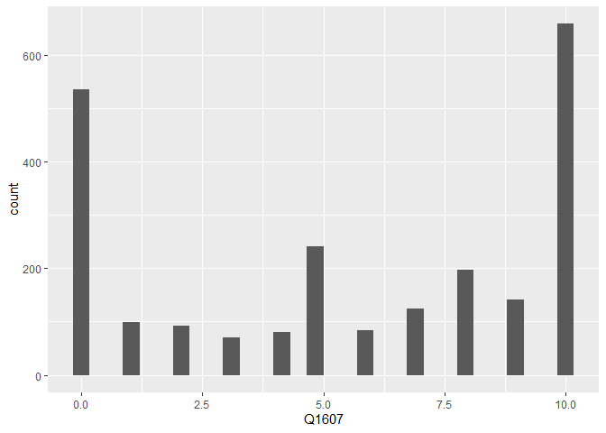<!-- -->

``` r
ggplot( banco_Q1607, aes( Q1607, "" ) ) +
        geom_violin( )
```

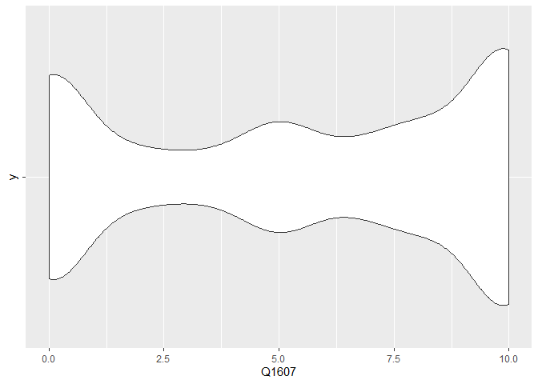<!-- -->

``` r
# DESCRIÇÃO: a variável Q1607, a qual é discreta, representa uma escala a qual é usada para representar a intensidade com a qual as pessoas gostam de Jair
#            Bolsonaro. Antes da filtragem, tal escala ia de 0 à 10 e de 96 à 99, onde o primeiro intervalo demonstra o quanto a pessoa gosta do político,
#            e o segundo intervalo demonstra que a pessoa não conhece, não respondeu ou não sabe avaliar. Após a filtragem, mantém-se apenas os valores de
#            0 à 10. De acordo com o histograma, existem um pouco mais de 500 pessoas que não gostam de Bolsonaro de jeito nenhum, e um pouco mais que 600
#            que gostam muito, enquanto boa parte se encontra entre esses dois extremos. Entre 2 e 5, temos, para cada valor, menos de 100 observações. A
#            partir do valor 5, e com excessão do 6, todos os valores são acima de 100. Em suma, há uma ligeira tendência de apoio ao presidente.

### Vamos procurar entender o que está associado à aprovação deste candidato. Primeiro, vamos observar a idade dos respondentes com a variável D1A_ID.
### Represente esta variável graficamente.


max( banco_Q1607$D1A_ID )
```

    ## [1] 92

``` r
ggplot( banco_Q1607, aes( D1A_ID ) ) +
        geom_histogram( binwidth = 0.9, colour = "black", fill = "grey" )
```

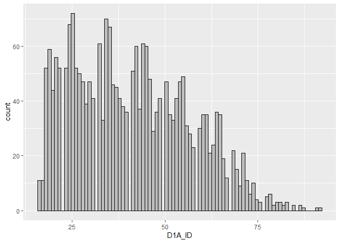<!-- -->

``` r
ggplot( banco_Q1607, aes( D1A_ID ) ) +
        geom_boxplot( )
```

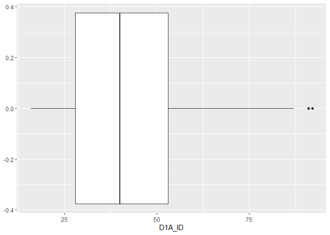<!-- -->

``` r
### Teste a associação entre a nota dada a Jair Bolsonaro e idade do respondente, explicando o resultado.


cor.test( banco_Q1607$Q1607, banco_Q1607$D1A_ID )
```

    ## 
    ##  Pearson's product-moment correlation
    ## 
    ## data:  banco_Q1607$Q1607 and banco_Q1607$D1A_ID
    ## t = 4.8628, df = 2324, p-value = 1.235e-06
    ## alternative hypothesis: true correlation is not equal to 0
    ## 95 percent confidence interval:
    ##  0.0599630 0.1404313
    ## sample estimates:
    ##       cor 
    ## 0.1003613

``` r
# RESPOSTA: De acordo com o teste de correlação, existe uma associação positiva e significante entre as duas variáveis. Com o p-valor baixíssimo de 1.235e-06,
#           podemos rejeitar a hipótese nula de que não há relação entre as variáveis, i.e., de que a correlação entre as variáveis teria valor igual à 0.
#           O intervalo de 95% de confiança é inteiramente positivo, i.e., não contém o valor 0, indo de 0.0599 à 0.1404. Isso reforça a rejeição da hipótese
#           nula. O valor da correlação para essa amostra é de 0.10003613.


### Faça uma regressao linear mostrando em que medida a idade do respondente explica a avaliação do candidato Jair Bolsonaro. Interprete o resultado.


ggplot( banco_Q1607, aes( D1A_ID, Q1607 ) ) +
        geom_point( ) +
        geom_smooth( method = "lm" )
```

    ## `geom_smooth()` using formula 'y ~ x'

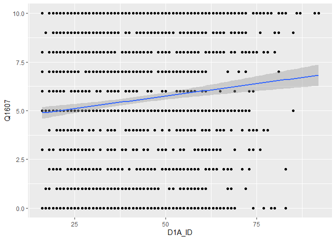<!-- -->

``` r
regressao_Q1607_D1A <- lm( Q1607 ~ D1A_ID, data = banco_Q1607 )

summary( regressao_Q1607_D1A )
```

    ## 
    ## Call:
    ## lm(formula = Q1607 ~ D1A_ID, data = banco_Q1607)
    ## 
    ## Residuals:
    ##     Min      1Q  Median      3Q     Max 
    ## -6.5932 -4.4442  0.6728  3.9430  5.1176 
    ## 
    ## Coefficients:
    ##             Estimate Std. Error t value Pr(>|t|)    
    ## (Intercept) 4.473878   0.230818  19.383  < 2e-16 ***
    ## D1A_ID      0.025534   0.005251   4.863 1.24e-06 ***
    ## ---
    ## Signif. codes:  0 '***' 0.001 '**' 0.01 '*' 0.05 '.' 0.1 ' ' 1
    ## 
    ## Residual standard error: 3.951 on 2324 degrees of freedom
    ## Multiple R-squared:  0.01007,    Adjusted R-squared:  0.009646 
    ## F-statistic: 23.65 on 1 and 2324 DF,  p-value: 1.235e-06

``` r
confint( regressao_Q1607_D1A, level = 0.95 )
```

    ##                  2.5 %     97.5 %
    ## (Intercept) 4.02124705 4.92650904
    ## D1A_ID      0.01523726 0.03583161

``` r
# INTERPRETAÇÃO: Na regressão, temos o intercepto, i.e., o alfa, que representa o valor que a variável dependente tem quando a variável independente é igual
#                à zero, tem valor de 4.473878, valor o qual é estatísticamente significativo, dado que o p-valor é baixíssimo, de 2e-16, possibilitando re-
#                jeitar a hipótese nula de que esse coeficiente tem valor igual  à zero. Sobre o beta, i.e., D1A_ID, esse é o coeficiente angular da equação,
#                o qual representa o impacto que uma variação na variável independente causa na variação da variável dependente. Aqui, D1A_ID tem valor de
#                0.025534. Isso significa que, caso mudemos D1A_ID em 1 unidade, alteraremos Q1607 em 0.025534. O p-valor de D1A_ID também é baixíssimo, de
#                1.24e-06, demonstrando que o valor de D1A_ID é estatísticamente significante, i.e., não é igual à 0. O erro residual padrão é de 3.951. Ele
#                representa a distância média entre os valores das observações e o valor da linha de regressão. Aqui, ele é bem alto, considerando que Q1607
#                vai de 0 a 10. O R quadrado, o qual representa o quanto a variável independente explica a variação na variável dependente, é baixo,
#                de 0.01007, i.e., 1%, deixando claro que esse modelo tem baixo valor explicativo. Segundo confint, podemos ter 95% de confiança de que o va-
#                lor do intercept se encontra entre 4.021 e 4.92, e que o valor de D1A_ID se encontra entre 0.01523 e 0.03583.


### Observe a variável D3_ESCOLA dos respondentes relativa a educação Represente esta variável graficamente. #OBS: observe que esta variável está como numérica,
### apesar de ser categórica ordinal. No entanto, trate-a como numérica, indicando que quanto maior o valor, maior o nível educacional do respondente.

str( banco_Q1607$D3_ESCOLA )
```

    ##  dbl+lbl [1:2326] 5, 5, 6, 3, 0, 0, 4, 8, 8, 6, 2, 2, 1, 2, 6, 2, 6, 4, 8, ...
    ##  @ label        : chr "D3) ESCOLARIDADE"
    ##  @ format.spss  : chr "F8.0"
    ##  @ display_width: int 13
    ##  @ labels       : Named num [1:10] 0 1 2 3 4 5 6 7 8 9
    ##   ..- attr(*, "names")= chr [1:10] "Analfabeto/ Nunca frequentou escola" "Primário incompleto (até 3ª série ou 4º ano do ensino f" "Primário completo (4ª.série  ou 5º ano do ensino fundame" "Ginásio incompleto (até 7ª série ou 8º ano do ensino fu" ...

``` r
min( banco_Q1607$D3_ESCOLA )
```

    ## <labelled<double>[1]>: D3) ESCOLARIDADE
    ## [1] 0
    ## 
    ## Labels:
    ##  value                                                    label
    ##      0                      Analfabeto/ Nunca frequentou escola
    ##      1  Primário incompleto (até 3ª série ou 4º ano do ensino f
    ##      2 Primário completo (4ª.série  ou 5º ano do ensino fundame
    ##      3  Ginásio incompleto (até 7ª série ou 8º ano do ensino fu
    ##      4 Ginásio completo (8ª série ou 9º ano do ensino fundament
    ##      5       Colegial incompleto (até 2ª série do ensino médio)
    ##      6             Colegial completo (3ª série do ensino médio)
    ##      7 Ensino universitário incompleto ou especialização (técni
    ##      8                            Ensino universitário completo
    ##      9                                    Pós-graduação ou mais

``` r
max( banco_Q1607$D3_ESCOLA )
```

    ## <labelled<double>[1]>: D3) ESCOLARIDADE
    ## [1] 9
    ## 
    ## Labels:
    ##  value                                                    label
    ##      0                      Analfabeto/ Nunca frequentou escola
    ##      1  Primário incompleto (até 3ª série ou 4º ano do ensino f
    ##      2 Primário completo (4ª.série  ou 5º ano do ensino fundame
    ##      3  Ginásio incompleto (até 7ª série ou 8º ano do ensino fu
    ##      4 Ginásio completo (8ª série ou 9º ano do ensino fundament
    ##      5       Colegial incompleto (até 2ª série do ensino médio)
    ##      6             Colegial completo (3ª série do ensino médio)
    ##      7 Ensino universitário incompleto ou especialização (técni
    ##      8                            Ensino universitário completo
    ##      9                                    Pós-graduação ou mais

``` r
ggplot( banco_Q1607, aes( D3_ESCOLA ) ) +
        geom_bar( )
```

    ## Don't know how to automatically pick scale for object of type haven_labelled/vctrs_vctr/double. Defaulting to continuous.

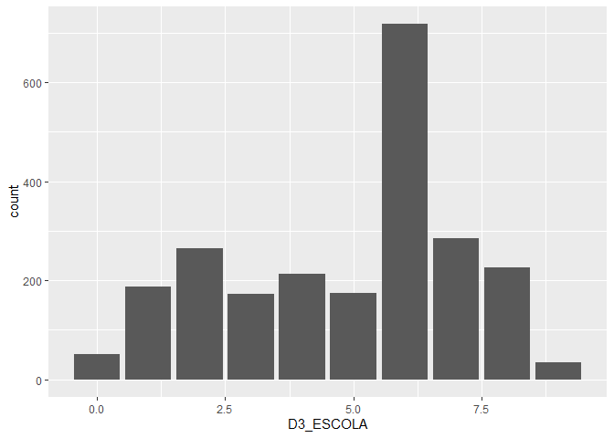<!-- -->

``` r
### Teste a associação entre a nota dada a Jair Bolsonaro e educação do respondente, explicando o resultado.

cor.test( banco_Q1607$Q1607, banco_Q1607$D3_ESCOLA )
```

    ## 
    ##  Pearson's product-moment correlation
    ## 
    ## data:  banco_Q1607$Q1607 and banco_Q1607$D3_ESCOLA
    ## t = -3.2641, df = 2324, p-value = 0.001114
    ## alternative hypothesis: true correlation is not equal to 0
    ## 95 percent confidence interval:
    ##  -0.10790092 -0.02698556
    ## sample estimates:
    ##         cor 
    ## -0.06755432

``` r
# RESPOSTA: Segundo o teste de correlação, existe uma correlação negativa e estatísticamente signficante entre as variáveis. O p-valor foi baixo, de 0.001114,
#           de modo que podemos rejeitar a hipótese nula, a qual afirma não haver relação entre as variáveis, com um alto grau de confiança. Além do mais, o
#           intervalo de confiança de 95% é inteiramente negativo, i.e., não inclui o 0, o que confirmaria a hipótese nula. Tal intervalo vai de -0.1079 à
#           -0.0269. A estimação da amostra é de -0.06755, valor o qual se encontra dentro do intervalo especificado.

### Faça uma regressao linear mostrando em que medida a educação do respondente explica a avaliação do candidato Jair Bolsonaro. Interprete o resultado.

ggplot( banco_Q1607, aes( D3_ESCOLA, Q1607 ) ) +
        geom_point( ) +
        geom_smooth( method = "lm" )
```

    ## Don't know how to automatically pick scale for object of type haven_labelled/vctrs_vctr/double. Defaulting to continuous.

    ## `geom_smooth()` using formula 'y ~ x'

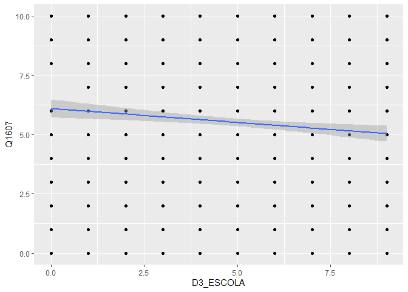<!-- -->

``` r
regressao_Q1607_D3 <- lm( Q1607 ~ D3_ESCOLA, data = banco_Q1607 )
summary( regressao_Q1607_D3 )
```

    ## 
    ## Call:
    ## lm(formula = Q1607 ~ D3_ESCOLA, data = banco_Q1607)
    ## 
    ## Residuals:
    ##     Min      1Q  Median      3Q     Max 
    ## -6.1022 -4.3921  0.6079  4.0161  4.9629 
    ## 
    ## Coefficients:
    ##             Estimate Std. Error t value Pr(>|t|)    
    ## (Intercept)  6.10223    0.19549  31.215  < 2e-16 ***
    ## D3_ESCOLA   -0.11835    0.03626  -3.264  0.00111 ** 
    ## ---
    ## Signif. codes:  0 '***' 0.001 '**' 0.01 '*' 0.05 '.' 0.1 ' ' 1
    ## 
    ## Residual standard error: 3.962 on 2324 degrees of freedom
    ## Multiple R-squared:  0.004564,   Adjusted R-squared:  0.004135 
    ## F-statistic: 10.65 on 1 and 2324 DF,  p-value: 0.001114

``` r
confint( regressao_Q1607_D3 )
```

    ##                  2.5 %      97.5 %
    ## (Intercept)  5.7188824  6.48557848
    ## D3_ESCOLA   -0.1894465 -0.04724737

``` r
# INTERPRETAÇÃO: O intercepto, alfa, coeficiente linear e valor que a variável dependente tem quando a variável independente é igual à zero, tem valor de
#                6.10223, a um p-valor baixissimo de 2e-16, o que permite a rejeição da hipótese nula de que o coeficiente tem valor igual à zero. D3_ESCOLA,
#                o beta e coeficiente angular, tem valor de -0.11835, a um p-valor baixo de 0.00111, o que também permite rejeitar a hipótese nula de que seu
#                valor seria 0. Cada unidade variada em D3_ESCOLA provoca uma variação de -0.11835, o que corresponde com a correlação negativa entre as va-
#                riáveis, apresentada no teste de correlação. O erro residual padrão é alto, de 3.962, considerando que a variável dependente vai de 0 a 10.
#                O R quadrado é bem baixo, de 0.004564, i.e., 0,4%, deixando claro que D3_ESCOLA explica pouco a variação em Q1607. Segundo confint, para um
#                intervalor de confiança de 95%, temos que o valor do intercepto esta entre 5.71 e 6.48, e o valor de D3_ESCOLA está entre -0.18 e -0.04.
#                Ambos os valores correspondem aos achados da regressão linear.

### Observe a variável D9 sobre renda dos respondentes. Represente esta variável graficamente. #OBS: note que os valores 9999998 e 9999999 devem ser
### descartados.

banco_D9 <- banco_Q1607 %>% group_by( D9 ) %>%
            filter( D9 != 9999998 && D9 != 9999999 )

str( banco_D9$D9 )
```

    ##  dbl+lbl [1:1815]  5000, 12000, 40000,  1500,   954,   954,  4000,  2862,  ...
    ##  @ label        : chr "D9. O(a) sr(a) poderia dizer qual é aproximadamente a renda mensal do seu domicílio, isto é, a soma da renda me"| __truncated__
    ##  @ format.spss  : chr "F8.0"
    ##  @ display_width: int 7
    ##  @ labels       : Named num [1:2] 1e+07 1e+07
    ##   ..- attr(*, "names")= chr [1:2] "Não sabe" "Não respondeu/ Recusa"

``` r
min( banco_D9$D9 )
```

    ## <labelled<double>[1]>: D9. O(a) sr(a) poderia dizer qual é aproximadamente a renda mensal do seu domicílio, isto é, a soma da renda mensal de todos os membros do seu domicilio.
    ## [1] 90
    ## 
    ## Labels:
    ##    value                 label
    ##  9999998              Não sabe
    ##  9999999 Não respondeu/ Recusa

``` r
max( banco_D9$D9 )
```

    ## <labelled<double>[1]>: D9. O(a) sr(a) poderia dizer qual é aproximadamente a renda mensal do seu domicílio, isto é, a soma da renda mensal de todos os membros do seu domicilio.
    ## [1] 55000
    ## 
    ## Labels:
    ##    value                 label
    ##  9999998              Não sabe
    ##  9999999 Não respondeu/ Recusa

``` r
ggplot( banco_D9, aes( D9 ) ) +
        geom_histogram( )
```

    ## Don't know how to automatically pick scale for object of type haven_labelled/vctrs_vctr/double. Defaulting to continuous.

    ## `stat_bin()` using `bins = 30`. Pick better value with `binwidth`.

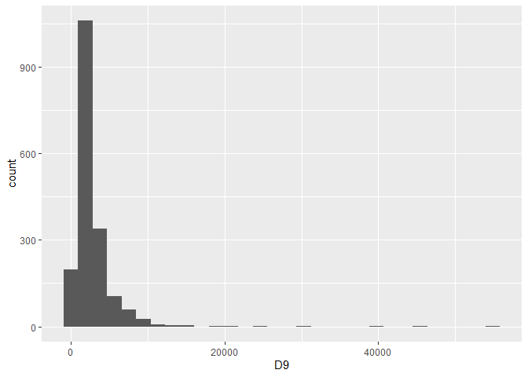<!-- -->

``` r
ggplot( banco_D9, aes( D9 ) ) +
        geom_boxplot( )
```

    ## Don't know how to automatically pick scale for object of type haven_labelled/vctrs_vctr/double. Defaulting to continuous.

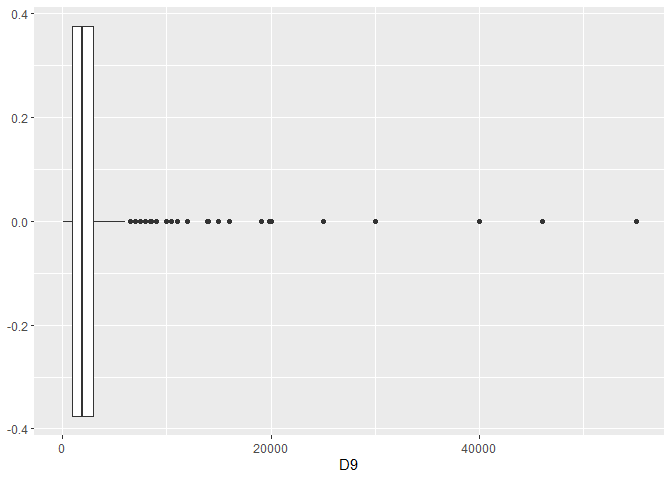<!-- -->

``` r
### Teste a associação entre a nota dada a Jair Bolsonaro e renda do respondente, explicando o resultado.

cor.test( banco_D9$Q1607, banco_D9$D9 )
```

    ## 
    ##  Pearson's product-moment correlation
    ## 
    ## data:  banco_D9$Q1607 and banco_D9$D9
    ## t = 0.19244, df = 1813, p-value = 0.8474
    ## alternative hypothesis: true correlation is not equal to 0
    ## 95 percent confidence interval:
    ##  -0.04150014  0.05052010
    ## sample estimates:
    ##        cor 
    ## 0.00451955

``` r
# RESPOSTA: A correlação entre as variáveis não é estatisticamente significante. O p-valor é extremamtena alto, de 0.8474, o que não nos possibilita
#           rejeitar a hipótese nula, de que não há correlação entre as variáveis. Outro fator que indica a invalidade da correlação observada é o fato
#           de que o intervalo de confiança de 95% contém 0, já que tal intervalo vai de -0.0415 à 0.0505. A estimativa da amostra é de 0.00451955, i.e.,
#           bem próximo de 0, indicando a invalidade da correlação.

### Faça uma regressao linear mostrando em que medida a renda do respondente explica a avaliação do candidato Jair Bolsonaro. Interprete o resultado.

ggplot( banco_D9, aes( D9, Q1607 ) ) +
        geom_point( ) +
        geom_smooth( method = "lm" )
```

    ## Don't know how to automatically pick scale for object of type haven_labelled/vctrs_vctr/double. Defaulting to continuous.

    ## `geom_smooth()` using formula 'y ~ x'

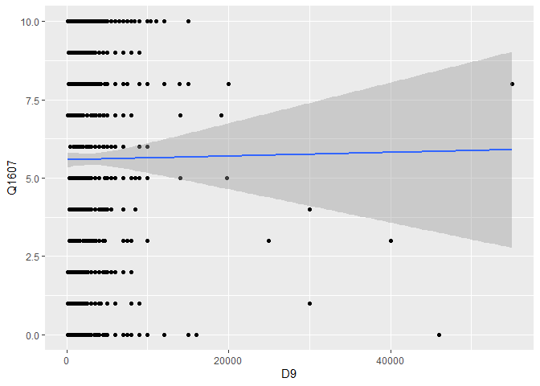<!-- -->

``` r
regressao_Q1607_D9 <- lm( Q1607 ~ D9, data = banco_D9 )
summary( regressao_Q1607_D9 )
```

    ## 
    ## Call:
    ## lm(formula = Q1607 ~ D9, data = banco_D9)
    ## 
    ## Residuals:
    ##     Min      1Q  Median      3Q     Max 
    ## -5.8476 -4.5869  0.4142  4.3984  4.4213 
    ## 
    ## Coefficients:
    ##              Estimate Std. Error t value Pr(>|t|)    
    ## (Intercept) 5.578e+00  1.221e-01  45.690   <2e-16 ***
    ## D9          5.857e-06  3.043e-05   0.192    0.847    
    ## ---
    ## Signif. codes:  0 '***' 0.001 '**' 0.01 '*' 0.05 '.' 0.1 ' ' 1
    ## 
    ## Residual standard error: 3.959 on 1813 degrees of freedom
    ## Multiple R-squared:  2.043e-05,  Adjusted R-squared:  -0.0005311 
    ## F-statistic: 0.03703 on 1 and 1813 DF,  p-value: 0.8474

``` r
confint( regressao_Q1607_D9 )
```

    ##                     2.5 %       97.5 %
    ## (Intercept)  5.338700e+00 5.817597e+00
    ## D9          -5.383427e-05 6.554816e-05

``` r
# INTERPRETAÇÃO: A regressão linear corrobora com os resultados da correlação. O intercepto, alfa e coeficiente linear, tem valor de 5.578e+00, a um
#                p-valor baixíssimo de 2e-16, possibilitando a rejeição da hipótese nula, segundo a qual o valor do intercepto seria 0. O coefici-
#                ente angular, ou beta, tem valor baixíssimo de -5.857e-06, a um p-valor alto de 0.847, o que demonstra a insignificância estatística
#                do resultado, impossibilitando a rejeição da hipótese nula, segundo a qual tal coeficiente teria valor 0. O erro residual padrão tem valor
#                de 3.959, e o R quadrado tem valor de 2.043e-05, demonstrando o baixo valor explicativo desse modelo, já que a variável independen-
#                te só dá conta de explicar um valor próximo de 0 da variação no valor da variável dependente aqui. O baixo valor do coeficiente angular
#                e o baixo valor do R quadrado deixam claro que D9 não é relevante para explicar Q1607. Confint, para 95% de confiança, corrobora com ambos
#                os coeficientes, já que o valor desses se encontram dentro dos intervalos especificados. I.e., o intercepto com valor 5.578e+00 está
#                dentro de 5.338700e+00 e 5.817597e+00, e D9 com valor de 5.857e-06 está dentro de --5.383427e-05 e 6.554816e-05.

### Deixando as variáveis socio-economicas de lado, vamos analisar agora variáveis relativas a preferências políticas.

### A variável Q1501 indica uma nota de 0 a 10 ao PT. Valores acima de 10 representam respostas não uteis para nossa pesquisa. Represente graficamente esta
### variável apenas com os valores válidos e descreva o resultado.

banco_Q1501 <- banco_Q1607 %>% filter( Q1501 <= 10 )

ggplot( banco_Q1501, aes( Q1501 ) ) +
        geom_histogram( )
```

    ## Don't know how to automatically pick scale for object of type haven_labelled/vctrs_vctr/double. Defaulting to continuous.

    ## `stat_bin()` using `bins = 30`. Pick better value with `binwidth`.

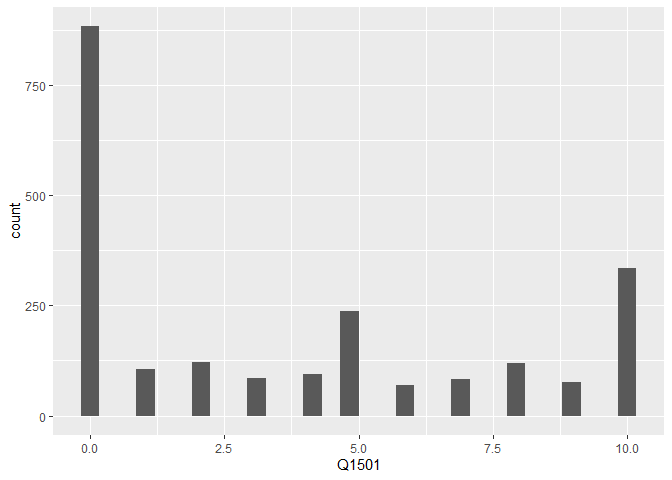<!-- -->

``` r
ggplot( banco_Q1501, aes( Q1501, "" ) ) +
        geom_violin( )
```

    ## Don't know how to automatically pick scale for object of type haven_labelled/vctrs_vctr/double. Defaulting to continuous.

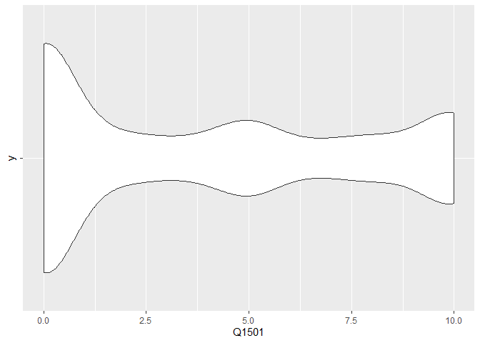<!-- -->

``` r
# DESCRIÇÃO: Basicamente, o que esses gráfico mostram é que as pessoas odeiam o PT. Temos mais de 875 observações no valor 0, o qual computa as pessoas que
#            não gostam de jeito nenhum do PT, enquanto, com exceção dos valores 5 e 10, todos os outros valores estão no máximo em 125 observações. 5 e
#            10 possuem, respectivamente,  quase 250 e quase 375 observações. Isso significa que poucas pessoas gostam, em algum nível, do PT.

### Teste a associação entre a nota dada a Jair Bolsonaro e a nota dada ao PT, explicando o resultado.

cor.test( banco_Q1501$Q1501, banco_Q1501$Q1607 )
```

    ## 
    ##  Pearson's product-moment correlation
    ## 
    ## data:  banco_Q1501$Q1501 and banco_Q1501$Q1607
    ## t = -20.349, df = 2206, p-value < 2.2e-16
    ## alternative hypothesis: true correlation is not equal to 0
    ## 95 percent confidence interval:
    ##  -0.4320901 -0.3618260
    ## sample estimates:
    ##        cor 
    ## -0.3975407

``` r
# RESPOSTA: De acordo com o resultado do teste correlação, podemos afirmar que há correlação entre as variáveis. Além do p-valor extremamente baixo, de
#           2.2e-16, o que indica que podemos imediatamente rejeitar a hipótese nula, de que não há relação entre as variáveis, temos também o fato do
#           intervalo de confiança não conter o valor 0, já que vai de -0.432 à -0.36182. As estimativas da amostra são de -0.39754. Isso indica que a
#           relação entre as variáveis é negativa, i.e., o aumento em uma é acompanhado de uma diminuição na outra. Essa correlação é teoricamente supor-
#           tada pelo fato de que o PT e o partido de Bolsonaro estão em posições ideológicas bem afastadas uma da outra.

### Faça uma regressao linear mostrando em que medida a nota dada ao PT pelo respondente explica a avaliação do candidato Jair Bolsonaro. Interprete o
### resultado.

ggplot( banco_Q1501, aes( Q1501, Q1607 ) ) +
        geom_point( ) +
        geom_smooth( method = "lm" )
```

    ## Don't know how to automatically pick scale for object of type haven_labelled/vctrs_vctr/double. Defaulting to continuous.

    ## `geom_smooth()` using formula 'y ~ x'

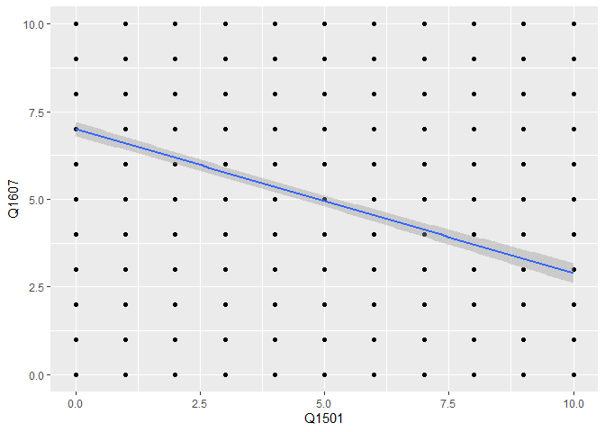<!-- -->

``` r
regressao_Q1607_Q1501 <- lm( Q1607 ~ Q1501, data = banco_Q1501 )
summary( regressao_Q1607_Q1501 )
```

    ## 
    ## Call:
    ## lm(formula = Q1607 ~ Q1501, data = banco_Q1501)
    ## 
    ## Residuals:
    ##     Min      1Q  Median      3Q     Max 
    ## -7.0016 -2.8897  0.4096  2.9984  7.1103 
    ## 
    ## Coefficients:
    ##             Estimate Std. Error t value Pr(>|t|)    
    ## (Intercept)  7.00156    0.10741   65.18   <2e-16 ***
    ## Q1501       -0.41118    0.02021  -20.35   <2e-16 ***
    ## ---
    ## Signif. codes:  0 '***' 0.001 '**' 0.01 '*' 0.05 '.' 0.1 ' ' 1
    ## 
    ## Residual standard error: 3.643 on 2206 degrees of freedom
    ## Multiple R-squared:  0.158,  Adjusted R-squared:  0.1577 
    ## F-statistic: 414.1 on 1 and 2206 DF,  p-value: < 2.2e-16

``` r
confint( regressao_Q1607_Q1501 )
```

    ##                  2.5 %     97.5 %
    ## (Intercept)  6.7909215  7.2122016
    ## Q1501       -0.4508089 -0.3715564

``` r
# INTERPRETAÇÃO: A regressao corrobora com os resultados apresentados na correlação. O intercepto, ou alfa e coeficiente linear, tem valor de 7.001 quando
#                a variável independente é igual a 0. Isso com um p-valor baixíssimo, de 2e-16, demonstrando a significância estatística do resultado e a
#                confiança de que o valor do intercepto não é igual à zero. O coeficiente angular, ou beta, Q1501, tem valor de -0.41118, a um p-valor bai-
#                xíssimo de 2e-16, o que também demonstra a significância estatistica desse coeficiente, de modo que possamos rejeitar a hipótese de que
#                ele seria igual à zero. O erro residual padrao é alto, de 3.643, considerando que a escala da variável dependente vai de 0 a 10. E o R
#                quadrado do modelo é alto, de 0.158, i.e., a variável independente explica 15% da variação na variável dependente. I.e., tem um razoável
#                poder explicativo. Confint reforça a significância dos valores dos coeficientes, dado que o valor do intercepto se encontra dentro do in-
#                tervalo de confiança de 95%, o qual vai de 6.79 à 7.21, e que Q1501 se encontra dentro de -0.4508 e -0.3715. O valor do coeficiente angu-
#                lar, ou beta, é bem alto, sugerindo que variações na variável independente provocam boas variações nos valores da variável dependente.

### A variável Q18 indica uma auto-atribuição em uma escala ideologica de 0 a 10, da esquerda para a direita. Valores acima de 10 representam respostas não
### uteis para nossa pesquisa. Represente graficamente esta variável apenas com os valores válidos e descreva o resultado.

banco_Q18 <- banco_Q1607 %>% filter( Q18 <= 10 )

max( banco_Q18$Q18 )
```

    ## <labelled<double>[1]>: Q18. Novamente pensando em esquerda e direita na política, como o(a) sr(a) se considera?
    ## [1] 10
    ## 
    ## Labels:
    ##  value                                      label
    ##      0                              (00) Esquerda
    ##      1                                       (01)
    ##      2                                       (02)
    ##      3                                       (03)
    ##      4                                       (04)
    ##      5                                       (05)
    ##      6                                       (06)
    ##      7                                       (07)
    ##      8                                       (08)
    ##      9                                       (09)
    ##     10                               (10) Direita
    ##     95 Não sabe o que é esquerda e direita (Esp.)
    ##     97                              Não respondeu
    ##     98       Não sabe se é de esquerda ou direita
    ##     99                                    Missing

``` r
ggplot( banco_Q18, aes( Q18 ) ) +
        geom_histogram( )
```

    ## Don't know how to automatically pick scale for object of type haven_labelled/vctrs_vctr/double. Defaulting to continuous.

    ## `stat_bin()` using `bins = 30`. Pick better value with `binwidth`.

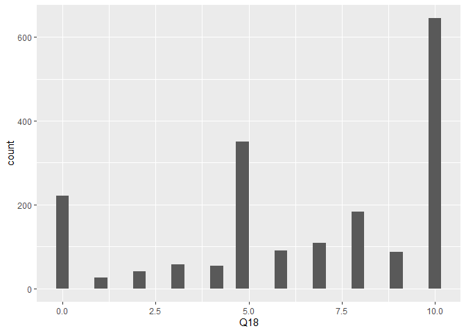<!-- -->

``` r
# DESCRIÇÃO: A variável Q18 mede o posicionamento de uma pessoa na escala ideológica, indo de 0 a 10. Valores mais próximos de 0 indicam que a pessoa é ou
#            tende à esquerda. Valores próximos de 5 indicam que a pessoa é ou tende a ser de centro, e, similarmente, valores próximos à 10 indicam que a 
#            pessoa é ou tende à direita. De acordo com o gráfico, temos um pouco mais de 200 pessoas que se consideram de esquerda, um pouco mais de 300
#            pessoas que se consideram de centro, e um pouco mais de 600 pessoas que se consideram de direita. Valores entre 0 e 5 estão abaixo das 100 ob-
#            servações, e, com exceção do valor 8, o qual tem quase 200 observações, valores entre 5 e 10 também estão abaixo das 100 observações. Entre-
#            tanto, observa-se uma tendência à direita.

### Teste a associação entre a nota dada a Jair Bolsonaro e a auto-atribuição ideológica, explicando o resultado.

cor.test( banco_Q18$Q1607, banco_Q18$Q18 )
```

    ## 
    ##  Pearson's product-moment correlation
    ## 
    ## data:  banco_Q18$Q1607 and banco_Q18$Q18
    ## t = 16.32, df = 1863, p-value < 2.2e-16
    ## alternative hypothesis: true correlation is not equal to 0
    ## 95 percent confidence interval:
    ##  0.3133128 0.3927580
    ## sample estimates:
    ##       cor 
    ## 0.3536731

``` r
# RESPOSTA: A correlação suporta um resultado esperado, i.e., que exista uma relação positiva entre as variáveis, dado que, como foi visto no gráfico, há
#           uma tendência à direita, posição ideológica na qual se encontra o presidente. Segundo a correlação, a qual é positiva, temos um resultado esta-
#           tísticamente significante, dado o p-valor baixíssimo de 2.2e-16, o que nos permite rejeitar a hipótese nula, e o fato de que o intervalo de con-
#           fiança de 95% ser inteiramente positivo, i.e., não conter o 0, indo de 0.3133 à 0.3927. A estimativa da amostra é de 0.3567.

### Faça uma regressao linear mostrando em que medida a auto-atribuição ideológica do repondente explica a avaliação do candidato Jair Bolsonaro. Interprete
### o resultado.

ggplot( banco_Q18, aes( Q18, Q1607 ) ) +
        geom_point( ) +
        geom_smooth( method = "lm" )
```

    ## Don't know how to automatically pick scale for object of type haven_labelled/vctrs_vctr/double. Defaulting to continuous.

    ## `geom_smooth()` using formula 'y ~ x'

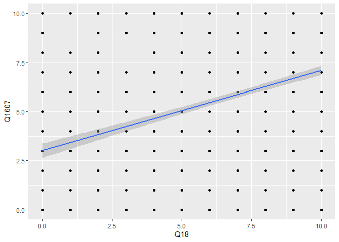<!-- -->

``` r
regressao_Q1607_Q18 <- lm( Q1607 ~ Q18, data = banco_Q18 )
summary( regressao_Q1607_Q18 )
```

    ## 
    ## Call:
    ## lm(formula = Q1607 ~ Q18, data = banco_Q18)
    ## 
    ## Residuals:
    ##     Min      1Q  Median      3Q     Max 
    ## -7.1005 -3.0064  0.8995  2.8995  6.9936 
    ## 
    ## Coefficients:
    ##             Estimate Std. Error t value Pr(>|t|)    
    ## (Intercept)  3.00636    0.18568   16.19   <2e-16 ***
    ## Q18          0.40941    0.02509   16.32   <2e-16 ***
    ## ---
    ## Signif. codes:  0 '***' 0.001 '**' 0.01 '*' 0.05 '.' 0.1 ' ' 1
    ## 
    ## Residual standard error: 3.695 on 1863 degrees of freedom
    ## Multiple R-squared:  0.1251, Adjusted R-squared:  0.1246 
    ## F-statistic: 266.3 on 1 and 1863 DF,  p-value: < 2.2e-16

``` r
confint( regressao_Q1607_Q18 )
```

    ##                 2.5 %    97.5 %
    ## (Intercept) 2.6421919 3.3705353
    ## Q18         0.3602131 0.4586135

``` r
# RESPOSTA: A regressão linear corrobora com o resultado do teste de correlação. O intercepto, ou alfa, tem valor de 3.006, a um p-valor baixíssimo de 2e-16,
#           indicando a significância estatística do valor do intercepto e que este não é igual à 0. Além do mais, Q18, ou beta, tem valor alto de 0.409, i.e.,
#           cada unidade alterada na variável independente muda em 0.40941 o valor da variável dependente. Esse coeficiente também é estatisticamente signi-
#           ficante, dado que seu p-valor é baixíssimo, de 2e-16, permitindo que rejeitemos a hipótese nula, segundo a qual ele teria valor 0. O erro residual
#           padrão é alto, de 3.695, considerando que a escala da variável dependente é de 0 a 10. E o R quadrão é razoável, de 0.1251. Isso significa que essa
#           variável independente explica 12.51% da variação nos valores da variável dependente. Confint confirma a validade dos valores dos coeficientes, dado
#           que os mesmos se encontram dentro dos intervalos de 95% de confiança, os quais vão de 2.642 à 3.37, para o intercepto, e 0.36 à 0.458, para Q18.

### Observando o resultado das regressões, você diria que qual tipo de variável explica mais a variação das notas atribuidas a Jair Bolsonaro, as
### socio-economicas ou políticas?

summary( lm( Q1607 ~ Q1501 + Q18, data = ( banco %>% filter( Q1607 <= 10, Q1501 <= 10, Q18 <= 10 ) ) ) )
```

    ## 
    ## Call:
    ## lm(formula = Q1607 ~ Q1501 + Q18, data = (banco %>% filter(Q1607 <= 
    ##     10, Q1501 <= 10, Q18 <= 10)))
    ## 
    ## Residuals:
    ##     Min      1Q  Median      3Q     Max 
    ## -8.3003 -2.6582  0.4781  2.2192  9.0528 
    ## 
    ## Coefficients:
    ##             Estimate Std. Error t value Pr(>|t|)    
    ## (Intercept)  4.87832    0.20236   24.11   <2e-16 ***
    ## Q1501       -0.39311    0.02098  -18.74   <2e-16 ***
    ## Q18          0.34220    0.02382   14.37   <2e-16 ***
    ## ---
    ## Signif. codes:  0 '***' 0.001 '**' 0.01 '*' 0.05 '.' 0.1 ' ' 1
    ## 
    ## Residual standard error: 3.379 on 1799 degrees of freedom
    ## Multiple R-squared:  0.268,  Adjusted R-squared:  0.2671 
    ## F-statistic: 329.2 on 2 and 1799 DF,  p-value: < 2.2e-16

``` r
summary( lm( Q1607 ~ D1A_ID + D3_ESCOLA + D9, data = ( banco %>% filter( Q1607 <= 10, D9 != 9999998 && D9 != 9999999 ) ) ) )
```

    ## 
    ## Call:
    ## lm(formula = Q1607 ~ D1A_ID + D3_ESCOLA + D9, data = (banco %>% 
    ##     filter(Q1607 <= 10, D9 != 9999998 && D9 != 9999999)))
    ## 
    ## Residuals:
    ##     Min      1Q  Median      3Q     Max 
    ## -6.6716 -4.4884  0.6713  3.9160  5.3042 
    ## 
    ## Coefficients:
    ##               Estimate Std. Error t value Pr(>|t|)    
    ## (Intercept)  4.992e+00  3.700e-01  13.491  < 2e-16 ***
    ## D1A_ID       2.171e-02  5.701e-03   3.808 0.000144 ***
    ## D3_ESCOLA   -6.123e-02  3.920e-02  -1.562 0.118415    
    ## D9          -2.803e-08  1.982e-08  -1.414 0.157448    
    ## ---
    ## Signif. codes:  0 '***' 0.001 '**' 0.01 '*' 0.05 '.' 0.1 ' ' 1
    ## 
    ## Residual standard error: 3.949 on 2322 degrees of freedom
    ## Multiple R-squared:  0.0119, Adjusted R-squared:  0.01062 
    ## F-statistic:  9.32 on 3 and 2322 DF,  p-value: 4.001e-06

``` r
# RESPOSTA: As variáveis políticas explicam mais. Os resultados das regressões envolvendo Q1607, Q1501 e Q18 apresentaram uma forte relação entre Q1607, como
#           variável dependente, e Q1501 e Q18 como independentes. Essas duas variáveis políticas explicam bastante o valor de Q1607. Q1501 influencia negati-
#           vamente no valor de Q1607, enquanto Q18 influencia positivamente no valor desta última, e ambas tem R quadrado de valor razoável, sendo o R quadra-
#           do de Q1501 = 0.15 e o R quadrado de Q18 = 0. 1251, i.e., Q1501 explica 15% e Q18 explicar 12.51%. D1A_ID, D3_ESCOLA e D9 influenciam pouquíssimo
#           ou nada no valor de Q1607, tendo R quadrado de D1A_ID = 0.01007, D3_ESCOLA = 0.004564 e D9 = 2.043e-05. D9, segundo o teste de correlação, sequer
#           tem relação estatisticamente significante com Q1607, enquanto as outras duas, apesar de terem alguma relação, essa relação é baixíssima, com coe-
#           ficientes angulares pequenos, e R quadrado baixos.

### Observando o resultado das regressões, você diria que algum modelo errou menos comparado aos outros na nota prevista atribuída a Jair Bolsonaro?

# RESPOSTA: Observando os erros residuais padrãp de todas as variáveis, temos o seguinte ordenamento dos erros: D1A_ID = 3.951, D3_ESCOLA = 3.962, D9 = 3.959, 
#           Q1501 = 3.643, Q18 = 3.695. Logo, Q1501 < Q18 < D1A_ID < D0 < D3_ESCOLA. Logo, o modelo de regressão envolvendo Q1607 e Q1501 é o que erra
#           menos. Esse é o modelo que mede o efeito de gostar ou não do PT sobre gostar ou não de Bolsonaro.

### Observando o resultado das regressões, você diria que qual(quais) variáveis possui(em) maior efeito no nota atribuída a Jair Bolsonaro?

# RESPOSTA: As variáveis Q1501 e Q18. Q1501 influencia negativamente na nota atribuída a Jair Bolsonaro, impactando em -0.41118 em Q1607, para cada unidade
#           variada em Q1501, variação a qual explica 15%, segundo o R quadrado, da variação em Q1607. Já Q18 influencia positivamente, alterando em 0.40941
#           Q1607 a cada unidade variada em Q18. Além do mais, o R quadrado de Q18 foi de 0.1251, i.e., variações em Q18 explicam 12.51% das variações em
#           Q1607.
```
