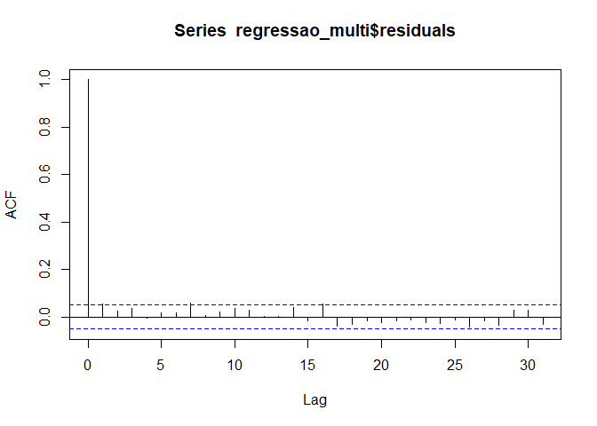
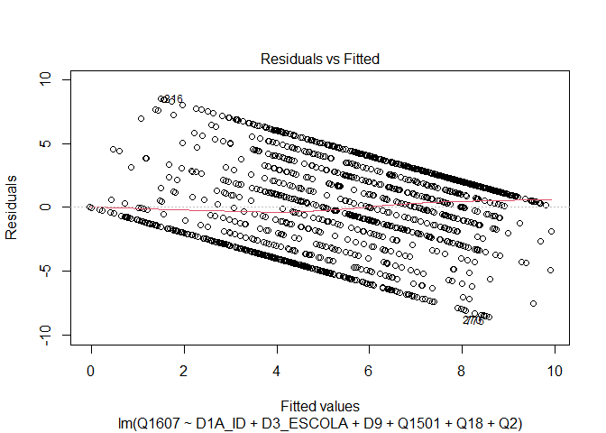
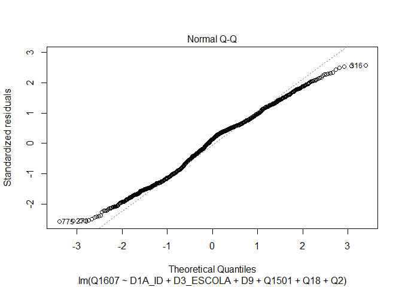
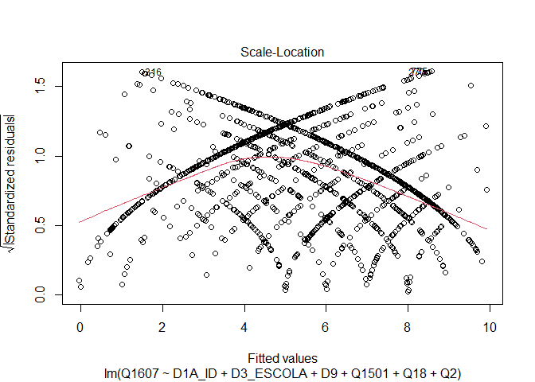
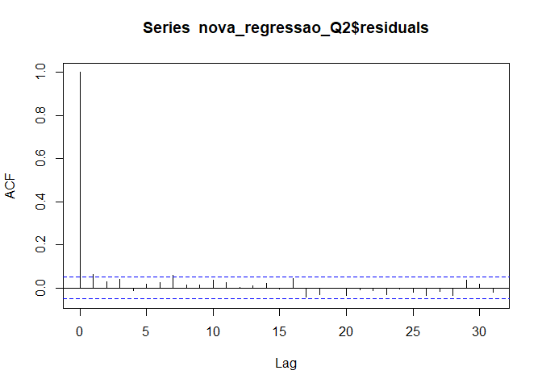

Exercicio 7
================
Kaique Pereira Santos

``` r
library( haven )
library( tidyverse )
library( observer )
library( tibble )
library( lmtest )
library( car )
library( MASS )

banco <- read_sav( "banco_ex6.sav" )

banco_limpo <- banco %>% mutate( Q1607 = as.numeric( Q1607 ) ) %>%
               filter( Q1607 <= 10,
                       Q1501 <= 10,
                       Q18 <= 10,
                       D9 != 9999998 & D9 != 9999999 )

### No exercício anterior foram feitos alguns modelos bivariados. Agora faça uma regressão multivariada mostrando como a nota atribuída a Jair Bolsonaro
### (variável Q1607) pode ser explicada pelas variáveis idade (D1A_ID), educação (D3_ESCOLA), renda (D9), nota atribuída ao PT (Q1501) e auto-atribuição
### ideológica (Q18) dos respondentes. Interprete o resultado a partir das informações dadas pelo sumário da regressão.

regressao_multi <- lm( Q1607 ~ D1A_ID + D3_ESCOLA + D9 + Q1501 + Q18, data = banco_limpo )

summary( regressao_multi )
```

    ## 
    ## Call:
    ## lm(formula = Q1607 ~ D1A_ID + D3_ESCOLA + D9 + Q1501 + Q18, data = banco_limpo)
    ## 
    ## Residuals:
    ##     Min      1Q  Median      3Q     Max 
    ## -9.0176 -2.5841  0.4915  2.1784  9.0477 
    ## 
    ## Coefficients:
    ##               Estimate Std. Error t value Pr(>|t|)    
    ## (Intercept)  5.743e+00  4.768e-01  12.044  < 2e-16 ***
    ## D1A_ID       5.816e-03  6.216e-03   0.936  0.34968    
    ## D3_ESCOLA   -1.543e-01  4.469e-02  -3.453  0.00057 ***
    ## D9          -3.067e-05  2.793e-05  -1.098  0.27230    
    ## Q1501       -4.154e-01  2.359e-02 -17.608  < 2e-16 ***
    ## Q18          3.244e-01  2.627e-02  12.349  < 2e-16 ***
    ## ---
    ## Signif. codes:  0 '***' 0.001 '**' 0.01 '*' 0.05 '.' 0.1 ' ' 1
    ## 
    ## Residual standard error: 3.336 on 1456 degrees of freedom
    ## Multiple R-squared:  0.2831, Adjusted R-squared:  0.2806 
    ## F-statistic:   115 on 5 and 1456 DF,  p-value: < 2.2e-16

``` r
confint( regressao_multi )
```

    ##                     2.5 %        97.5 %
    ## (Intercept)  4.807218e+00  6.677845e+00
    ## D1A_ID      -6.378648e-03  1.800966e-02
    ## D3_ESCOLA   -2.419686e-01 -6.665908e-02
    ## D9          -8.546072e-05  2.411486e-05
    ## Q1501       -4.616620e-01 -3.691133e-01
    ## Q18          2.728670e-01  3.759211e-01

``` r
# INTERPRETAÇÃO: O intercepto da regressão multivariada tem valor estatísticamente significativo, de 5.743e+00, a um p-valor baixíssimo, de 2e-16, o que
#                nos permite rejeitar que o valor do intercepto seria 0. O coeficiente de D1A_ID tem valor bem baixo, de 5.816e-03, a um p-valor alto de
#                0.34968. Com esse p-valor alto, não podemos imediatamente rejeitar a possibilidade do valor real do coeficiente ser 0, i.e., de que ele não
#                tem relação com a variável dependente, ou seja, não podemos ter muita confiança sobre o valor atual do coeficiente. Ou seja, ele não tem
#                muita significância estatística. D3_ESCOLA tem valor baixo, de -1.543e-1, o qual é estatísticamente significante, dado que o p-valor é
#                baixíssimo, de 0.00057. D9 tem valor baixíssimo, de -3.067e-05, o qual não é estatísticamente significante, dado que seu p-valor é bem
#                alto, de 0.2723, não nos permitindo descartar a possbilidade desse coeficiente ser igual a 0, e, portanto, não influenciar na variável
#                dependente. Q1501 tem valor baixo, de -4.154e-01, o qual é estatísticamente significante, já que o p-valor é baixíssimo, de 2e-16. Q18
#                tem valor baixo, de 3.244e-01, e é estatísticamente significante, dado que seu p-valor é baixíssimo, de 2e-16. O intercepto, em uma re-
#                gressão multivariada, representa o valor da variável dependente quando todas as variáveis independentes são iguais à 0. Os coeficientes
#                associados a cada variável independente, aqui, apresentam o quanto a variação em uma unidade no valor de cada variável independente faz
#                a variável dependente variar. No caso de uma regressão multivariada, os valores de cada um desses coeficientes são calculados mantendo
#                fixos os valores dos outros coeficientes. E.g., o valor de D1A_ID é calculado mantendo fixos os valores de todas as outras variáveis
#                independentes consideradas. I.e., para calcularmos o valor de cada coeficientes, "controlamos" pelos valores das outras variáveis. O
#                erro residual padrão, i.e., a distância média dos valores das observações para com a os valores na reta de regressão, é alto, de 3.336,
#                já que a variável dependente vai de 0 a 10. O R quadrado, ou poder explicativo do modelo, é alto, de 0.2831. I.e., as variáveis em con-
#                sideração explicam 28,31% das variações na variável dependente. 

### Em que medida os resultados se mantém ou se alteram quando comparados com os resultados do exercício anterior, quando foram utilizadas apenas regres-
### sões bivariadas?

# RESPOSTA: Para algumas variáveis, os resultados mudam. Q1501 e Q18 mantém a mesma importância que apresentaram nos modelos bivariados. Só houve uma pe-
#           quena redução, de 0.40941 para 0.3244, no impacto que Q18 tem sobre Q1607, mas a significância estatística permanece a mesma, com p-valores
#           baixíssimos para as duas variáveis. D1A_ID, D3_ESCOLA e D9, no entanto, apresentaram resultados bem diferentes do que os presentes nos modelos
#           bivariados. O impacto de D1A_ID, aqui, caiu muito, de 0.025534 para 5.816e-03, ao mesmo tempo em que teve um aumento enorme no p-valor, de
#           1.24e-06 para 0.34968. Com D3_ESCOLA, houve uma ligeira mudança no quanto ela afeta a variável dependente, dado que no modelo multivariado ela
#           passa a afetar mais negativamente do que no modelo bivariado, já que seu valor vai de -0.11835 para -1.543e-01. Porém, houve uma queda brusca
#           no p-valor de D3_ESCOLA, quando em comparação com o modelo bivariado, indo de 0.00111 para 0.00057. No modelo multivariado, ela passou a ser
#           mais significante estatísticamente. D9 também apresentou grandes alterações. Houve uma redução grande no impacto dela sobre o valor da variável
#           dependente, já que ele cai de 5.857e-06 para -3.067e-08, e houve também uma redução no p-valor, que caiu de 0.847 para 0.2723, de modo que ela
#           passa a ser mais estatísticamente significante do que no modelo bivariado, mas com p-valor ainda alto.

### A partir da exposição de gráficos e testes, avalie se o modelo se adequa aos pressupostos que uma regressão linear exige. 

# Linearidade
plot( regressao_multi, 1 )
```

<!-- -->

``` r
# Normalidade dos Resíduos
plot( regressao_multi, 2 )
```

<!-- -->

``` r
sresid <- studres( regressao_multi )
shapiro.test( sresid )
```

    ## 
    ##  Shapiro-Wilk normality test
    ## 
    ## data:  sresid
    ## W = 0.98814, p-value = 1.522e-09

``` r
# Homocedasticidade
plot( regressao_multi, 3 )
```

<!-- -->

``` r
bptest( regressao_multi )
```

    ## 
    ##  studentized Breusch-Pagan test
    ## 
    ## data:  regressao_multi
    ## BP = 57.067, df = 5, p-value = 4.898e-11

``` r
ncvTest( regressao_multi )
```

    ## Non-constant Variance Score Test 
    ## Variance formula: ~ fitted.values 
    ## Chisquare = 23.31391, Df = 1, p = 1.376e-06

``` r
# Autocorrelação entre casos/resíduos
acf( regressao_multi$residuals )
```

<!-- -->

``` r
durbinWatsonTest( regressao_multi )
```

    ##  lag Autocorrelation D-W Statistic p-value
    ##    1      0.05506583      1.887184   0.028
    ##  Alternative hypothesis: rho != 0

``` r
# RESPOSTA: O primeiro teste, plot( regressao_multi, 1 ), avalia o pressuposto de linearidade. De acordo com o gráfico do teste,
#           a linha vermelha apresenta duas ligeiras distorções, ou curvaturas. Mesmo que ela seja razoavelmente próxima da li-
#           nha tracejada, ela não está próxima de ser plenamente horizontal. Então, eu diria que não, que o pressuposto de
#           linearidade não é satisfeito. Já no segundo gráfico, o plot( regressao_multi, 2 ) o qual é usado para se explorar o
#           pressuposto de normalidade dos resíduos, podemos ver que há três grandes distorções, duas nas extremidades e uma no
#           centro. O teste de normalidade Shapiro-Wilk também reforçam que tal pressuposto não é satisfeito. Isso se dá pois o
#           p-valor é baixíssimo, o que nos permite rejeitar a hipótese nula de que há normalidade nos resíduo, i.e., o pressu-
#           posto não é satisfeito. Para verificar o pressuposto de homocedasticidade, usamos plot( regressao_multi, 3 ). Aqui,
#           o intuito é observar a distribuição das observações, para verificar se há ou não uniformidade em tal distribuição
#           Nesse caso, não há, dado que há uma concentração bem maior de observações para cima. Ambos os testes formais refor-
#           çam o fato de que o pressuposto de homocedasticidade não é satisfeito. O teste de Breusch-Pagan e o teste de Non-
#           constant Variance tem p-valor baixíssimos, de modo que podemos rejeitar a hipótese nula, segundo a qual não há
#           homocedasticidade, havendo heterocedasticidade no lugar. Por último, o pressuposto de autocorrelação entre as obser-
#           vações. Segundo o gráfico, podemos perceber afirmar que há alguma autocorrelação entre as observações, dado que al-
#           gumas linhas passam ligeiramente do intervalo delimitado. Além do mais, o teste formal para verificar autocorrelação
#           apresenta um p-valor não muito baixo, de 0.032. Isso nos permite rejeitar a hipótese nula, segundo a qual não há auto-
#           correlação. Com isso, não podemos dizer com muita certeza que tal pressuposto é satisfeito. Porém, o nível de autocor-
#           relação é baixo, de 0.0055065. Ou seja, mesmo com autocorrelação entre as observações, ela não é muito alta.

### Caso algum pressuposto não seja satisfeito, quais são as consequências específicas para o modelo estimado?

# RESPOSTA: Dois pressupostos foram severamente não satisfeitos, i.e., o de Normalidade dos Resíduos e o de Homocedasticidade, e
#           dois deles foram ligeiramente violados, o de Linearidade e o de Autocorrelação. A violação do pressuposto de Linearidade
#           implica que a relação entre as variáveis não pode ser representada por uma função linear, dado que seus parâmetros não
#           são lineares. A quebra desse pressuposto indica uma diferença entre os parâmetros estimados e os observados.

#           O pressuposto de normalidade dos resíduos é relacionado à distribuição dos mesmos. Mais especificamente, é necessário
#           que os termos de erro, ou resíduos, sigam uma distribuição normal ou uma aproximação desta. Sem isso, teremos problemas
#           de viés e eficiência nos estimadores, i.e., nos Betas associados à cada variável independente. No presente modelo, o
#           gráfico apresenta distorções nas extremidades e no centro, e o teste formal de Shapiro-Wilk apresentou p-valor extrema-
#           mente baixo, o que nos permite rejeitar a hipótese nula de que há normalidade na distribuição dos resíduos.

#           A quebra do pressuposto de Homocedasticidade implica que não há uniformidade na variação dos resíduos. Violar esse
#           pressuposto afeta os testes de significância e afeta o cálculo dos intervalos de confiança, podendo até torná-los
#           completamente imprecisos e errados. No caso do modelo em questão, há uma distorção severa na distribuição das observa-
#           ções. Há uma concentração clara, de acordo com o gráfico, das observações na parte central superior do mesmo.

#           Sobre o pressuposto de autocorrelação, há uma incerteza sobre os resultados apresentados no gráfico e os resultados do
#           teste formal de Durbin-Watson. O gráfico sugere que não há muita autocorrelação, dado que a maior parte das linhas verti-
#           cais se encontram dentro do intervalo especificado. Mas o teste formal aponta que não é possivel rejeitar a hipótese nula
#           de que não há autocorrelação, por causa do p-valor baixo. Porém, mesmo que não rejeitemos, o grau de autocorrelação é ex-
#           tremamente baixo. De qualquer forma, a violação do pressuposto de autocorrelação implica que as observações não são inde-
#           pendentes entre si, i.e., que elas influenciam umas as outras. Isso afeta os testes de significância e a segurança sobre
#           o intervalo de confiança.


### Considerando o 4o hurdle do livro *Fundamentals...*, faça um modelo de regressão extra adicionando uma variável **numérica** que foi omitida do modelo
### anterior, mas que possa ter relação causal com a variável dependente (e talvez alguma associação com as independentes anteriores). Justifique a variável
### extra e analise o resultado. 

### Compare o resultado obtido com o modelo e conclusões anteriores.

banco_Q2 <- banco_limpo %>% filter( Q2 <= 4 )

nova_regressao_Q2 <- lm( Q1607 ~ D1A_ID + D3_ESCOLA + D9 + Q1501 + Q18 + Q2, data = banco_Q2 )

summary( nova_regressao_Q2 )
```

    ## 
    ## Call:
    ## lm(formula = Q1607 ~ D1A_ID + D3_ESCOLA + D9 + Q1501 + Q18 + 
    ##     Q2, data = banco_Q2)
    ## 
    ## Residuals:
    ##     Min      1Q  Median      3Q     Max 
    ## -8.5743 -2.6448  0.4723  2.2383  8.5051 
    ## 
    ## Coefficients:
    ##               Estimate Std. Error t value Pr(>|t|)    
    ## (Intercept)  6.962e+00  5.675e-01  12.267  < 2e-16 ***
    ## D1A_ID       1.998e-03  6.268e-03   0.319    0.750    
    ## D3_ESCOLA   -1.875e-01  4.541e-02  -4.130 3.84e-05 ***
    ## D9          -3.416e-05  2.788e-05  -1.225    0.221    
    ## Q1501       -4.086e-01  2.361e-02 -17.308  < 2e-16 ***
    ## Q18          3.165e-01  2.635e-02  12.010  < 2e-16 ***
    ## Q2          -3.367e-01  8.491e-02  -3.966 7.67e-05 ***
    ## ---
    ## Signif. codes:  0 '***' 0.001 '**' 0.01 '*' 0.05 '.' 0.1 ' ' 1
    ## 
    ## Residual standard error: 3.321 on 1447 degrees of freedom
    ## Multiple R-squared:   0.29,  Adjusted R-squared:  0.287 
    ## F-statistic: 98.49 on 6 and 1447 DF,  p-value: < 2.2e-16

``` r
plot( nova_regressao_Q2, 1 )
```

<!-- -->

``` r
plot( nova_regressao_Q2, 2 )
```

<!-- -->

``` r
plot( nova_regressao_Q2, 3 )
```

<!-- -->

``` r
acf( nova_regressao_Q2$residuals )
```

<!-- -->

``` r
# RESPOSTA: Nesse novo modelo de regressão multivariada, é incluída a variável Q2, a qual mede com qual intensidade as pessoas acompanham notícias sobre
#           política. São consideradas diversas mídias em tal variável, como TV, Rádio, Jornais ou Internet. Tal variável tem valores de 1 à 9, com 1
#           indicando que a pessoa acompanha com muita intensidade notícias sobre política, e 9 indicandos respostas não dadas. Como valores 7, 8 e 9 não
#           fornecem nenhum tipo de informação aproveitável, indicando, respectivamente, que a pessoa não respondeu, que não sabe e, por último, missing,
#           considerarei somente os valores de 1 à 4, com 1 indicando que a pessoa acompanha notícias sobre política com muita intensidade, e 4 indicando
#           que a pessoa simplesmente não acompanha notícias sobre política. A nova regressão multivariada, na qual é incluída a variável Q2, apresenta
#           algumas alterações nos resultados. Na primeira regressão multivariada, o intercepto tinha valor 5.743e+00. Na regressão com Q2, o valor dele
#           sobe para 6.962e+00, enquanto o p-valor se mantém igual em ambas as regressões. O valor de D1A_ID cai de 5.816e-03 para 1.998e-03, enquanto
#           seu p-valor sobe de 0.34968 para 0.750. D3_ESCOLA tem uma ligeira mudança, de -1.543e-01 para -1.875e-01, com o p-valor mudando de 0.00057
#           para 3.84e-05, o que é uma redução alta, e reforça a significância estatística do valor do coeficiente. D9 tem valor alterado de -3.067e-05
#           para -3.416e-05, com p-valor reduzido de 0.27230 para 0.221, o que aumenta a sua significância, diminuindo as chances da hipótese nula ser
#           verdadeira, já que o p-valor se encontra bem menor. Q1501 vai de -4.154e-01 à -4.086e-01, ou seja, varia pouquíssimo, mantendo o mesmo valor
#           para o p-valor. Q18 vai de 3.244e-01 à 3.165e-01, variando pouquíssimo, mantendo o mesmo p-valor. E Q2, a nova variável, tem valor estatísti-
#           camente significante, de -3.367e-01, a um p-valor baixo, de 7.67e-05, de modo que podemos rejeitar a hipótese nula de que essa variável não
#           tem relação com a variável dependente. O erro residual padrão da nova regressão é ligeiramente menor, tendo valor 3.321, enquanto que na re-
#           gressão anterior ele era de 3.336. E o R quadrado é ligeiramente maior, saindo de 0.2831 para 0.29, mostrando que esse novo modelo explica um
#           pouco mais a variação na variável dependente do que o anterior, mesmo que com pouca diferença. A relação observada entre Q2 e Q1607 é extre-
#           mamente espera, dado que ela é negativa, i.e., a medida que Q2 aumente, Q1607 diminui. Isso indica que pessoas pouco interessadas em política,
#           as quais não acompanham o noticiário político, tem menos propensão à votar em Bolsonaro do que pessoas que acompanham com muita intensidade
#           notícias sobre política. Isso vai de encontro com o fato de que, durante a campanha de 2018, Bolsonaro teve campanha intensamente presente
#           principalmente em redes sociais, como o Whatsapp, sendo este aplicativo o meio central para a divulgação da candidatura dele.
#           No que diz respeito aos testes de pressupostos, os resultados da regressão anterior não foram alterados na nova regressão.
```
