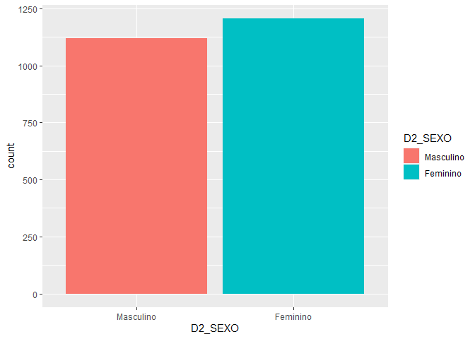
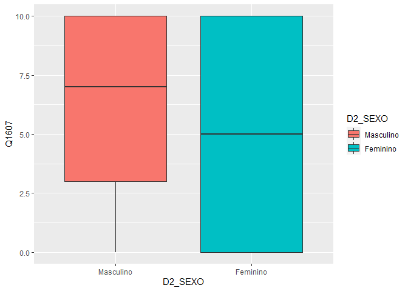
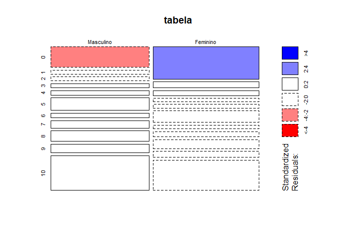
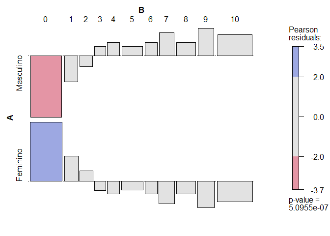
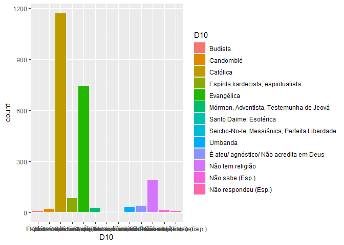
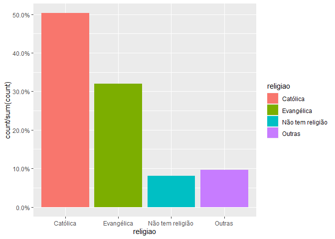
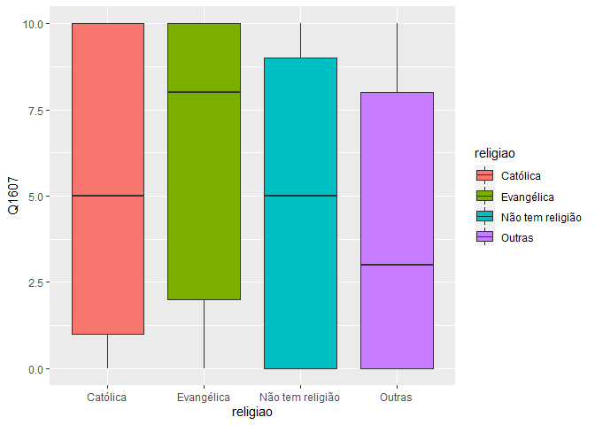
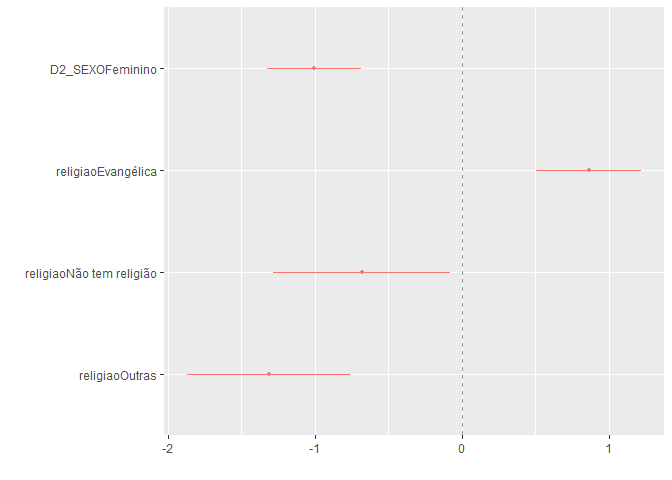

Exercício 8
================
Kaíque Pereira Santos

``` r
### Continuaremos com a utilização dos dados do ESEB2018. Carregue o banco da mesma forma que nos exercicios anteriores

library( tidyverse )
library( haven )
library( scales )
library( graphics )
library( vcd )
library( dotwhisker )

link <- "https://github.com/MartinsRodrigo/Analise-de-dados/blob/master/04622.sav?raw=true"

download.file(link, "04622.sav", mode = "wb")

banco <- read_spss("04622.sav")

banco <- banco %>% mutate( D2_SEXO = as_factor( D2_SEXO ),
         D10 = as_factor( D10 )) %>%
         filter( Q1607 < 11 )

### Começaremos a utilizar no modelo de regressão variáveis qualitativas/categóricas. A primeira delas é sexo (D2_SEXO). Represente esta variável
### graficamente.

ggplot( banco, aes( D2_SEXO, fill = D2_SEXO ) ) +
        geom_bar( )
```

<!-- -->

``` r
### Represente graficamente a associação entre sexo e nota atribuida a Bolsonaro (Q1607)

ggplot( banco, aes( D2_SEXO, Q1607, fill = D2_SEXO ) ) +
        geom_boxplot( )
```

<!-- -->

``` r
### Teste a associação entre sexo e aprovação de Bolsonaro. Qual é sua conclusão?

tabela <- table( banco$D2_SEXO, banco$Q1607 )

chisq.test( tabela )
```

    ## 
    ##  Pearson's Chi-squared test
    ## 
    ## data:  tabela
    ## X-squared = 48.469, df = 10, p-value = 5.095e-07

``` r
mosaicplot( tabela, shade = TRUE )
```

<!-- -->

``` r
assoc( tabela, shade = TRUE )
```

<!-- -->

``` r
# RESPOSTA: O teste Chi-Squared tem valor alto e estatisticamente significante, dando que o p-valor foi baixíssimo, de 5.095e-07, permitindo que
#           rejeitemos a hipótese nula, segundo a qual não existe relação entre as variáveis. Além do mais, gráfico  assoc( tabela, shade = TRUE )
#           indica que há uma relação negativa entre ser homem e avaliar negativamente Bolsonaro, e uma associação positiva entre ser mulher e ava-
#           liar negativamente Bolsonaro. I.e., homens tendem a avaliar mais positivamente o presidente enquanto mulheres tendem a fazer avaliações
#           negativas do mesmo. O boxplot reforça esse resultado, indicando uma concentração maior de homens em notas mais altas, i.e., avaliações
#           mais positivas, enquanto as mulheres estão mais igualmente distribuídas pelo gráfico, apresentando uma distribuição quase igual por
#           todas as notas, mas também estando presente em faixas de notas nais quais não se encontram homens, como o intervalo entre 0 e 2.5.

### Faça uma regressão bivariada com estas duas variáveis, verificando em que medida sexo explica a nota atribuida a Bolsonaro. Interprete o resul-
### tado da regressão (o $\beta$, o $\alpha$, p-valores e medidas de desempenho do modelo)

regressao_D2 <- lm( Q1607 ~ D2_SEXO, data = banco )

summary( regressao_D2 )
```

    ## 
    ## Call:
    ## lm(formula = Q1607 ~ D2_SEXO, data = banco)
    ## 
    ## Residuals:
    ##     Min      1Q  Median      3Q     Max 
    ## -6.0205 -4.0614 -0.0205  3.9795  4.9386 
    ## 
    ## Coefficients:
    ##                 Estimate Std. Error t value Pr(>|t|)    
    ## (Intercept)       6.0205     0.1178  51.112  < 2e-16 ***
    ## D2_SEXOFeminino  -0.9592     0.1636  -5.863 5.18e-09 ***
    ## ---
    ## Signif. codes:  0 '***' 0.001 '**' 0.01 '*' 0.05 '.' 0.1 ' ' 1
    ## 
    ## Residual standard error: 3.942 on 2324 degrees of freedom
    ## Multiple R-squared:  0.01458,    Adjusted R-squared:  0.01415 
    ## F-statistic: 34.38 on 1 and 2324 DF,  p-value: 5.178e-09

``` r
confint( regressao_D2 )
```

    ##                     2.5 %     97.5 %
    ## (Intercept)      5.789550  6.2515214
    ## D2_SEXOFeminino -1.279962 -0.6383893

``` r
# INTERPRETAÇÃO: O alfa, ou intercepto, tem valor de 6.0205, o qual é estatisticamente significante, dado o p-valor baixíssimo de 2e-16. O beta,
#                o qual representa o coeficiente angular da equação da reta de regressão, e demonstra o impacto da variável independente sobre a
#                variável dependente, tem valor de -0.9592, o qual também é estatisticamente significante, dado o p-valor baixíssimo de 5.18e-09,
#                nos permitindo rejeitar a hipótese nula de que a relação entre a variável independente e a variável dependente é 0. No caso, o
#                valor de beta aqui demonstra o qual alterar em uma unidade a variável independente faz variar a variável dependente. Nesse caso,
#                ser mulher, quando em comparação com ser homem, afeta negativamente a avaliação de Bolsonaro. Mais especificamente, ser mulher
#                faz com que a avaliação de Bolsonaro caia em -0.9592, quando em comparação com ser homem. É necessário ressaltar o quando em
#                comparação com ser homem pois a variável independente, aqui, é binária, podendo variar entre somente dois valores, de modo que
#                o resultado do beta tem que ser interpretado em termos do outro valor possível que a variável pode assumir. O erro residual
#                padrão é alto, de 3.942. É alto pois a variável dependente vai somente de 0 a 10. E o R quadrado é baixo, de 0.01458, o que sig-
#                nifica que a variável sexo explica apenas 1.458% da variação na variável dependente.

### Outra variável categórica bastante presente no debate sobre voto na última eleição é religião (D10). Represente esta variável graficamente.

ggplot( banco, aes( D10, fill = D10 ) ) +
        geom_bar( )
```

<!-- -->

``` r
### Crie no banco de dados uma variável de religião modificada chamada `religiao` com as categorias "Evangélica", "Católica", "Não tem religião", e
### agregue todas as outras na categoria "Outras".

Outras <- levels( banco$D10 )[ -c( 3, 5, 13 ) ]

banco_novo <- banco %>%
              mutate( religiao = case_when( D10 %in% Outras ~ "Outras",
                                            D10 == "Católica" ~ "Católica",
                                            D10 == "Evangélica" ~ "Evangélica",
                                            D10 == "Não tem religião" ~ "Não tem religião" ) )

ggplot( banco_novo, aes( religiao, ..count../sum( ..count.. ), fill = religiao ) ) +
        geom_bar( ) +
        scale_y_continuous( labels = percent )
```

<!-- -->

``` r
### Represente graficamente a associação entre religiao e nota atribuida a Bolsonaro 

ggplot( banco_novo, aes( religiao, Q1607, fill = religiao ) ) +
        geom_boxplot( )
```

<!-- -->

``` r
### Para fazer o teste estatistico da associação entre as variáveis, não podemos usar o teste-t pois neste caso a variável categórica possui diversos
### níveis. O adequado é utilizar o teste de ANOVA ou o teste de Kruskal. Abaixo ilustramos como fazer esse teste. O Kruskal-test indica se há dife-
### rença entre alguma das categorias da variável e a variável contínua, mas não especifica como as diferentes categorias se diferenciam. Isso pode
### ser obtido com o teste de Wilcox, que compara os agrupamentos par a par. Como você interpreta esse resultado?

kruskal.test( Q1607 ~ religiao, data = banco_novo )
```

    ## 
    ##  Kruskal-Wallis rank sum test
    ## 
    ## data:  Q1607 by religiao
    ## Kruskal-Wallis chi-squared = 61.013, df = 3, p-value = 3.571e-13

``` r
pairwise.wilcox.test( banco_novo$Q1607, banco_novo$religiao, p.adjust.method = "BH" )
```

    ## 
    ##  Pairwise comparisons using Wilcoxon rank sum test with continuity correction 
    ## 
    ## data:  banco_novo$Q1607 and banco_novo$religiao 
    ## 
    ##                  Católica Evangélica Não tem religião
    ## Evangélica       7.4e-06  -          -               
    ## Não tem religião 0.043    8.3e-06    -               
    ## Outras           1.2e-05  4.4e-11    0.126           
    ## 
    ## P value adjustment method: BH

``` r
# INTERPRETAÇÃO: O resultado do teste de Kruskal-Wallis foi alto e estatísticamente significante. O valor do chi-squared foi de 61.013, com p-valor
#                baixíssimoo de 3.571e-13. Esses valores indicam que existe uma diferença entre alguma das categorias da variável categórica e a vá-
#                riável contínua. O teste ANOVA pairwise.wilcox.test indica que há diferença estatisticamente relevante entre Evangélicos e Católicos,
#                Não Tem Religião e Católicos, Não Tem Religião e Evangélicos, Outras e Católicos e Outras e Evangélicos, dado que os p-valores desses
#                pares de categorias são menores que 0.05. Não há diferença estatisticamente significante entre Outras e Não Tem Religião, dado que o
#                p-valor foi alto, de 0.126, o que é maior que 0.05. Apesar de estatisticamente significante, o p-valor de Não Tem Religião e Católicos
#                está bem próximo do limiar de 0.05. 

### Faça uma regressão linear para verificar em que medida religião explica a avaliação de Bolsonaro. Interprete o resultado da regressão (cada um dos
### $\beta$s, o $\alpha$, p-valores e medidas de desempenho do modelo)

unique( banco_novo$religiao )
```

    ## [1] "Evangélica"       "Católica"         "Outras"           "Não tem religião"

``` r
regressao_religiao <- lm( Q1607 ~ religiao, data = banco_novo )

summary( regressao_religiao )
```

    ## 
    ## Call:
    ## lm(formula = Q1607 ~ religiao, data = banco_novo)
    ## 
    ## Residuals:
    ##    Min     1Q Median     3Q    Max 
    ## -6.259 -4.107  0.559  3.741  5.893 
    ## 
    ## Coefficients:
    ##                          Estimate Std. Error t value Pr(>|t|)    
    ## (Intercept)                5.4410     0.1146  47.470  < 2e-16 ***
    ## religiaoEvangélica         0.8184     0.1838   4.452 8.93e-06 ***
    ## religiaoNão tem religião  -0.6325     0.3081  -2.053   0.0402 *  
    ## religiaoOutras            -1.3339     0.2859  -4.665 3.26e-06 ***
    ## ---
    ## Signif. codes:  0 '***' 0.001 '**' 0.01 '*' 0.05 '.' 0.1 ' ' 1
    ## 
    ## Residual standard error: 3.921 on 2322 degrees of freedom
    ## Multiple R-squared:  0.0261, Adjusted R-squared:  0.02484 
    ## F-statistic: 20.74 on 3 and 2322 DF,  p-value: 2.936e-13

``` r
# INTERPRETAÇÃO: Aqui, a categoria de referência é a religião Católica. O intercepto tem valor de 5.441, o qual é estatisticamente significante, dado
#                o p-valor de 2e-16. O beta de Evangélicos tem valor de 0.8184, o qual é estatisticamente significante, dado que o p-valor é de 8.93e-06.
#                O valor de 0.8184 tem que ser pensado em termos da categoria de referência. Ele significa que, em relação aos Católicos, ser evangélico
#                significa avaliar Bolsonaro 0.8184 mais positivamente do que os Católicos os avaliam. O beta de quem Não Tem Religião é de -0.6325, o
#                qual é estatisticamente significante, dado o p-valor de 0.0402. O valor do coeficiente significa que quem Não Tem Religião avalia Bolso-
#                naro -0.6325 a menos do que quem é Católico. O beta de Outras religiões é de -1.3339, com um p-valor baixíssimo de 3.26e-06. Isso signi-
#                fica que quem é de Outras religiões tende a avaliar Bolsonaro mais negativamente do que quem é Católico. Mais especificamente, pessoas
#                de Outras religiões avaliam ele -1.3339 a menos que Católicos. Todos esses valores dos betas tem que ser pensandos na escala das variá-
#                independentes, as quais eles estao associados. Os p-valores também são medidos em termos da categoria de referência, i.e., os Católicos.
#                Sobre o intercepto, Católicos é como se fosse o novo 0, o ponto em que a linha de regressão toca o eixo y. O Erro residual é alto, de
#                3.921. É alto pois é medido em termos da variável dependente, a qual vai de 0 a 10. O R quadrado é baixo, de 0.0261. Isso significa que
#                as variáveis em tal modelo explicam apenas 2.61% das variações na variável dependente.

### Faça uma regressao linear avaliando ao mesmo tempo em que medida religiao e sexo explicam a avaliacao de Bolsonaro. Interprete o resultado de cada
### um dos coeficientes a partir da representação gráfica destes.

regressao_multi <- lm( Q1607 ~ D2_SEXO + religiao, data = banco_novo )

summary( regressao_multi )
```

    ## 
    ## Call:
    ## lm(formula = Q1607 ~ D2_SEXO + religiao, data = banco_novo)
    ## 
    ## Residuals:
    ##     Min      1Q  Median      3Q     Max 
    ## -6.8130 -3.9448  0.1915  3.7365  6.3682 
    ## 
    ## Coefficients:
    ##                          Estimate Std. Error t value Pr(>|t|)    
    ## (Intercept)                5.9493     0.1401  42.477  < 2e-16 ***
    ## D2_SEXOFeminino           -1.0045     0.1616  -6.215 6.07e-10 ***
    ## religiaoEvangélica         0.8637     0.1825   4.732 2.36e-06 ***
    ## religiaoNão tem religião  -0.6813     0.3057  -2.229   0.0259 *  
    ## religiaoOutras            -1.3130     0.2837  -4.629 3.88e-06 ***
    ## ---
    ## Signif. codes:  0 '***' 0.001 '**' 0.01 '*' 0.05 '.' 0.1 ' ' 1
    ## 
    ## Residual standard error: 3.889 on 2321 degrees of freedom
    ## Multiple R-squared:  0.04204,    Adjusted R-squared:  0.04039 
    ## F-statistic: 25.46 on 4 and 2321 DF,  p-value: < 2.2e-16

``` r
dwplot( regressao_multi, vline = geom_vline( xintercept = 0, colour = "grey60", linetype = 2 ) )
```

<!-- -->

``` r
# INTERPRETAÇÃO: Aqui, temos duas categorias de referência. Para a categoria Sexo, sexo Masculino é a categoria de referência, enquanto que, para a cate-
#                goria religião, a religião Católica é a categoria de referência. O intercepto, ou alfa, que é o valor da variável dependente quando
#                as variáveis assumem os valores das categorias de referência, i.e., sexo Masculino e Católicos, tem valor de 5.9493, o qual é estatisti-
#                camente significante, dado o p-valor baixo de 2e-16. O valor do coeficiente para quando a variável sexo tem valor Feminino é de -1.0045,
#                o qual é estatisticamente significante, dado o p-valor baixissimo de 6.07e-10. Isso significa que, quando em comparação com sexo Mascu-
#                lino, mulheres tendem a avaliar Bolsonaro -1.0045 a menos. O coeficiente para religião Evangélica é de 0.8637, o qual é estatisticamente
#                significante, dado o p-valor baixo de 2.36e-06. Isso significa que Evangélicos avaliam Bolsonaro 0.8637 a mais que Católicos. O coefici-
#                ente para quem Não Tem Religião é de -0.6813, o qual é estatisticamente significante, dado o p-valor razoável de 0.0259. Isso significa
#                que quem Não Tem Religião avalia Bolsonaro -0.6813 a menos do que quem é Católico. Por último, o valor do coeficiente para quem é de
#                Outras religiões é de -1.3130, o qual é estatisticamente significante, dado o p-valor de 3.88e-06. Isso significa que quem é de Outras
#                religiões avalia Bolsonaro -1.3130 a menos do que quem é Católico. O erro residual padrão é alto, de 3.889. É alto porque a variável
#                dependente vai de 0 a 10. O R quadrado é baixo, de 0.04204. Isso significa que o modelo tem capacidade de explicar apenas 4.204% das
#                variações na variável dependente. O gráfico reforça a ideia de que todas as variáveis são estatisticamente significantes, dado que
#                nenhuma das linhas horizontais tocou ou cruzou o valor da linha tracejada vertical. Esse cruzamento, o qual não aconteceu, significaria
#                que o valor do coeficiente poderia ser 0, de modo que não pudessemos rejeitas a hipótese nula de que a variável independente com esse
#                coeficiente não tem relação com a variável dependente.
```
