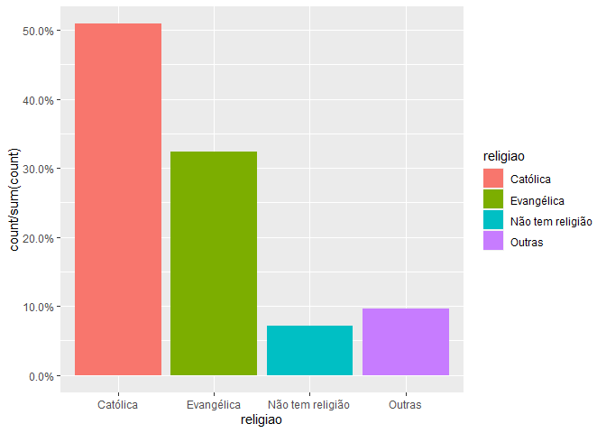

Exercicio 9
================

``` r
### Continuaremos com a utilização dos dados do ESEB2018. Carregue o banco da mesma forma que nos exercicios anteriores

library( tidyverse )
library( haven )
library( scales )
library( sjPlot )
library( stargazer )

link <- "https://github.com/MartinsRodrigo/Analise-de-dados/blob/master/04622.sav?raw=true"

download.file( link, "04622.sav", mode = "wb" )

banco <- read_spss( "04622.sav" ) 

banco <- banco %>%
         mutate( D10 = as_factor( D10 ) ) %>%
         filter( Q1607 < 11, 
                 Q18 < 11,
                 D9 < 9999998,
                 Q1501 < 11 )

### Crie a mesma variável de religião utilizada no exercício anterior

Outras <- levels( banco$D10 )[ -c( 3, 5, 13 ) ]

banco <- banco %>%
         mutate( religiao = case_when( D10 %in% Outras ~ "Outras",
                                       D10 == "Católica" ~ "Católica",
                                       D10 == "Evangélica" ~ "Evangélica",
                                       D10 == "Não tem religião" ~ "Não tem religião" ) )


ggplot( banco, aes( religiao, ..count../sum( ..count.. ), fill = religiao ) ) +
        geom_bar( ) +
        scale_y_continuous( labels = percent )
```

<!-- -->

``` r
### Faça uma regressão linear avaliando em que medida as variáveis independentes utilizadas nos exercícios 7 e 8, idade(D1A_ID), educação
### (D3_ESCOLA), renda (D9), nota atribuída ao PT (Q1501), auto-atribuição ideológica (Q18), sexo (D2_SEXO) e religião (variável criada no
### passo anterior) explicam a avaliação de Bolsonaro (Q1607), mas com uma interação entre as variáveis religião e sexo. Exiba o resultado
### da regressão e interprete os valores dos coeficientes $\beta$s estimados.

regressao <- lm( Q1607 ~ D1A_ID + D3_ESCOLA + D9 + Q1501 + Q18 + D2_SEXO * religiao, data = banco )

summary( regressao )
```

    ## 
    ## Call:
    ## lm(formula = Q1607 ~ D1A_ID + D3_ESCOLA + D9 + Q1501 + Q18 + 
    ##     D2_SEXO * religiao, data = banco)
    ## 
    ## Residuals:
    ##    Min     1Q Median     3Q    Max 
    ## -8.942 -2.561  0.361  2.303  9.052 
    ## 
    ## Coefficients:
    ##                                    Estimate Std. Error t value Pr(>|t|)    
    ## (Intercept)                       6.114e+00  5.915e-01  10.338   <2e-16 ***
    ## D1A_ID                            1.065e-02  6.255e-03   1.703   0.0888 .  
    ## D3_ESCOLA                        -1.134e-01  4.491e-02  -2.524   0.0117 *  
    ## D9                               -3.632e-05  2.768e-05  -1.312   0.1897    
    ## Q1501                            -3.956e-01  2.370e-02 -16.696   <2e-16 ***
    ## Q18                               3.150e-01  2.607e-02  12.083   <2e-16 ***
    ## D2_SEXO                          -6.115e-01  2.438e-01  -2.508   0.0122 *  
    ## religiaoEvangélica                1.181e+00  6.146e-01   1.921   0.0549 .  
    ## religiaoNão tem religião          1.986e-01  1.059e+00   0.188   0.8512    
    ## religiaoOutras                   -1.583e+00  9.503e-01  -1.666   0.0960 .  
    ## D2_SEXO:religiaoEvangélica       -3.412e-01  3.895e-01  -0.876   0.3812    
    ## D2_SEXO:religiaoNão tem religião -1.889e-01  6.979e-01  -0.271   0.7867    
    ## D2_SEXO:religiaoOutras            5.041e-01  6.067e-01   0.831   0.4062    
    ## ---
    ## Signif. codes:  0 '***' 0.001 '**' 0.01 '*' 0.05 '.' 0.1 ' ' 1
    ## 
    ## Residual standard error: 3.297 on 1449 degrees of freedom
    ## Multiple R-squared:  0.3028, Adjusted R-squared:  0.297 
    ## F-statistic: 52.44 on 12 and 1449 DF,  p-value: < 2.2e-16

``` r
### Interprete a significancia estatística dos coeficientes estimados
```

INTERPRETAÇÃO: O intercepto, ou alfa, o qual é o valor da variável
dependente quando as variáveis dependentes são iguais à 0, tem valor de
6.114e+00, o qual é estatísticamente significante, dado o p-valor de
2e-16. D1A\_ID tem coeficiente com valor de 1.065e-02, porém, não
podemos descartar a possibilidade de que esse beta é igual à 0, dado o
p-valor de 0.0888, o qual não nos permite rejeitar com muita confiança a
hipótese nula de que o coeficiente é diferente de 0. D3\_ESCOLA tem beta
com valor de -1.134e-01, o qual é estatisticamente significante, dado o
p-valor de 0.0117. D9 tem coeficiente de valor -3.632e-05. Porém, dado
seu p-valor de 0.1897, não podemos descartar a hipótese nula de que esse
coeficiente tem valor igual à 0, portanto, não podemos dizer que é
estatisticamente significante. Q1501 tem valor -3.956e-01, o qual é
estatis- ticamente significante, dado o p-valor baixíssimo de 2e-16, de
modo que possamos rejeitar a hipótese nula de que esse beta é igual à 0
e não impacta na variável dependente. Q18 tem valor de 3.150e-01, o qual
também é estatisticamente significante, dado o p-valor de 2e-16. Os
valores de cada um desses coeficientes representam o quanto uma mudança
em uma unidade de cada um deles faz com que a variável dependente mude.
E.g.: variar Q1501 em uma unidade faz com que Q1607 varie em -3.956e-01,
mantendo, claro, constantes as outras variáveis dependente, i.e.,
controlando por elas. D2\_SEXO tem valor igual à -6.115e-01, o qual é
estatisticamente significante, permitindo-nos rejeitar a hipótese nula
de que tal coeficiente é igual à 0, dado o p-valor de 0.0122. Como a
variável religião é categórica, a análise de cada uma das categorias tem
que ser feita em termos da categoria de referência, i.e., o “0” para tal
variável. Aqui, a categoria de referência é a religião católica. Ser
evan- gélico impact em 1.181e+00 no valor da variável dependente Q1607,
quando em comparação com Católicos. Esse valor está no limiar da
significância estatística, dado o p-valor de 0.0549, o qual ainda nos
permite rejeitar a hipótese nula de que o tal coeficiente é igual à 0.
Não Ter Religião tem impacto de 1.986e-01 em Q1607, quando em
comparação com Católicos. Tal valor, porém, não é estatisticamente
significante, dado o p-valor extremamente alto de 0.8512, o qual não nos
permite rejei- tar a hipótese nula de que este coeficiente é igual à 0.
Ser de Outras Religiões tem impacto de -1.583e+00 em Q1607. Porém, não
tem significância estatística, dado que o p-valor é de 0.096, não nos
permitindo rejeitar a hipótese nula de que tal valor na verdade é 0.
Assumindo que a categoria de referência para a variável D2\_SEXO é
Masculino, no termo interativo entre religião e D2\_SEXO, temos que ser
Mulher e Evangélica impacta em -3.412e-01 na variável dependente, quando
em comparação com Homens Católicos. Similarmente, ser Mulher e Não Ter
Religião afeta em -1.889e-01 o valor de Q1607, e ser Mulher de Outras
Religiões afeta em 5.041e-01 o valor de Q1607. Todos esses três termos
interativos tem p-valor altos, o que sugere que não há significância
estatística em nenhuma das interações. Para o primeiro caso, na
interação entre ser Mulher e Evangélica, temos um p-valor de 0.3812.
No segundo caso, de ser Mulher e Não Ter Religião, o p-valor é de
0.7867. E, por último, o ter- ceiro caso, Mulher e Outras Religiões,
temos um p-valor de 0.4062. Porém, como dito em aula, não devemos dar
importância demais ao p-valor de termos interativos. O erro residual
padrão é de 3.297, o que é alto, dado que a escala variável depen- dente
é de 0 a 10. O R quadrado é de 0.3028, o que significa que tal modelo
consegue explicar 30.28% da variação na variável dependente. Um último
ponto: o valor do intercepto é calculado quando todas as variáveis
independentes são 0. Como temos variáveis categóricas no modelo, o 0 é
justamente as categorias de referência. Aqui, as categorias de
referência são Masculino, para D2\_SEXO, e Católica, para a variável
religiões. Portanto, o 0 usado como base para o cálculo do intercepto é
Homens Católicos.

``` r
### Faça um gráfico que mostre a interação entre as duas variáveis. Interprete o resultado apresentado.

plot_model( regressao, type = "pred",
            terms = c( "religiao", "D2_SEXO" ),
            ci.lvl = 0.9 )
```

<!-- -->

INTERPRETAÇÃO: Segundo o gráfico, podemos ver que, na categoria Outras
religiões, há uma grande sobreposição nos intervalos de confiança da
variável D2\_SEXO. Isso significa que não podemos dizer que mudar os
valores da variável D2\_SEXO afeta os valores da variável depentente.
I.e., não podemos dizer que há uma diferença entre ser Homem de Outras
religiões e ser Mulher de outras religiões, no que diz respeito à como
cada uma afeta a variável dependente. Similarmente, há uma sobreposição
nos intervalos de confiança na categoria Não Tem Religião. I.e., não
podemos dizer que há diferença entre ser Homem e Não Ter Religião e ser
Mulher e Não Ter Religião, no que diz respeito ao impacto de ambas na
variável dependente. Porém, esses mesmos resultados não valem para as
categorias Evangélica e Católica. Para Católicos, não há sobreposição
nos intervalos de confiança de ser Mulher e ser Homem. Isso significa
que ser Mulher Católica tem um efeito diferente sobre a variável
dependente quando compara- do com o efeito que ser Homem Católico tem
sobre a variável dependente. Mais especificamente, Homens Católicos
tendem a avaliar mais positivamente Bolsonaro, i.e., afetam
positivamente o valor de Q1607, do que Mulheres Católicas. Pode-se dizer
o mesmo quando consideramos a categoria Evangélica. Existe uma
diferença, no que diz respeito ao impacto sobre a variável dependente,
entre ser Mulher Evangélica e ser Homem Evangélico. Mais
especificamente, Homens Evangélicos tendem a avaliar mais positivamente
Bolsonaro, i.e., afetam positivamente o valor de Q1607, do que Mulheres
Evangélicas.
